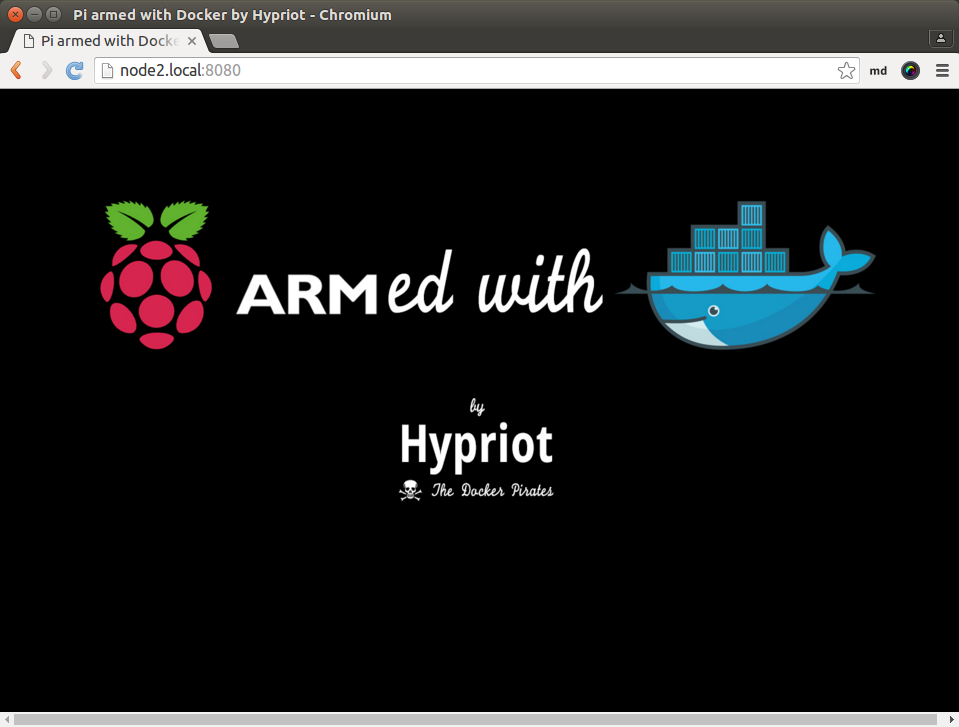
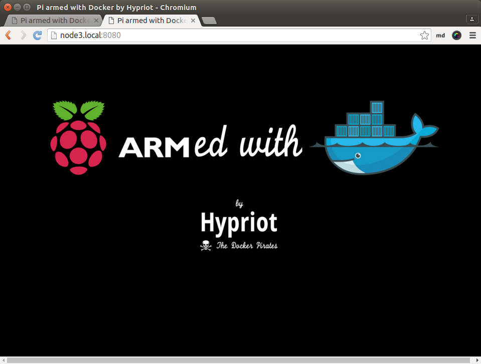

class: split-30 nopadding
background-image: url( https://cloud.githubusercontent.com/assets/4231611/15090540/af6a8d30-1454-11e6-96a2-6ab97cc519fc.jpg )

.column_t2.center[.vmiddle[
.fgtransparent[
.figplaint[

]
]
]]
.column_t2[.vmiddle.nopadding[
.shadelightdark[.boxtitle1[
### Sample Cases - RPIs
# Docker Swarm

### [Eueung Mulyana](https://github.com/eueung)
### http://eueung.github.io/docker-stuff/cluster
#### CodeLabs | [Attribution-ShareAlike CC BY-SA](https://creativecommons.org/licenses/by-sa/4.0/)
#### 
]]
]]

---
class: column_t1 middle

.fonth4[
.tab1.fullwidth[
| Outline  |
|:-------------:|
| Swarm on RPIs - A 3-Node Cluster |
| Docker Machine - Generic Driver |
]]

---
class: split-30 nopadding
background-image: url( https://cloud.githubusercontent.com/assets/4231611/15090540/af6a8d30-1454-11e6-96a2-6ab97cc519fc.jpg )

.column_t2.center[.vmiddle[
.fgtransparent[
.figplaint[

]
]
]]
.column_t2[.vmiddle.nopadding[
.shadelightdark[.boxtitle1[
### Docker Swarm on RPIs
# A 3-Node Cluster

### 
### 
#### 
#### 
]]
]]

---
class: split-40 nopadding 

.column_t2[.vmiddle.pushfront.right[
### Step #1
# Prepare &amp; Flash

]]
.column_t1[.vmiddle[

```bash
*$ flash --hostname node1 hypriot-rpi-20160306-192317.img 
*$ flash --hostname node2 hypriot-rpi-20160306-192317.img 
*$ flash --hostname node3 hypriot-rpi-20160306-192317.img 

# -d /dev/mmcblk0 doesn't work 
```

]]

---
class: split-70 nopadding 
background-image: url(images/cluster.jpg)

.column_t2[.vmiddle.right[

]]
.column_bt[.vmiddle.pushfront[
### Step #2
## Connect Everything
## Plug &amp; Power-Up
]]

---
class: split-30 nopadding 

.column_t2[.vmiddle.pushfront.right[
### Step #3
# Test Connectivity

]]
.column_t1[.vmiddle[

```bash
*$ ping -c 3 node1.local
PING node1.local (192.168.1.102) 56(84) bytes of data.
64 bytes from 192.168.1.102: icmp_seq=1 ttl=64 time=3.51 ms
...
--- node1.local ping statistics ---
3 packets transmitted, 3 received, 0% packet loss, time 6026ms
rtt min/avg/max/mdev = 1.673/2.859/3.511/0.840 ms

*$ ping -c 3 node2.local
PING node2.local (192.168.1.101) 56(84) bytes of data.
64 bytes from 192.168.1.101: icmp_seq=1 ttl=64 time=3.60 ms
...
--- node2.local ping statistics ---
3 packets transmitted, 3 received, 0% packet loss, time 6025ms
rtt min/avg/max/mdev = 1.806/2.491/3.608/0.796 ms

*$ ping -c 3 node3.local
PING node3.local (192.168.1.100) 56(84) bytes of data.
64 bytes from 192.168.1.100: icmp_seq=1 ttl=64 time=3.09 ms
...
--- node3.local ping statistics ---
3 packets transmitted, 3 received, 0% packet loss, time 2003ms
rtt min/avg/max/mdev = 1.684/2.186/3.090/0.640 ms

```

]]

---
class: split-30 nopadding 

.column_t1[.vmiddle.pushfront.right[
### Step #4
# Check Docker

]]
.column_t2[.vmiddle[

```bash
*$ ssh root@node1.local
*$ ssh root@node2.local
*$ ssh root@node3.local
# root/hypriot

HypriotOS: root@node1 in ~

HypriotOS: root@node1 in ~
*$ docker version

Client:
 Version:      1.10.2
 API version:  1.22
 Go version:   go1.4.3
 Git commit:   c3959b1
 Built:        Wed Feb 24 09:51:38 2016
 OS/Arch:      linux/arm

Server:
 Version:      1.10.2
 API version:  1.22
 Go version:   go1.4.3
 Git commit:   c3959b1
 Built:        Wed Feb 24 09:51:38 2016
 OS/Arch:      linux/arm

*$ docker-machine --version
docker-machine version 0.4.1 (549d016)

```

]]

---
class: split-30 nopadding 

.column_t1[.vmiddle.pushfront.right[
### Step #4
# Check Docker

]]
.column_t2[.vmiddle[

```bash
HypriotOS: root@node1 in ~
*$ docker info

Containers: 0
 Running: 0
 Paused: 0
 Stopped: 0
Images: 25
*Server Version: 1.10.2
Storage Driver: overlay
 Backing Filesystem: extfs
Execution Driver: native-0.2
Logging Driver: json-file
Plugins: 
 Volume: local
 Network: null host bridge
*Kernel Version: 4.1.17-hypriotos-v7+
Operating System: Raspbian GNU/Linux 8 (jessie)
OSType: linux
Architecture: armv7l
*CPUs: 4
*Total Memory: 925.5 MiB
Name: node1
ID: HX6D:ZAUS:RCVC:OA6Y:NTU6:KJ2P:KUIF:BE6Q:ANIX:U3NE:CMDO:TCHX

```

]]

---
class: split-30 nopadding 

.column_t2[.vmiddle.pushfront.right[
### Step #5
# Update Swarm

]]
.column_t1[.vmiddle[

```bash
HypriotOS: root@node1 in ~

*$ docker pull hypriot/rpi-swarm
Using default tag: latest
latest: Pulling from hypriot/rpi-swarm

a3ed95caeb02: Pull complete 
f12f883ff802: Pull complete 
Digest: sha256:058810659b2cfa26e68aabd9499fe5eb9b70b2d0bc753cdcafcff00359049609
Status: Downloaded newer image for hypriot/rpi-swarm:latest

*$ docker images
REPOSITORY          TAG                 IMAGE ID            CREATED             SIZE
hypriot/rpi-swarm   latest              07fafcb46ec6        31 hours ago        13.97 MB
<none>              <none>              c298de062190        8 weeks ago         13.27 MB

```

]]

---
class: split-30 nopadding 

.column_t1[.vmiddle.pushfront.right[
### Step #6
# Prepare for Machine Operation

]]
.column_t2[.vmiddle[

```bash
*$ ssh root@node1.local
*$ ssh-keygen -t rsa -C "root@node1"
Generating public/private rsa key pair.
*Enter file in which to save the key (/root/.ssh/id_rsa): 
*Enter passphrase (empty for no passphrase): 
Enter same passphrase again: 
Your identification has been saved in /root/.ssh/id_rsa.
Your public key has been saved in /root/.ssh/id_rsa.pub.
The key fingerprint is:
d8:76:66:1a:45:5f:9e:9f:7d:cd:21:ca:55:c7:1d:be root@node1
The key's randomart image is:
+---[RSA 2048]----+
|          .   .++|
|         . . oo.+|
|          . .ooo |
|       o .. o .o*|
|      . S +o   E*|
|       . *      .|
|        .        |
|                 |
|                 |
+-----------------+

# no passphrase
# if necessary
# ssh-keygen -f "~/.ssh/known_hosts" -R node1.local

*$ ssh-copy-id -i ~/.ssh/id_rsa.pub root@node1.local
*$ ssh-copy-id -i ~/.ssh/id_rsa.pub root@node2.local
*$ ssh-copy-id -i ~/.ssh/id_rsa.pub root@node3.local
```

]]

---
class: split-30 nopadding 

.column_t2[.vmiddle.pushfront.right[
### Step #7
# Generate Token

Using Docker Hub Discovery Backend Service

]]
.column_t1[.vmiddle[

```bash
*$ sudo apt-get install bc

*# generate-token.sh
# ------
#!/bin/bash

export TOKEN=$(for i in $(seq 1 32); do echo -n $(echo "obase=16; $(($RANDOM % 16))" | bc); done; echo)
echo $TOKEN

# ------
*# cluster.token
# ------
export TOKEN=405C5E6893E28BE726F89C08BB1666CF

# ------
*$ source cluster.token && echo $TOKEN

```

]]

---
class: split-30 nopadding 

.column_t1[.vmiddle.pushfront.right[
### Step #8
# Execute Machine

]]
.column_t2[.vmiddle[

```bash
HypriotOS: root@node1 in ~
*$ docker-machine create -d hypriot --swarm --swarm-master --swarm-discovery token://$TOKEN --hypriot-ip-address 192.168.1.102 node1
Importing SSH key...
To see how to connect Docker to this machine, run: docker-machine env node1

HypriotOS: root@node1 in ~
*$ docker-machine create -d hypriot --swarm --swarm-discovery token://$TOKEN --hypriot-ip-address 192.168.1.101 node2
Importing SSH key...
To see how to connect Docker to this machine, run: docker-machine env node2

HypriotOS: root@node1 in ~
*$ docker-machine create -d hypriot --swarm --swarm-discovery token://$TOKEN --hypriot-ip-address 192.168.1.100 node3
Importing SSH key...
To see how to connect Docker to this machine, run: docker-machine env node3

HypriotOS: root@node1 in ~
*$ docker-machine ls
NAME    ACTIVE   DRIVER    STATE     URL                        SWARM
node1            hypriot   Running   tcp://192.168.1.102:2376   node1 (master)
node2            hypriot   Running   tcp://192.168.1.101:2376   node1
node3            hypriot   Running   tcp://192.168.1.100:2376   node1
```

]]

---
class: split-30 nopadding 

.column_t2[.vmiddle.pushfront.right[
### Step #9
# Ready for Testing

]]
.column_t1[.vmiddle[

```bash
HypriotOS: root@node1 in ~
*$ eval $(docker-machine env --swarm node1)

HypriotOS: root@node1 in ~
*$ docker ps
CONTAINER ID        IMAGE                      COMMAND                  CREATED             STATUS              PORTS                                    NAMES
af2f6f431141        hypriot/rpi-swarm:latest   "/swarm join --advert"   5 minutes ago       Up 5 minutes        2375/tcp                                 node2/swarm-agent
36a7229cad5a        hypriot/rpi-swarm:latest   "/swarm join --advert"   About an hour ago   Up About an hour    2375/tcp                                 node3/swarm-agent
fbc861a660de        hypriot/rpi-swarm:latest   "/swarm join --advert"   About an hour ago   Up About an hour    2375/tcp                                 node1/swarm-agent
9e849976b10b        hypriot/rpi-swarm:latest   "/swarm manage --tlsv"   About an hour ago   Up About an hour    2375/tcp, 192.168.1.102:3376->3376/tcp   node1/swarm-agent-master

```

]]

---
class: split-30 nopadding 

.column_t2[.vmiddle.pushfront.right[
### Step #9
# Ready for Testing

]]
.column_t1[.vmiddle[

```bash
HypriotOS: root@node1 in ~
*$ docker run -d -p 8080:80 hypriot/rpi-nano-httpd
01be89a41fdc7c3caadb4f985e9cf43161a15f991e06ef2d47fe7e6c6c79e32b

*$ docker run -d -p 8080:80 hypriot/rpi-nano-httpd
628ba526621af33ca289303f6f54a80c4fe139bcece38e202ff4ea5bd4ec8e5a

*$ docker ps
CONTAINER ID        IMAGE                      COMMAND                  CREATED              STATUS              PORTS                                    NAMES
*628ba526621a        hypriot/rpi-nano-httpd     "/httpd 80"              14 seconds ago       Up 12 seconds       192.168.1.101:8080->80/tcp               node2/awesome_panini
*01be89a41fdc        hypriot/rpi-nano-httpd     "/httpd 80"              About a minute ago   Up About a minute   192.168.1.100:8080->80/tcp               node3/jolly_fermat
af2f6f431141        hypriot/rpi-swarm:latest   "/swarm join --advert"   10 minutes ago       Up 10 minutes       2375/tcp                                 node2/swarm-agent
36a7229cad5a        hypriot/rpi-swarm:latest   "/swarm join --advert"   About an hour ago    Up About an hour    2375/tcp                                 node3/swarm-agent
fbc861a660de        hypriot/rpi-swarm:latest   "/swarm join --advert"   About an hour ago    Up About an hour    2375/tcp                                 node1/swarm-agent
9e849976b10b        hypriot/rpi-swarm:latest   "/swarm manage --tlsv"   About an hour ago    Up About an hour    2375/tcp, 192.168.1.102:3376->3376/tcp   node1/swarm-agent-master

```

]]

---
class: split-30 nopadding 

.column_t2[.vmiddle.pushfront.right[
### Step #9
# Ready for Testing

]]
.column_t1[.vmiddle[

```bash
HypriotOS: root@node1 in ~
*$ docker info

Containers: 6
 Running: 6 - Paused: 0 - Stopped: 0
Images: 5
Server Version: swarm/1.2.1 - Role: primary
*Strategy: spread
*Filters: health, port, containerslots, dependency, affinity, constraint
Nodes: 3
* node1: 192.168.1.102:2376
  - ID: MHER:4BEC:J5ER:3TJL:IH55:UFWY:ONGH:2S4I:R4VP:UNS5:NTG4:FJ3J
  - Status: Healthy
* - Containers: 2
  - Reserved CPUs: 0 / 4
  - Reserved Memory: 0 B / 971.8 MiB
  - Labels: executiondriver=native-0.2, kernelversion=4.1.17-hypriotos-v7+, operatingsystem=Raspbian GNU/Linux 8 (jessie), provider=hypriot, storagedriver=overlay
  - Error: (none) - UpdatedAt: 2016-05-08T01:42:11Z - ServerVersion: 1.10.2
* node2: 192.168.1.101:2376
* - Containers: 2
  - Reserved CPUs: 0 / 4
  - Reserved Memory: 0 B / 971.8 MiB
* node3: 192.168.1.100:2376
* - Containers: 2
  - Reserved CPUs: 0 / 4
  - Reserved Memory: 0 B / 971.8 MiB
...
Kernel Version: 4.1.17-hypriotos-v7+ - Operating System: linux - Architecture: arm
*CPUs: 12
*Total Memory: 2.847 GiB
Name: 9e849976b10b

```

]]

---
class: split-30 nopadding 

.column_t2[.vmiddle.pushfront.right[
### Step #9
# Ready for Testing

]]
.column_t1[.vmiddle[

```bash
CONTAINER ID        IMAGE                      COMMAND                  CREATED              STATUS              PORTS                                    NAMES
*628ba526621a        hypriot/rpi-nano-httpd     "/httpd 80"              14 seconds ago       Up 12 seconds       192.168.1.101:8080->80/tcp               node2/awesome_panini
01be89a41fdc        hypriot/rpi-nano-httpd     "/httpd 80"              About a minute ago   Up About a minute   192.168.1.100:8080->80/tcp               node3/jolly_fermat
```

.figstyle1[

]

]]

---
class: split-30 nopadding 

.column_t2[.vmiddle.pushfront.right[
### Step #9
# Ready for Testing

]]
.column_t1[.vmiddle[
```bash
CONTAINER ID        IMAGE                      COMMAND                  CREATED              STATUS              PORTS                                    NAMES
628ba526621a        hypriot/rpi-nano-httpd     "/httpd 80"              14 seconds ago       Up 12 seconds       192.168.1.101:8080->80/tcp               node2/awesome_panini
*01be89a41fdc        hypriot/rpi-nano-httpd     "/httpd 80"              About a minute ago   Up About a minute   192.168.1.100:8080->80/tcp               node3/jolly_fermat
```

.figstyle1[

]

]]

---
class: split-30 nopadding
background-image: url( https://cloud.githubusercontent.com/assets/4231611/15090540/af6a8d30-1454-11e6-96a2-6ab97cc519fc.jpg )

.column_t2.center[.vmiddle[
.fgtransparent[
.figplaint[

]
]
]]
.column_t2[.vmiddle.nopadding[
.shadelightdark[.boxtitle1[
### Generic Driver
# More with Docker Machine

### 
### 
#### 
#### 
]]
]]

---
class: split-30 nopadding 

.column_t1[.vmiddle.pushfront.right[
# Prepare the Nodes 

]]
.column_t2[.vmiddle[

```bash
#!/bin/bash
*# prepare-node.sh

function getip() { (traceroute $1 2>&1 | head -n 1 | cut -d\( -f 2 | cut -d\) -f 1) }

IP_ADDRESS=$(getip $1)
#echo $IP_ADDRESS

ssh-keygen -R $IP_ADDRESS
ssh-copy-id -oStrictHostKeyChecking=no -oCheckHostIP=no root@$IP_ADDRESS

ssh root@$IP_ADDRESS sed -i \'s/ID=raspbian/ID=debian/g\' /etc/os-release

# -----
*# cluster.token
export TOKEN=405C5E6893E28BE726F89C08BB1666FE

```

```bash
*$ docker-machine version
docker-machine version 0.7.0, build a650a40

*$ source cluster.token && echo $TOKEN

*$ ./prepare-node.sh node1.local
*$ ./prepare-node.sh node2.local
$ ./prepare-node.sh node3.local

```
]]

---
class: split-30 nopadding 

.column_t1[.vmiddle.pushfront.right[
# Activate Master Node

]]
.column_t2[.vmiddle[

```bash
#!/bin/bash
*# activate-master.sh

function getip() { (traceroute $1 2>&1 | head -n 1 | cut -d\( -f 2 | cut -d\) -f 1) }

IP_ADDRESS=$(getip $1)
echo $IP_ADDRESS
echo $TOKEN

*docker-machine -D create -d generic \
  --engine-storage-driver=overlay --swarm --swarm-master \
* --swarm-image hypriot/rpi-swarm:1.2.1 \
  --swarm-discovery="token://$TOKEN" \
  --generic-ip-address=$(getip $1) \
  $1
```

]]

---
class: split-30 nopadding 

.column_t1[.vmiddle.pushfront.right[
# Activate Master Node

.yellow[ssh root@node1.local]<br/>
**docker rm ..**<br/>
**docker rmi ..**<br/><br/>

.bluelight[docker pull hypriot/rpi-swarm:1.2.1]

]]
.column_t2[.vmiddle[

```bash
*$ ./activate-master.sh node1.local

Running pre-create checks...
Creating machine...
(node1.local) No SSH key specified. Connecting to this machine now and in the future will require the ssh agent to contain the appropriate key.
Waiting for machine to be running, this may take a few minutes...
Detecting operating system of created instance...
Waiting for SSH to be available...
Detecting the provisioner...
Provisioning with debian...
Copying certs to the local machine directory...
Copying certs to the remote machine...
Setting Docker configuration on the remote daemon...
Configuring swarm...
...
```

]]

---
class: split-30 nopadding 

.column_t1[.vmiddle.pushfront.right[
# Activate Agents

.yellow[ssh root@node1.local]<br/>
**docker rm ..**<br/>
**docker rmi ..**<br/><br/>

.bluelight[docker pull hypriot/rpi-swarm:1.2.1]

]]
.column_t2[.vmiddle[

```bash
#!/bin/bash
*# activate-agent.sh

function getip() { (traceroute $1 2>&1 | head -n 1 | cut -d\( -f 2 | cut -d\) -f 1) }

IP_ADDRESS=$(getip $1)
echo $IP_ADDRESS
echo $TOKEN

*docker-machine -D create -d generic \
  --engine-storage-driver=overlay --swarm \
* --swarm-image hypriot/rpi-swarm:1.2.1 \
  --swarm-discovery="token://$TOKEN" \
  --generic-ip-address=$(getip $1) \
  $1
```

```bash
*$ ./activate-agent.sh node2.local
$ ./activate-agent.sh node3.local
...

```

]]

---
class: split-30 nopadding 

.column_t1[.vmiddle.pushfront.right[
# Check

]]
.column_t2[.vmiddle[

```bash
*$ docker-machine ls
NAME          ACTIVE      DRIVER       STATE     URL                        SWARM                  DOCKER    ERRORS
agent1        -           virtualbox   Stopped                                                     Unknown   
agent2        -           virtualbox   Stopped                                                     Unknown   
default       -           virtualbox   Stopped                                                     Unknown   
manager       -           virtualbox   Stopped                                                     Unknown   
*node1.local   * (swarm)   generic      Running   tcp://192.168.1.102:2376   node1.local (master)   v1.10.2   
*node2.local   -           generic      Running   tcp://192.168.1.101:2376   node1.local            v1.10.2   

```

]]

---
class: split-30 nopadding 

.column_t2[.vmiddle.pushfront.right[
# Install DVM

Docker (Client) Version Manager

]]
.column_t1[.vmiddle[

```bash
*$ curl -sL https://download.getcarina.com/dvm/latest/install.sh | sh

Downloading dvm.sh...
######################################################################## 100,0%
Downloading bash_completion
######################################################################## 100,0%
Downloading dvm-helper...
######################################################################## 100,0%

Docker Version Manager (dvm) has been installed to /home/em/.dvm
Run the following command to start using dvm. Then add it to your bash profile (e.g. ~/.bashrc or ~/.bash_profile) to complete the installation.

  source /home/em/.dvm/dvm.sh

*$ source /home/em/.dvm/dvm.sh
*$ dvm install 1.10.2
Installing 1.10.2...
Now using Docker 1.10.2

```

]]

---
class: split-30 nopadding 

.column_t2[.vmiddle.pushfront.right[
# Install DVM

Docker (Client) Version Manager
]]
.column_t1[.vmiddle[

```bash
*$ docker version

*Client:
* Version:      1.10.2
* API version:  1.22
 Go version:   go1.5.3
 Git commit:   c3959b1
 Built:        Mon Feb 22 22:37:33 2016
 OS/Arch:      linux/amd64

Server:
 Version:      1.11.1
 API version:  1.23
 Go version:   go1.5.4
 Git commit:   5604cbe
 Built:        Tue Apr 26 23:43:49 2016
 OS/Arch:      linux/amd64

*$ dvm ls
->  1.10.2
  system (1.11.1)
*$ dvm use 1.10.2
```

]]

---
class: split-30 nopadding 

.column_t1[.vmiddle.pushfront.right[
# Ready for Testing 

]]
.column_t2[.vmiddle[

```bash
*$ eval $(docker-machine env --swarm node1.local)

*$ docker info
*Containers: 3
 Running: 3 - Paused: 0 - Stopped: 0
Images: 6
*Server Version: swarm/1.2.1
Role: primary
Strategy: spread
Filters: health, port, containerslots, dependency, affinity, constraint
*Nodes: 2
* node1.local: 192.168.1.102:2376
  - Containers: 2
  - Reserved CPUs: 0 / 4
  - Reserved Memory: 0 B / 971.8 MiB
  - ServerVersion: 1.10.2
* node2.local: 192.168.1.101:2376
  - Containers: 1
  - Reserved CPUs: 0 / 4
Kernel Version: 4.1.17-hypriotos-v7+ - Operating System: linux - Architecture: arm
*CPUs: 8 - Total Memory: 1.898 GiB

```

]]

---
class: split-30 nopadding 

.column_t1[.vmiddle.pushfront.right[
# Ready for Testing 

]]
.column_t2[.vmiddle[

```bash
*$ docker run -d -p 8080:80 hypriot/rpi-nano-httpd
95458ecf5c3fe3577f92cbbb408bc02facef7de4618f266717805e0422f8e30b

*$ docker ps
CONTAINER ID        IMAGE                     COMMAND                  CREATED             STATUS              PORTS                                    NAMES
*95458ecf5c3f        hypriot/rpi-nano-httpd    "/httpd 80"              8 seconds ago       Up 5 seconds        192.168.1.101:8080->80/tcp               node2.local/evil_einstein
df3a453ac694        hypriot/rpi-swarm:1.2.1   "/swarm join --advert"   17 minutes ago      Up 17 minutes       2375/tcp                                 node2.local/swarm-agent
c0d26b7f6d6f        hypriot/rpi-swarm:1.2.1   "/swarm join --advert"   45 minutes ago      Up 45 minutes       2375/tcp                                 node1.local/swarm-agent
c796d9b32052        202851b321f9              "/swarm manage --tlsv"   46 minutes ago      Up 46 minutes       2375/tcp, 192.168.1.102:3376->3376/tcp   node1.local/swarm-agent-master

```

]]

---
class: split-30 nopadding
background-image: url( https://cloud.githubusercontent.com/assets/4231611/15090540/af6a8d30-1454-11e6-96a2-6ab97cc519fc.jpg )

.column_t2.center[.vmiddle[
.fgtransparent[
.figplaint[

]
]
]]
.column_t2[.vmiddle.nopadding[
.shadelightdark[.boxtitle1[
### 
# Refs

### 
### 
#### 
#### 
]]
]]

---
# Refs
.fonth5[
1. [Installing Docker Swarm on HypriotOS](http://rpi-cloud.com/running-swarm-on-rpi-cluster/)
1. [Let Docker Swarm all over your Raspberry Pi Cluster](http://blog.hypriot.com/post/let-docker-swarm-all-over-your-raspberry-pi-cluster/)
1. [How to setup a Docker Swarm cluster with Raspberry Pi's](http://blog.hypriot.com/post/how-to-setup-rpi-docker-swarm/)
1. getcarina/dvm: [Docker Version Manager](https://github.com/getcarina/dvm)
1. [Manage Docker clients with the Docker Version Manager | Carina by Rackspace](https://getcarina.com/blog/docker-version-manager/)

]

---
class: split-30 nopadding
background-image: url( https://cloud.githubusercontent.com/assets/4231611/15090540/af6a8d30-1454-11e6-96a2-6ab97cc519fc.jpg )

.column_t2.center[.vmiddle[
.fgtransparent[
.figplaint[

]
]
]]
.column_t2[.vmiddle.nopadding[
.shadelightdark[.boxtitle1[
### 
# END

### [Eueung Mulyana](https://github.com/eueung)
### http://eueung.github.io/docker-stuff/cluster
#### CodeLabs | [Attribution-ShareAlike CC BY-SA](https://creativecommons.org/licenses/by-sa/4.0/)
#### 
]]
]]

