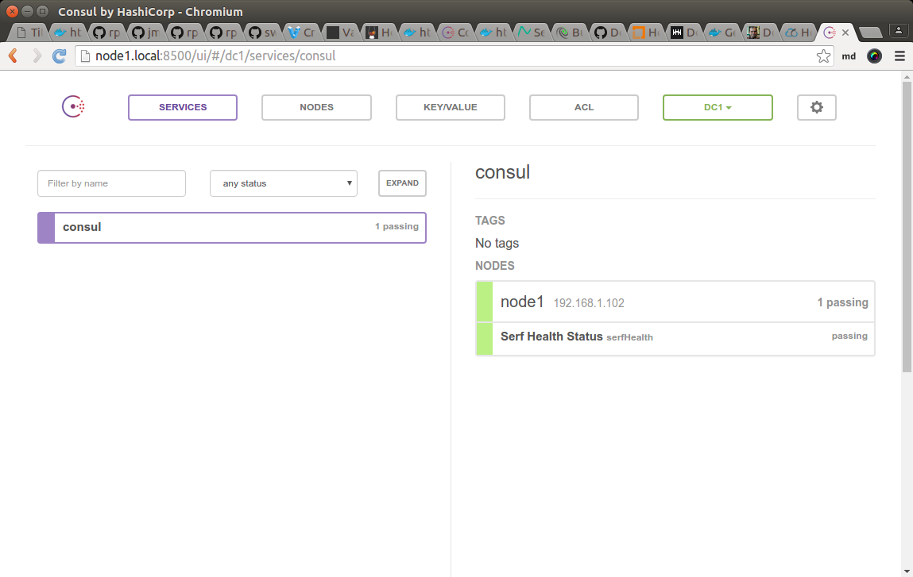
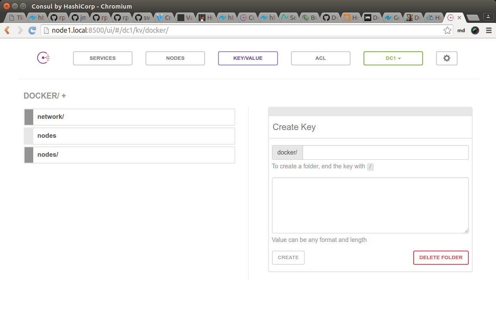
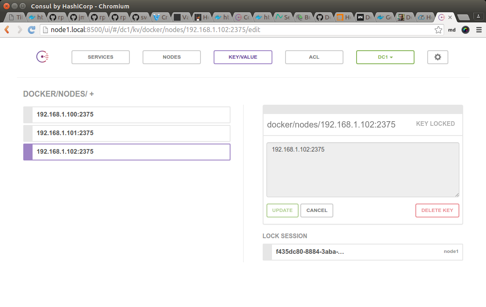
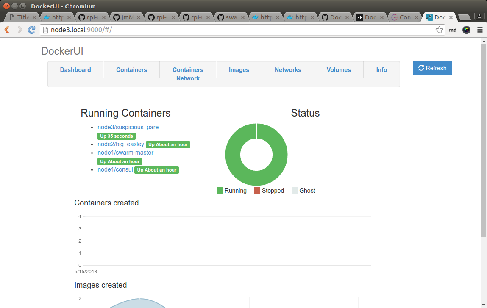
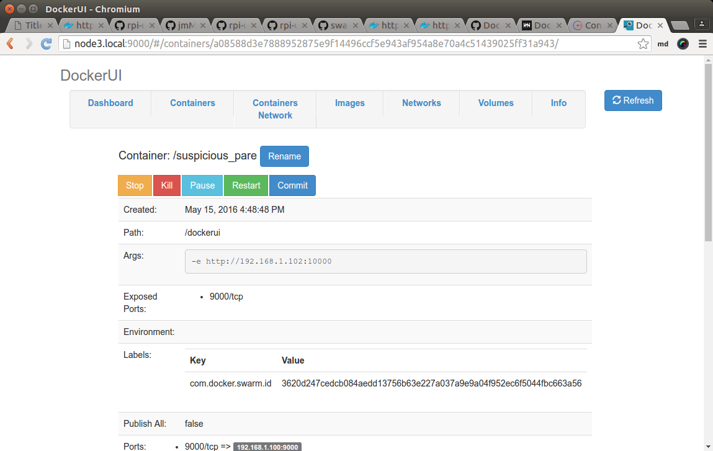
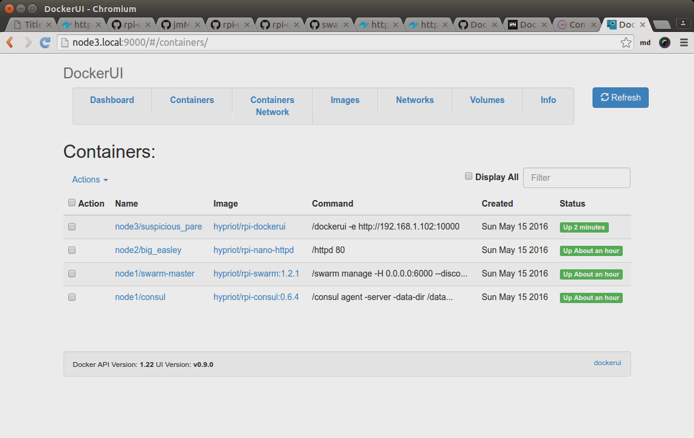
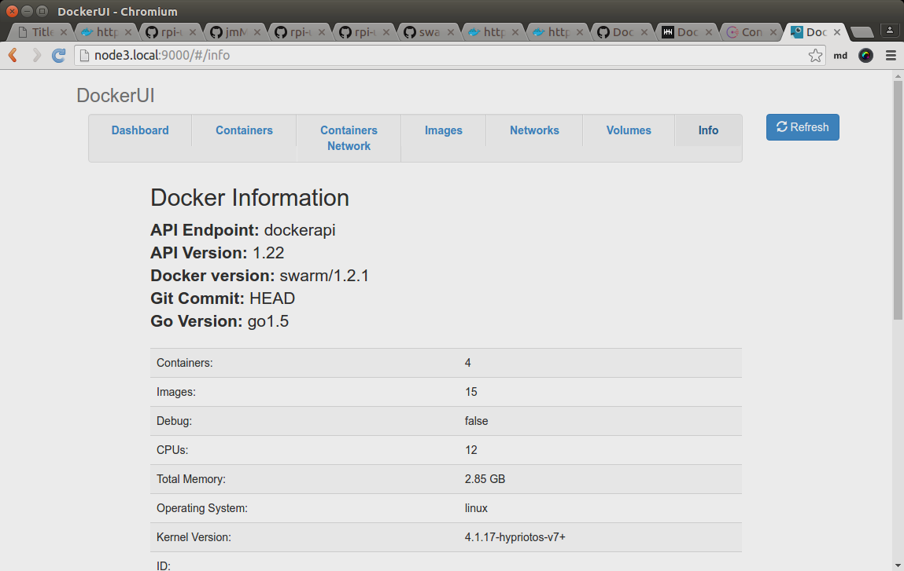

class: split-30 nopadding
background-image: url( https://cloud.githubusercontent.com/assets/4231611/15278632/7c0cb7ae-1b45-11e6-9544-45c5cb24d22a.jpg )

.column_t2.center[.vmiddle[
.fgtransparent[
.figplaint[

]
]
]]
.column_t2[.vmiddle.nopadding[
.shadelightdark[.boxtitle1[
### Container Cluster
# Consul &amp; Swarm

### [Eueung Mulyana](https://github.com/eueung)
### http://eueung.github.io/docker-stuff/consul
#### CodeLabs | [Attribution-ShareAlike CC BY-SA](https://creativecommons.org/licenses/by-sa/4.0/)
#### 
]]
]]

---
class: column_t1 middle

.fonth4[
.tab1.fullwidth[
| Outline  |
|:-------------:|
| Consul - Introduction |
| RPI Swarm Cluster + Consul |
]]

---
class: split-30 nopadding
background-image: url( https://cloud.githubusercontent.com/assets/4231611/15278632/7c0cb7ae-1b45-11e6-9544-45c5cb24d22a.jpg )

.column_t2.center[.vmiddle[
.fgtransparent[
.figplaint[

]
]
]]
.column_t2[.vmiddle.nopadding[
.shadelightdark[.boxtitle1[
### Consul
# Introduction

### 
### 
#### 
#### 
]]
]]


---
class: split-50 nopadding 
background-image: url(images/p01.jpg)

.column_bt[.vmiddle.pushfront.right[
<br/><br/><br/><br/><br/><br/><br/><br/><br/><br/><br/>
# Consul

Consul is s a tool for .yellow[discovering] and .yellow[configuring] .uline[services] in our infrastructure.

###Key Features

Service Discovery .bluelight[|] Health Checking .bluelight[|] .yellow[**Key/Value Store**] .bluelight[|]
Multi Datacenter

]]
.column_t2[.vmiddle.right[
]]

---
class: split-50 nopadding 

.column_t2[.vmiddle.right[
##Service Discovery

Clients of Consul can .uline[provide] a service, such as api or mysql, and other clients can use Consul to **discover** .uline[providers] of a given service. Using either DNS or HTTP, applications can .uline[easily find] the services they depend upon.

##Health Checking

Consul clients can provide any number of .uline[health checks], either associated with a given **service** ("is the webserver returning 200 OK"), or with the **local** node ("is memory utilization below 90%"). This information can be used by an operator to monitor cluster health, and it is used by the service discovery components to route traffic away from unhealthy hosts.

]]
.column_t1[.vmiddle.pushfront[
##Key/Value Store

Applications can make use of Consul's hierarchical **key/value store** for any number of purposes, including .bluelight[dynamic configuration], feature flagging, .bluelight[coordination], leader election, and more. The simple HTTP API makes it easy to use.

##Multi Datacenter

Consul supports multiple datacenters out of the box. This means users of Consul do not have to worry about building additional layers of abstraction to grow to .uline[multiple] regions.

Ref: [Introduction - Consul by HashiCorp](https://www.consul.io/intro/index.html)

####&nbsp;
####&nbsp;
]]

---
class: split-50 nopadding 

.column_t1[.vmiddle.right[
# Architecture
.fonth5[
Consul is a .yellow[**distributed**], highly available system. 

Every node that .uline[provides] services to Consul runs .yellow[a Consul agent]. Running an agent is .uline[not] required for .uline[discovering] other **services** or getting/setting **key/value data**. The agent is responsible for health checking the .bluelight[services] on the node as well as .bluelight[the node itself].]

]]
.column_t2[.vmiddle.pushfront[
The .uline[agents] talk to one or more Consul .red[**servers**]. The Consul servers are where data is stored and replicated. The servers themselves .uline[elect] a .blue[**leader**]. While Consul can function with **one** server, **3 to 5** is recommended to avoid failure scenarios leading to data loss. A **cluster** of Consul servers is recommended for .uline[each] datacenter.

Components of your infrastructure that need to discover other services or nodes can .uline[query] **any** of the Consul .red[servers] or **any** of the Consul .blue[agents]. The agents .uline[forward] queries to the servers automatically.

Each datacenter runs a .uline[cluster] of Consul servers. When a .uline[cross-datacenter] service discovery or configuration request is made, the .uline[local] Consul .red[servers] forward the request to the .uline[remote] datacenter and return the result.

Ref: [Introduction - Consul by HashiCorp](https://www.consul.io/intro/index.html)

]]

---
background-image: url(images/10000ft.png)

---
class: split-30 nopadding
background-image: url( https://cloud.githubusercontent.com/assets/4231611/15278632/7c0cb7ae-1b45-11e6-9544-45c5cb24d22a.jpg )

.column_t2.center[.vmiddle[
.fgtransparent[
.figplaint[

]
]
]]
.column_t2[.vmiddle.nopadding[
.shadelightdark[.boxtitle1[
### 
# RPI Swarm Cluster + Consul

### 
### 
#### 
#### 
]]
]]

---
class: column_t1 center middle

# Let's rebuild our .uline[previous] container cluster with Consul..
### Check [it](http://eueung.github.io/docker-stuff/cluster) again if necessary: [Docker Swarm Cluster](http://eueung.github.io/docker-stuff/cluster)   

---
class: split-70 nopadding 
background-image: url(images/cluster.jpg)

.column_t2[.vmiddle.right[

]]
.column_bt[.vmiddle.pushfront[
# A 3-Node RPI Cluster
<hr>

### node1
192.168.1.102

### node2
192.168.1.101

### node3
192.168.1.100
]]

---
class: split-40 nopadding 

.column_t2[.vmiddle.pushfront.right[
### A Note
# SSH Setting

]]
.column_t1[.vmiddle[

```bash

*$ ssh-keygen -R node1.local
*$ ssh-copy-id -oStrictHostKeyChecking=no -oCheckHostIP=no root@$node1.local

# if necessary
*$ ssh -oStrictHostKeyChecking=no -oCheckHostIP=no root@$node1.local
*$ ssh-keygen -R 192.168.1.102

```

]]

---
class: split-40 nopadding 

.column_t1[.vmiddle.pushfront.right[
### Engine Config
# DOCKER_OPTS

]]
.column_t2[.vmiddle[

```bash

# etc/default/docker
*DOCKER_OPTS="--storage-driver=overlay -D -H tcp://0.0.0.0:2375 --cluster-store consul://192.168.1.102:8500 --cluster-advertise=eth0:2375"

# if necessary
*$ systemctl restart docker
*$ docker info 
*$ ps aux | grep docker

```

]]

---
class: split-40 nopadding 

.column_t2[.vmiddle.pushfront.right[
# Start Consul &amp; Swarm Master

]]
.column_t1[.vmiddle[

```bash
*# start.sh

function getip() { (traceroute $1 2>&1 | head -n 1 | cut -d\( -f 2 | cut -d\) -f 1) }

IP_ADDRESS=$(getip $1)
echo $IP_ADDRESS

*docker -H $IP_ADDRESS:2375 run \
*  -d --net=host --name=consul \
*  -v /data -p 8500:8500 \
*  hypriot/rpi-consul:0.6.4 agent -server -data-dir /data -bootstrap-expect 1 \
*  -ui-dir=/ui \
*  -advertise=$IP_ADDRESS -bind=$IP_ADDRESS -client=$IP_ADDRESS 

*docker -H $IP_ADDRESS:2375 run \
*  -d -p 10000:6000 --name=swarm-master \
*  hypriot/rpi-swarm:1.2.1 manage -H 0.0.0.0:6000 \
*  --discovery-opt="kv.path=docker/nodes" \
*  consul://$IP_ADDRESS:8500
```

```bash

*$ ./start.sh node1.local

```

]]

---
class: split-40 nopadding 

.column_t1[.vmiddle.pushfront.right[
# Check &amp; Test

]]
.column_t2[.vmiddle[

```bash

*$ export DOCKER_HOST=tcp://192.168.1.102:10000
*$ docker run -d -p 8080:80 hypriot/rpi-nano-httpd
571d31928b3db90fc6baffa088c25c645f8d55d5e144dc03816ef5f6af62ae21

*$ docker ps
CONTAINER ID        IMAGE                      COMMAND                  CREATED             STATUS              PORTS                                     NAMES
*571d31928b3d        hypriot/rpi-nano-httpd     "/httpd 80"              8 seconds ago       Up 5 seconds        192.168.1.101:8080->80/tcp                node2/big_easley
d897b5aeab29        hypriot/rpi-swarm:1.2.1    "/swarm manage -H 0.0"   6 minutes ago       Up 6 minutes        2375/tcp, 192.168.1.102:10000->6000/tcp   node1/swarm-master
dc1bb0bd5188        hypriot/rpi-consul:0.6.4   "/consul agent -serve"   6 minutes ago       Up 6 minutes                                                  node1/consul

```

]]

---
class: split-40 nopadding 

.column_t1[.vmiddle.pushfront.right[
# Check &amp; Test

]]
.column_t2[.vmiddle[

```bash
*$ docker info

*Containers: 3
 Running: 3 - Paused: 0 - Stopped: 0
Images: 11
*Server Version: swarm/1.2.1
Role: primary
Strategy: spread
Filters: health, port, containerslots, dependency, affinity, constraint
*Nodes: 3
* node1: 192.168.1.102:2375
  - ID: ASSH:N743:XQ4D:2B3A:LQA6:ESIO:PHBI:RPN7:NWMP:5WK2:4X4F:WNY5 - Status: Healthy
  - Containers: 2
  - Reserved CPUs: 0 / 4
  - Reserved Memory: 0 B / 971.8 MiB
  - Labels: executiondriver=native-0.2, kernelversion=4.1.17-hypriotos-v7+, operatingsystem=Raspbian GNU/Linux 8 (jessie), storagedriver=overlay
  - Error: (none) - UpdatedAt: 2016-05-15T08:34:02Z
  - ServerVersion: 1.10.2
* node2: 192.168.1.101:2375
  - Containers: 1
  - Reserved CPUs: 0 / 4
  - Reserved Memory: 0 B / 971.8 MiB
* node3: 192.168.1.100:2375
  - Containers: 0
  - Reserved CPUs: 0 / 4
  - Reserved Memory: 0 B / 971.8 MiB
...
Kernel Version: 4.1.17-hypriotos-v7+ - Operating System: linux - Architecture: arm
*CPUs: 12
*Total Memory: 2.847 GiB
Name: d897b5aeab29
```

]]

---
class: column_t1  middle center

# Consul UI
#### &nbsp;

.figstyle1[

]

---
class: column_t1  middle center

# Consul UI
#### &nbsp;

.figstyle1[

]

---
class: column_t1  middle center

# Consul UI
#### &nbsp;

.figstyle1[

]

---
class: split-40 nopadding 

.column_t1[.vmiddle.pushfront.right[
### Now: UI for Docker
# Try DockerUI

]]
.column_t2[.vmiddle[

```bash

*$ docker run -d -p 9000:9000 hypriot/rpi-dockerui:v0.9.0 -e http://192.168.1.102:10000
a08588d3e7888952875e9f14496ccf5e943af954a8e70a4c51439025ff31a943

*$ docker ps
CONTAINER ID        IMAGE                      COMMAND                  CREATED             STATUS              PORTS                                     NAMES
*a08588d3e788        hypriot/rpi-dockerui       "/dockerui -e http://"   6 seconds ago       Up 4 seconds        192.168.1.100:9000->9000/tcp              node3/suspicious_pare
571d31928b3d        hypriot/rpi-nano-httpd     "/httpd 80"              About an hour ago   Up About an hour    192.168.1.101:8080->80/tcp                node2/big_easley
d897b5aeab29        hypriot/rpi-swarm:1.2.1    "/swarm manage -H 0.0"   About an hour ago   Up About an hour    2375/tcp, 192.168.1.102:10000->6000/tcp   node1/swarm-master
dc1bb0bd5188        hypriot/rpi-consul:0.6.4   "/consul agent -serve"   About an hour ago   Up About an hour                                              node1/consul

```

]]

---
class: column_t1  middle center

# DockerUI
#### &nbsp;

.figstyle1[

]

---
class: column_t1  middle center

# DockerUI
#### &nbsp;

.figstyle1[

]

---
class: column_t1  middle center

# DockerUI
#### &nbsp;

.figstyle1[

]

---
class: column_t1  middle center

# DockerUI
#### &nbsp;

.figstyle1[

]


---
class: split-30 nopadding
background-image: url( https://cloud.githubusercontent.com/assets/4231611/15278632/7c0cb7ae-1b45-11e6-9544-45c5cb24d22a.jpg )

.column_t2.center[.vmiddle[
.fgtransparent[
.figplaint[

]
]
]]
.column_t2[.vmiddle.nopadding[
.shadelightdark[.boxtitle1[
### 
# Refs

### 
### 
#### 
#### 
]]
]]

---
# Refs
.fonth5[
1. [Introduction - Consul by HashiCorp](https://www.consul.io/intro/index.html)
1. [Consul Architecture - Consul by HashiCorp](https://www.consul.io/docs/internals/architecture.html)
1. [kevana/ui-for-docker: An unofficial web interface for Docker, formerly known as DockerUI](https://github.com/kevana/ui-for-docker)
1. [consul @ docker hub](https://hub.docker.com/r/library/consul/)
1. [progrium/consul @ docker hub](https://hub.docker.com/r/progrium/consul/)
1. [gliderlabs/consul @ docker hub](https://hub.docker.com/r/gliderlabs/consul/) | [consul-agent](https://hub.docker.com/r/gliderlabs/consul-agent/~/dockerfile/) | [consul-server](https://hub.docker.com/r/gliderlabs/consul-server/~/dockerfile/)

]

---
class: split-30 nopadding
background-image: url( https://cloud.githubusercontent.com/assets/4231611/15278632/7c0cb7ae-1b45-11e6-9544-45c5cb24d22a.jpg )

.column_t2.center[.vmiddle[
.fgtransparent[
.figplaint[

]
]
]]
.column_t2[.vmiddle.nopadding[
.shadelightdark[.boxtitle1[
### 
# END

### [Eueung Mulyana](https://github.com/eueung)
### http://eueung.github.io/docker-stuff/consul
#### CodeLabs | [Attribution-ShareAlike CC BY-SA](https://creativecommons.org/licenses/by-sa/4.0/)
#### 
]]
]]

