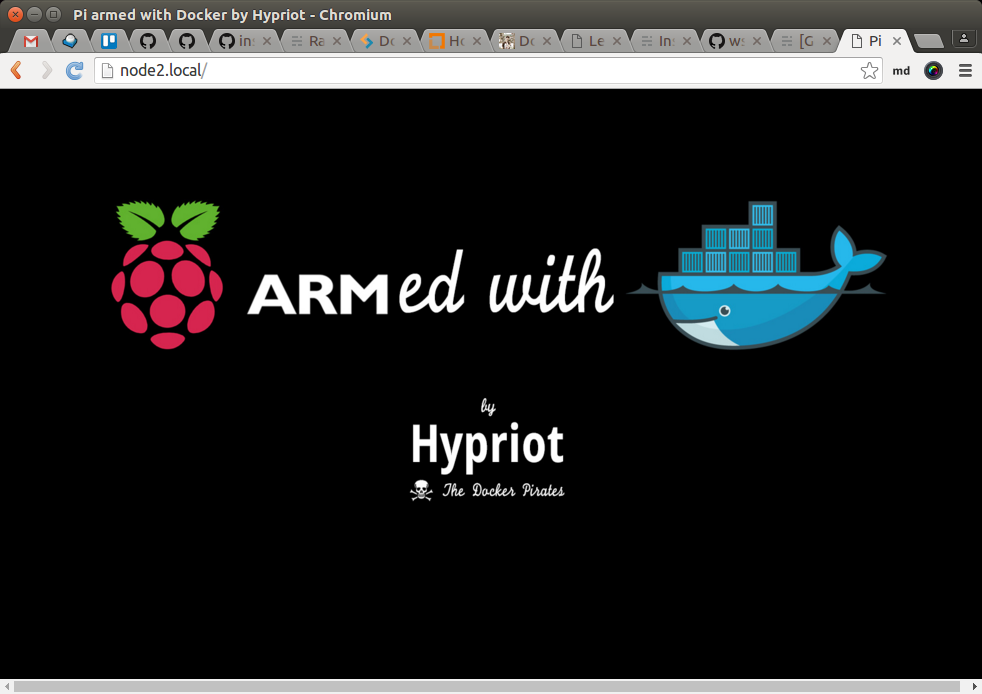
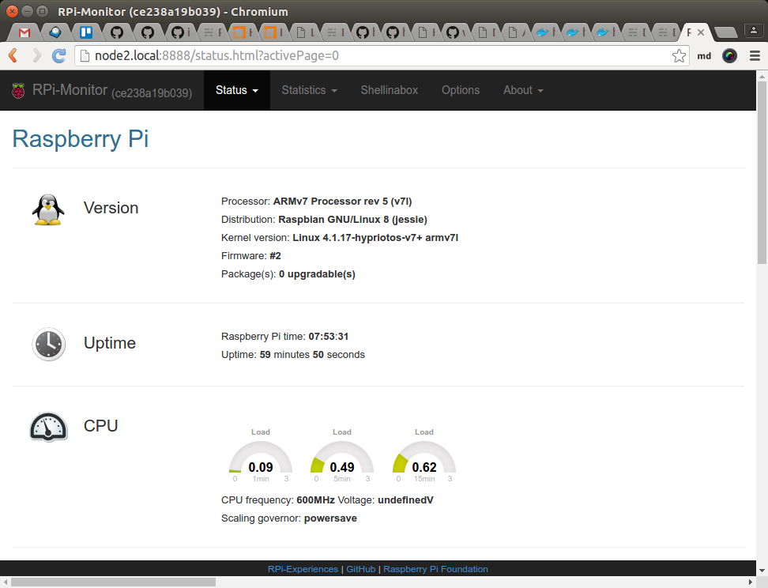
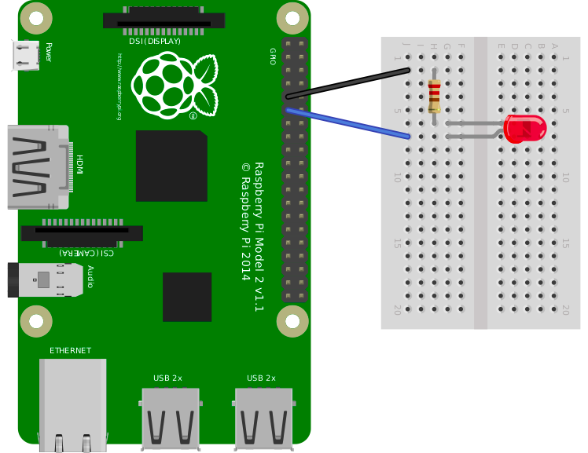
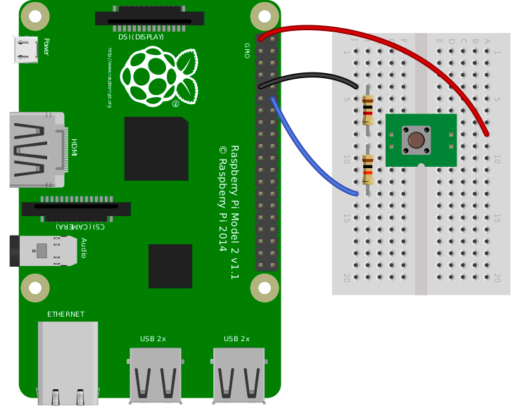

class: split-30 nopadding
background-image: url( https://cloud.githubusercontent.com/assets/4231611/15031524/7fe67312-1283-11e6-8911-608c0951f217.jpg )

.column_t2.center[.vmiddle[
.fgtransparent[
.figplaint[

]
]
]]
.column_t2[.vmiddle.nopadding[
.shadelightdark[.boxtitle1[
### HypriotOS
# Docker on ARM Boards

### [Eueung Mulyana](https://github.com/eueung)
### http://eueung.github.io/docker-stuff/hypriot
#### CodeLabs | [Attribution-ShareAlike CC BY-SA](https://creativecommons.org/licenses/by-sa/4.0/)
#### 
]]
]]

---
class: column_t1 middle

.fonth4[
.tab1.fullwidth[
| Outline  |
|:-------------:|
| Team Hypriot &amp; HypriotOS |
| Quick-Start |
| Let's Get Physical |
]]

---
class: split-30 nopadding
background-image: url( https://cloud.githubusercontent.com/assets/4231611/15031524/7fe67312-1283-11e6-8911-608c0951f217.jpg )

.column_t2.center[.vmiddle[
.fgtransparent[
.figplaint[

]
]
]]
.column_t2[.vmiddle.nopadding[
.shadelightdark[.boxtitle1[
### 
# Team Hypriot &amp; HypriotOS

### 
### 
#### 
#### 
]]
]]

---
class: split-50 nopadding 

.column_t2[.vmiddle.pushfront.right[

.figplaint[

]

Ref: [Dieter Reuter](), [Hypriot](http://blog.hypriot.com/)

]]
.column_t1[.vmiddle[
## Team Hypriot - Goals
###Containers and the Internet of Things
- evangelizing to use Docker container on ARM boards
- convincing Docker containers for IoT applications
- enabling the Docker ecosystem on low-powered devices

.fonth5.bluelight[Pushing the Docker technology into the IoT world]

<hr/>

"Since we started in early 2015 our mission was to make container technology a first class citizen on ARM and IoT devices. Then and now Docker was the dominant container technology so it made sense to concentrate on Docker"

]]

---
class: split-50 nopadding 

.column_t1[.vmiddle.pushfront.right[
# HypriotOS

A minimal Debian-based operating systems that is optimized to run Docker

First Release 02/2014

Ref: [About HypriotOS](http://blog.hypriot.com/about/)

]]
.column_t2[.vmiddle[

##Main Features 

- **minimal Debian-based operating system** - most people know how to use Debian & Ubuntu based distros
- **optimized for Docker awesomeness** - from optimized and tuned Linux kernel settings to the included fileystems everything is aligned to make Docker run very well
- **up-to-date Docker versions** - often we are only mere seconds behind the officially published upstream versions
- **really easy to use** - download, flash and boot - that's all you need to get started

]]

---
class: split-50 nopadding 

.column_t2[.vmiddle.pushfront.right[
## Concepts - Parts and Ideas
##The New HypriotOS

A Debian-based **root filesystem** (32 and 64-bit)

A board **specific layer**: Linux kernel, firmware, bootloader

A **common** layer: Hypriot specific settings and tools, Docker Engine, Compose, Swarm, Machine

An .uline[optional] **application** layer e.g. Hypriot Cluster Lab

]]
.column_t1[.vmiddle[

]]

---
class: center
background-image: url(images/complete.jpg)

## Complete Docker Toolset on ARM

---
class: split-30 nopadding
background-image: url( https://cloud.githubusercontent.com/assets/4231611/15031524/7fe67312-1283-11e6-8911-608c0951f217.jpg )

.column_t2.center[.vmiddle[
.fgtransparent[
.figplaint[

]
]
]]
.column_t2[.vmiddle.nopadding[
.shadelightdark[.boxtitle1[
### 
# Quick-Start

### 
### 
#### 
#### 
]]
]]

---
class: column_t1 center middle

# Let's Try It ...
### My Case: amd64 Machine, Ubuntu 16.04

---
class: split-50 nopadding 

.column_t2[.vmiddle.pushfront.right[
### Step #1
# Prepare &amp; Flash

]]
.column_t1[.vmiddle[

```bash
*$ sudo apt install pv awscli
*$ sudo apt install nmap

# awscli might not be necessary

*$ wget https://raw.githubusercontent.com/hypriot/flash/master/$(uname -s)/flash
*$ chmod +x flash
*$ sudo mv flash /usr/local/bin/flash

*$ flash --hostname node2 hypriot-rpi-20160306-192317.img
# mmcblk0
# or flash http://downloads.hypriot.com/hypriot-rpi-20160306-192317.img.zip

# or using dd
# umount ...
*# sudo dd if=hypriot.img of=/dev/mmcblk0 bs=1M
# umount ...

*$ lsblk
NAME        MAJ:MIN RM   SIZE RO TYPE MOUNTPOINT
sda           8:0    0 465,8G  0 disk 
  sda1        8:1    0 449,9G  0 part /
  sda2        8:2    0     1K  0 part 
  sda5        8:5    0  15,9G  0 part [SWAP]
sr0          11:0    1  1024M  0 rom  
*mmcblk0     179:0    0  14,9G  0 disk 
  mmcblk0p1 179:1    0    60M  0 part /media/em/boot
  mmcblk0p2 179:2    0  14,9G  0 part /media/em/e6e7f776-...
```

]]

---
class: split-50 nopadding 

.column_t1[.vmiddle.pushfront.right[
### Step #2
# Switch-On &amp; Connect

]]
.column_t2[.vmiddle[

```bash
*$ ping node2.local
PING node2.local (192.168.1.100) 56(84) bytes of data.
64 bytes from 192.168.1.100: icmp_seq=1 ttl=64 time=6.44 ms
64 bytes from 192.168.1.100: icmp_seq=2 ttl=64 time=1.96 ms
...

*$ ssh root@node2.local
The authenticity of host 'node2.local (192.168.1.100)' can't be established.
ECDSA key fingerprint is SHA256:tNrdOcXb8tzuEWcC9yJNSP1c51l+7fLJ+QEchAIHA74.
Are you sure you want to continue connecting (yes/no)? yes
Warning: Permanently added 'node2.local,192.168.1.100' (ECDSA) to the list of known hosts.
root@node2.local's password: 

The programs included with the Debian GNU/Linux system are free software;
the exact distribution terms for each program are described in the
individual files in /usr/share/doc/*/copyright.

Debian GNU/Linux comes with ABSOLUTELY NO WARRANTY, to the extent
permitted by applicable law.
HypriotOS: root@node2 in ~
$ 

*# Creds: root/hypriot or pi/raspberry

```

]]

---
class: split-50 nopadding 

.column_t2[.vmiddle.pushfront.right[
### Step #3
# Explore - General

]]
.column_t1[.vmiddle[

```bash
*HypriotOS: root@node2 in ~
*$ hostnamectl
   Static hostname: node2
         Icon name: computer
           Chassis: n/a
        Machine ID: f2bcb4a318f14a049f7a3618d9c471c8
           Boot ID: 399cf20c996d46c4bf0342aa6bbaa739
  Operating System: Raspbian GNU/Linux 8 (jessie)
            Kernel: Linux 4.1.17-hypriotos-v7+
      Architecture: arm

*$ cat /etc/os-release
PRETTY_NAME="Raspbian GNU/Linux 8 (jessie)"
NAME="Raspbian GNU/Linux"
VERSION_ID="8"
VERSION="8 (jessie)"
ID=raspbian
ID_LIKE=debian
HOME_URL="http://www.raspbian.org/"
SUPPORT_URL="http://www.raspbian.org/RaspbianForums"
BUG_REPORT_URL="http://www.raspbian.org/RaspbianBugs"
```

]]

---
class: split-50 nopadding 

.column_t1[.vmiddle.pushfront.right[
### Step #4
# Explore - Docker Stuff

]]
.column_t2[.vmiddle[

```bash
*$ docker version

Client:
 Version:      1.10.2
 API version:  1.22
 Go version:   go1.4.3
 Git commit:   c3959b1
 Built:        Wed Feb 24 09:51:38 2016
 OS/Arch:      linux/arm

Server:
 Version:      1.10.2
 API version:  1.22
 Go version:   go1.4.3
 Git commit:   c3959b1
 Built:        Wed Feb 24 09:51:38 2016
 OS/Arch:      linux/arm

*$ docker-compose version
docker-compose version 1.6.2, build 4d72027
docker-py version: 1.7.2
CPython version: 2.7.9
OpenSSL version: OpenSSL 1.0.1k 8 Jan 2015

*$ docker-machine --version
docker-machine version 0.4.1 (549d016)

```

]]

---
class: split-50 nopadding 

.column_t2[.vmiddle.pushfront.right[
### Step #4
# Explore - Docker Stuff

]]
.column_t1[.vmiddle[

```bash
*$ docker info

Containers: 0
 Running: 0
 Paused: 0
 Stopped: 0
Images: 2
Server Version: 1.10.2
Storage Driver: overlay
 Backing Filesystem: extfs
Execution Driver: native-0.2
Logging Driver: json-file
Plugins: 
 Volume: local
 Network: bridge null host
*Kernel Version: 4.1.17-hypriotos-v7+
*Operating System: Raspbian GNU/Linux 8 (jessie)
*OSType: linux
*Architecture: armv7l
*CPUs: 4
*Total Memory: 925.5 MiB
Name: node2
ID: HX6D:ZAUS:RCVC:OA6Y:NTU6:KJ2P:KUIF:BE6Q:ANIX:U3NE:CMDO:TCHX
Debug mode (server): true
 File Descriptors: 11
 Goroutines: 20
 System Time: 2016-04-28T12:17:14.540758764+02:00
 EventsListeners: 0
 Init SHA1: dfeb8c17f8c3a118753fea8353b715a7a75f5491
 Init Path: /usr/lib/docker/dockerinit
 Docker Root Dir: /var/lib/docker
```

]]


---
class: split-50 nopadding 

.column_t1[.vmiddle.pushfront.right[
### Step #5
# Try - Hypriot World

]]
.column_t2[.vmiddle[

```bash
*HypriotOS: root@node2 in ~
*$ docker pull hypriot/rpi-busybox-httpd

Using default tag: latest
latest: Pulling from hypriot/rpi-busybox-httpd
c74a9c6a645f: Pull complete 
6f1938f6d8ae: Pull complete 
e1347d4747a6: Pull complete 
a3ed95caeb02: Pull complete 
Digest: sha256:c00342f952d97628bf5dda457d3b409c37df687c859df82b9424f61264f54cd1
Status: Downloaded newer image for hypriot/rpi-busybox-httpd:latest

*HypriotOS: root@node2 in ~
*$ docker images
REPOSITORY                  TAG                 IMAGE ID            CREATED             SIZE
hypriot/rpi-swarm           latest              c298de062190        7 weeks ago         13.27 MB
hypriot/rpi-busybox-httpd   latest              fbd9685c5ffc        10 months ago       2.156 MB

*$ docker run -d -p 80:80 hypriot/rpi-busybox-httpd
eab926d842ab7b334810517fd5e4574683494d1bb82bcf42dabd8c107e7fbc33
HypriotOS: root@node2 in ~

*$ docker ps
CONTAINER ID        IMAGE                       COMMAND                  CREATED             STATUS              PORTS                NAMES
eab926d842ab        hypriot/rpi-busybox-httpd   "/bin/busybox httpd -"   7 seconds ago       Up 4 seconds        0.0.0.0:80->80/tcp   drunk_davinci

```

]]

---
class: column_t1 center middle

.figstyle1[

]

---
class: split-50 nopadding 

.column_t1[.vmiddle.pushfront.right[
### Step #5
## Another Try - RPI Monitor

]]
.column_t2[.vmiddle[

```bash
*$ docker build -t jancelin/rpi-monitor git://github.com/jancelin/docker-rpi-monitor

*$ docker images
REPOSITORY                  TAG                 IMAGE ID            CREATED             SIZE
jancelin/rpi-monitor        latest              6e70c482c2a2        26 seconds ago      223.4 MB
hypriot/rpi-swarm           latest              c298de062190        8 weeks ago         13.27 MB
hypriot/rpi-busybox-httpd   latest              fbd9685c5ffc        10 months ago       2.156 MB

*$ docker run -p 8888:8888 -p 4200:4200 -d -t jancelin/rpi-monitor
```

]]

---
class: center middle

.figstyle1[

]

---
class: split-30 nopadding
background-image: url( https://cloud.githubusercontent.com/assets/4231611/15031524/7fe67312-1283-11e6-8911-608c0951f217.jpg )

.column_t2.center[.vmiddle[
.fgtransparent[
.figplaint[

]
]
]]
.column_t2[.vmiddle.nopadding[
.shadelightdark[.boxtitle1[
### [Basic wPi @ Hypriot](http://blog.hypriot.com/post/lets-get-physical/)
# Let's Get Physical

### 
### 
#### 
#### 
]]
]]

---
class: split-50 nopadding 

.column_t1[.vmiddle.pushfront.right[

# Pull Image
## .yellow[hypriot/rpi-gpio]

... the binary from the **wiringPi** project within a Docker container

]]
.column_t2[.vmiddle[

```bash
*$ docker pull hypriot/rpi-gpio
Using default tag: latest
latest: Pulling from hypriot/rpi-gpio

8e7875cfab37: Pull complete 
6953557b7832: Pull complete 
Digest: sha256:4055a39a2b68404c0ac9516b5440d103e52eb711b53e78693a532bd820c5c9c1
Status: Downloaded newer image for hypriot/rpi-gpio:latest

*HypriotOS: root@node2 in ~
*$ docker images
REPOSITORY                  TAG                 IMAGE ID            CREATED             SIZE
hypriot/rpi-swarm           latest              c298de062190        8 weeks ago         13.27 MB
hypriot/rpi-busybox-httpd   latest              fbd9685c5ffc        10 months ago       2.156 MB
*hypriot/rpi-gpio            latest              b35a44695fd0        14 months ago       2.069 MB
```

]]

---
class: center middle

.figplaint[

]

---
class: split-30 nopadding 

.column_t1[.vmiddle.pushfront.right[

# GPIO readall

]]
.column_t2[.vmiddle[

```bash
*HypriotOS: root@node2 in ~
*$ docker run --rm --cap-add SYS_RAWIO --device /dev/mem hypriot/rpi-gpio readall
 +-----+-----+---------+------+---+---Pi 2---+---+------+---------+-----+-----+
 | BCM | wPi |   Name  | Mode | V | Physical | V | Mode | Name    | wPi | BCM |
 +-----+-----+---------+------+---+----++----+---+------+---------+-----+-----+
 |     |     |    3.3v |      |   |  1 || 2  |   |      | 5v      |     |     |
 |   2 |   8 |   SDA.1 |   IN | 1 |  3 || 4  |   |      | 5V      |     |     |
 |   3 |   9 |   SCL.1 |   IN | 1 |  5 || 6  |   |      | 0v      |     |     |
 |   4 |   7 | GPIO. 7 |   IN | 1 |  7 || 8  | 1 | ALT0 | TxD     | 15  | 14  |
 |     |     |      0v |      |   |  9 || 10 | 1 | ALT0 | RxD     | 16  | 15  |
 |  17 |   0 | GPIO. 0 |   IN | 0 | 11 || 12 | 0 | IN   | GPIO. 1 | 1   | 18  |
 |  27 |   2 | GPIO. 2 |   IN | 0 | 13 || 14 |   |      | 0v      |     |     |
 |  22 |   3 | GPIO. 3 |   IN | 0 | 15 || 16 | 0 | IN   | GPIO. 4 | 4   | 23  |
 |     |     |    3.3v |      |   | 17 || 18 | 0 | IN   | GPIO. 5 | 5   | 24  |
 |  10 |  12 |    MOSI |   IN | 0 | 19 || 20 |   |      | 0v      |     |     |
 |   9 |  13 |    MISO |   IN | 0 | 21 || 22 | 0 | IN   | GPIO. 6 | 6   | 25  |
 |  11 |  14 |    SCLK |   IN | 0 | 23 || 24 | 1 | IN   | CE0     | 10  | 8   |
 |     |     |      0v |      |   | 25 || 26 | 1 | IN   | CE1     | 11  | 7   |
 |   0 |  30 |   SDA.0 |   IN | 1 | 27 || 28 | 1 | IN   | SCL.0   | 31  | 1   |
 |   5 |  21 | GPIO.21 |   IN | 1 | 29 || 30 |   |      | 0v      |     |     |
 |   6 |  22 | GPIO.22 |   IN | 1 | 31 || 32 | 0 | IN   | GPIO.26 | 26  | 12  |
 |  13 |  23 | GPIO.23 |   IN | 0 | 33 || 34 |   |      | 0v      |     |     |
 |  19 |  24 | GPIO.24 |   IN | 0 | 35 || 36 | 0 | IN   | GPIO.27 | 27  | 16  |
 |  26 |  25 | GPIO.25 |   IN | 0 | 37 || 38 | 0 | IN   | GPIO.28 | 28  | 20  |
 |     |     |      0v |      |   | 39 || 40 | 0 | IN   | GPIO.29 | 29  | 21  |
 +-----+-----+---------+------+---+----++----+---+------+---------+-----+-----+
 | BCM | wPi |   Name  | Mode | V | Physical | V | Mode | Name    | wPi | BCM |
 +-----+-----+---------+------+---+---Pi 2---+---+------+---------+-----+-----+

```

]]

---
background-image: url(images/p04.jpg)

```bash

*HypriotOS: root@node2 in ~
*$ docker run --rm --cap-add SYS_RAWIO --device /dev/mem hypriot/rpi-gpio write 0 on

```

---
background-image: url(images/p03.jpg)

```bash

*HypriotOS: root@node2 in ~
*$ docker run --rm --cap-add SYS_RAWIO --device /dev/mem hypriot/rpi-gpio write 0 off

```

---
class: center middle

.figplaint[

]

---
class: column_t1 middle

```bash

*HypriotOS: root@node2 in ~
*$ docker run --rm --cap-add SYS_RAWIO --device /dev/mem hypriot/rpi-gpio read 1

# wPi GPIO 1 / BCM 18
# 0 or 1

```

---
class: split-30 nopadding
background-image: url( https://cloud.githubusercontent.com/assets/4231611/15031524/7fe67312-1283-11e6-8911-608c0951f217.jpg )

.column_t2.center[.vmiddle[
.fgtransparent[
.figplaint[

]
]
]]
.column_t2[.vmiddle.nopadding[
.shadelightdark[.boxtitle1[
### 
# Refs

### 
### 
#### 
#### 
]]
]]

---
# Refs
.fonth5[
1. [Docker Pirates ARMed with explosive stuff ](http://blog.hypriot.com/)
1. [Mastering Docker on a Raspberry Pi](http://www.slideshare.net/TeamHypriot/mastering-docker-on-a-raspberry-pi)
1. [Let's get physical with Docker on the Raspberry Pi ](http://blog.hypriot.com/post/lets-get-physical/)
1. [WiringPi](http://wiringpi.com/)

]

---
class: split-30 nopadding
background-image: url( https://cloud.githubusercontent.com/assets/4231611/15031524/7fe67312-1283-11e6-8911-608c0951f217.jpg )

.column_t2.center[.vmiddle[
.fgtransparent[
.figplaint[

]
]
]]
.column_t2[.vmiddle.nopadding[
.shadelightdark[.boxtitle1[
### 
# END

### [Eueung Mulyana](https://github.com/eueung)
### http://eueung.github.io/docker-stuff/hypriot
#### CodeLabs | [Attribution-ShareAlike CC BY-SA](https://creativecommons.org/licenses/by-sa/4.0/)
#### 
]]
]]

