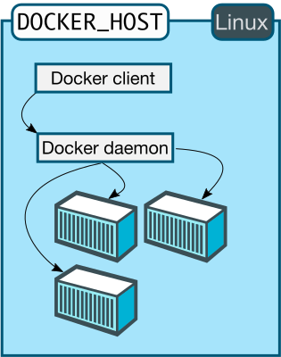
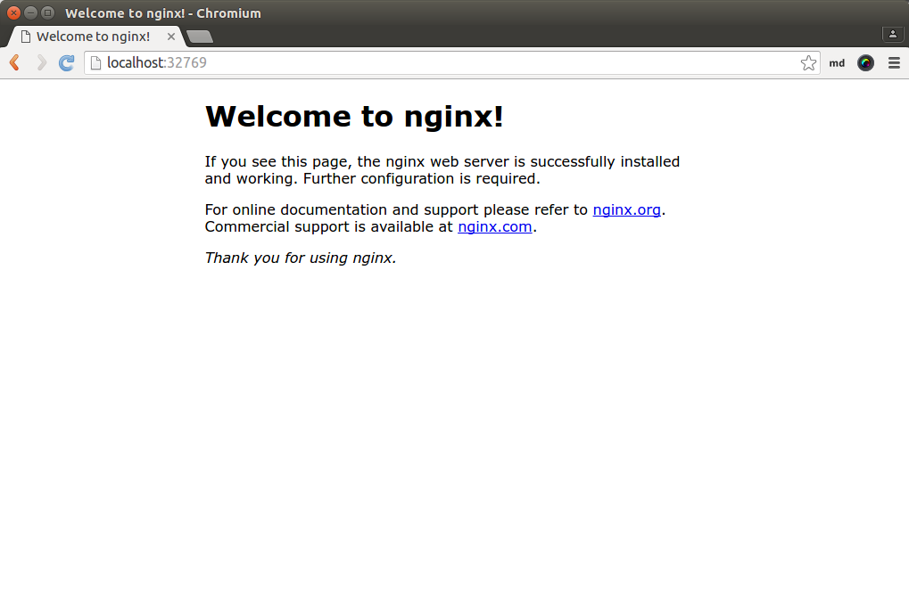
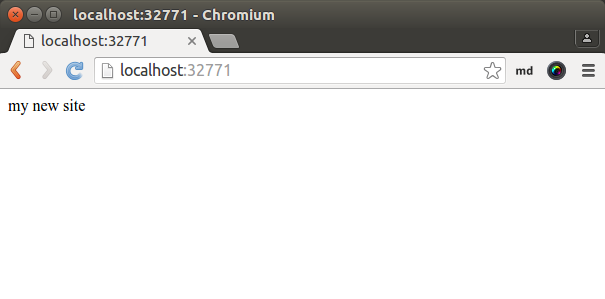
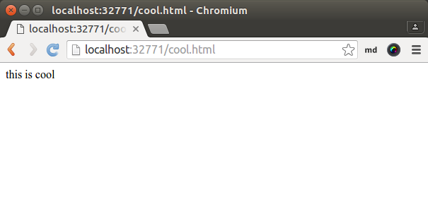
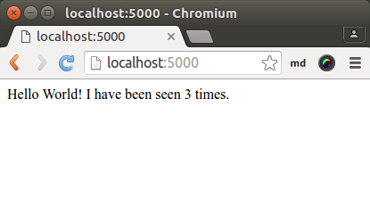

class: split-30 nopadding
background-image: url( https://cloud.githubusercontent.com/assets/4231611/14815979/a38d4a36-0bd8-11e6-8373-2c8896b6221e.jpg )

.column_t2.center[.vmiddle[
.fgtransparent[
.figplaint[

]
]
]]
.column_t2[.vmiddle.nopadding[
.shadelightdark[.boxtitle1[
### App Container
# Docker Basics

### [Eueung Mulyana](https://github.com/eueung)
### http://eueung.github.io/docker-stuff/intro
#### CodeLabs | [Attribution-ShareAlike CC BY-SA](https://creativecommons.org/licenses/by-sa/4.0/)
#### 
]]
]]

---
class: column_t1 middle

.fonth4[
.tab1.fullwidth[
| Outline  |
|:-------------:|
| VMs, Containers, Docker|
| Getting Started - Docker Engine |
| Custom Images |
| Docker Compose |
]]


---
class: split-30 nopadding
background-image: url( https://cloud.githubusercontent.com/assets/4231611/14815979/a38d4a36-0bd8-11e6-8373-2c8896b6221e.jpg )

.column_t2.center[.vmiddle[
.fgtransparent[
.figplaint[

]
]
]]
.column_t2[.vmiddle.nopadding[
.shadelightdark[.boxtitle1[
### VMs, Containers &amp; Docker
# Introduction

### 
### 
#### 
#### 
]]
]]

---
class: split-50 nopadding 

.column_t1[.vmiddle.pushfront.right[
# Virtual Machines
## vs.
# Containers
&nbsp;

.fonth5[
**Containers** have similar resource isolation and allocation benefits as virtual machines but a .uline[different] architectural approach allows them to be .uline[much more] portable and efficient.
]

Ref: [docker.com](https://www.docker.com/what-docker)


]]
.column_t2[.vmiddle[

###Virtual Machines
Each virtual machine includes the application, the necessary binaries and libraries and an .uline[entire] guest operating system - all of which may be **tens** of GBs in size.

###Containers
(Docker) Containers include the application and all of its dependencies, but **share** the kernel with other containers. They run as an .uline[isolated] process in userspace on the host operating system. They're also not tied to any specific infrastructure.

(Docker) **Containers** running on a single machine all .red[**share**] the same operating system kernel so they start instantly and make more efficient use of RAM. Images are constructed from .blue[**layered**] filesystems so they can share common files, making disk usage and image downloads much more efficient.

]]

---
background-image: url(images/p01.jpg)

---

class: split-50 nopadding 

.column_t2[.vmiddle.pushfront.right[
# Containers


Container (lightweight process virtualization) technology is .uline[not] new, mainstream .uline[support] in the **vanilla kernel** however is, paving the way for widespread adoption (Linux Kernel 3.8 - released in February 2013 - cf. Rami Rosen).

.fonth5[
FreeBSD has **Jails**, Solaris has **Zones** and there are other (Linux) container technologies: OpenVZ, VServer, Google Containers, .red[**LXC**]/LXD, .blue[**Docker**], etc.
]

Ref: [Flockport](https://www.flockport.com/lxc-vs-docker/)


]]
.column_t1[.vmiddle[

###LXC
LXC owes its origin to the development of **cgroups** and **namespaces** in the Linux kernel to support lightweight virtualized OS environments (containers) and some early work by Daniel Lezcano and Serge Hallyn dating from 2009 at IBM.

The LXC Project provides tools to manage containers, advanced networking and storage support and a wide choice of minimal container OS templates. It is currently led by a 2 member team, Stephane Graber and Serge Hallyn from Ubuntu. The LXC project is supported by Ubuntu.


###Docker
Docker is a project by **dotCloud** now **Docker Inc** released in March 2013, initially based on the LXC project to build .bluelight[**single**] application containers. Docker has now developed their own implementation .uline[libcontainer] that uses kernel .yellow[namespaces] and .yellow[cgroups] directly.

]]

---

class: split-50 nopadding 

.column_t2[.vmiddle.pushfront.right[
# LXC vs. Docker


Ref: [Flockport](https://www.flockport.com/lxc-vs-docker/)


]]
.column_t1[.vmiddle[

.fonth5[
Both **LXC** and **Docker** are userland container managers that use kernel .uline[namespaces] to provide end user containers. We also now have **Systemd-Nspawn** that does the same thing. 

The only difference is LXC containers have an an init and can thus run .yellow[**multiple**] processes and Docker containers do not have an init and can only run .yellow[**single**] processes.
]

]]

---
background-image: url(images/p02.jpg)

---

class: split-50 nopadding 

.column_t1[.vmiddle.pushfront.right[
# Docker

Docker allows you to package an application with .uline[all] of its .yellow[dependencies] into a standardized unit for software development.

Docker containers wrap up a piece of software in a complete filesystem that contains **everything** it needs to run: code, runtime, system tools, system libraries - anything you can install on a server. This guarantees that it will always run the same, regardless of the environment it is running in.

Docker containers run on any computer, on any infrastructure and in any cloud.

Ref: [docker.com](https://www.docker.com/what-docker)

]]
.column_t2[.vmiddle[

.figplaint[

]

]]

---
class: center middle

.figplaint[

]

Containers isolate individual applications and use operating system resources that have been abstracted by Docker. Containers can be built by "layering", with multiple containers sharing underlying layers, decreasing resource usage. [Ref: Docker Ecosystem - DO](https://www.digitalocean.com/community/tutorials/the-docker-ecosystem-an-introduction-to-common-components)

---

class: split-50 nopadding 

.column_t1[.vmiddle.pushfront.right[
# Docker

Typically, when designing an application or service to use Docker, it works best to break out functionality into individual containers, a design recently known as micro-service architecture. 

This gives you the ability to easily scale or update components independently in the future. 

Having this flexibility is one of the many reasons that people are interested in Docker for development and deployment.

Ref: [Docker Ecosystem - DO](https://www.digitalocean.com/community/tutorials/the-docker-ecosystem-an-introduction-to-common-components)

]]
.column_t2[.vmiddle[
## Advantages
- **Lightweight** resource utilization: instead of virtualizing an entire operating system, containers isolate at the process level and use the host's kernel.
- **Portability**: all of the dependencies for a containerized application are bundled inside of the container, allowing it to run on any Docker host.
- **Predictability**: The host does not care about what is running inside of the container and the container does not care about which host it is running on.  The interfaces are standardized and the interactions are predictable.

]]


---
class: split-30 nopadding
background-image: url( https://cloud.githubusercontent.com/assets/4231611/14815979/a38d4a36-0bd8-11e6-8373-2c8896b6221e.jpg )

.column_t2.center[.vmiddle[
.fgtransparent[
.figplaint[

]
]
]]
.column_t2[.vmiddle.nopadding[
.shadelightdark[.boxtitle1[
### Docker Engine
# Getting Started

### 
### 
#### 
#### 
]]
]]

---

class: split-50 nopadding 

.column_t2[.vmiddle.pushfront[

.figplaint[

]

]]
.column_t1[.vmiddle[
# Docker Engine
When people say "Docker" they typically mean .yellow[**Docker Engine**], the client-server application made up of the Docker .yellow[**daemon**], a .yellow[**REST API**] that specifies interfaces for interacting with the daemon, and a command line interface (.yellow[**CLI**]) client that talks to the daemon (through the REST API wrapper). 

Docker Engine accepts docker commands from the CLI, such as `docker run <image>`, `docker ps` to list running containers, `docker images` to list images, and so on.

Engine is the core of Docker and nothing else will run without it. 

Ref: [docker.com](https://docs.docker.com/machine/overview/)

]]

---
class: column_t1 center middle 

#Docker Architecture
.figplaint[

]

---
class: split-50 nopadding 

.column_t1[.vmiddle.pushfront[
# Docker Architecture

Docker uses a client-server architecture. The Docker .yellow[**client**] talks to the Docker .yellow[**daemon**], which does the heavy lifting of building, running, and distributing your Docker containers. 

Both the Docker client and the daemon can run on the .uline[same] system, or you can connect a Docker client to a .uline[remote] Docker daemon. 

The Docker client and daemon communicate via sockets or through a RESTful API.

]]
.column_t2[.vmiddle[

###Docker daemon
The Docker daemon runs on a host machine. The user does not directly interact with the daemon, but instead through the Docker client.

###Docker client
The Docker client, in the form of the docker binary, is the primary user interface to Docker.

It accepts commands from the user and communicates back and forth with a Docker daemon.

Ref: [docker.com](https://docs.docker.com/engine/understanding-docker/)

]]

---

class: split-50 nopadding 

.column_t2[.vmiddle.pushfront[

.figplaint[

]

]]
.column_t1[.vmiddle[

.figplaint[

]

]]

---
class: column_t1 center middle

# Let's Try It ...
### My Case: amd64 Machine, Ubuntu 16.04

---
class: split-50 nopadding 

.column_t2[.vmiddle[

```bash
*$ curl -fsSL https://get.docker.com/ | sh
*$ docker info
Containers: 1
...
Images: 15
Server Version: 1.11.1
Storage Driver: aufs
...
Logging Driver: json-file
Cgroup Driver: cgroupfs
Plugins: 
...
Kernel Version: 4.4.0-21-generic
Operating System: Ubuntu 16.04 LTS
...
*$ docker version

Client:
 Version:      1.11.1
 API version:  1.23
 Go version:   go1.5.4
 Git commit:   5604cbe
 Built:        Tue Apr 26 23:43:49 2016
 OS/Arch:      linux/amd64

Server:
 Version:      1.11.1
 API version:  1.23
 Go version:   go1.5.4
 Git commit:   5604cbe
 Built:        Tue Apr 26 23:43:49 2016
 OS/Arch:      linux/amd64
```

]]
.column_t1[.vmiddle[
# First Step

```bash
*$ docker run hello-world

Hello from Docker.
This message shows that your installation appears to be working correctly.

To generate this message, Docker took the following steps:
 1. The Docker client contacted the Docker daemon.
 2. The Docker daemon pulled the "hello-world" image from the Docker Hub.
 3. The Docker daemon created a new container from that image which runs the
    executable that produces the output you are currently reading.
 4. The Docker daemon streamed that output to the Docker client, which sent it
    to your terminal.

To try something more ambitious, you can run an Ubuntu container with:
 $ docker run -it ubuntu bash

Share images, automate workflows, and more with a free Docker Hub account:
 https://hub.docker.com

For more examples and ideas, visit:
 https://docs.docker.com/userguide/
```

Ref: [Quickstart](https://docs.docker.com/engine/quickstart/), [Install Docker](https://docs.docker.com/linux/step_one/)

]]

---
class: split-50 nopadding 

.column_t1[.vmiddle[
# Try Some Commands

```bash
*$ docker images
REPOSITORY                  TAG                 SIZE
em/notebook                 v1                  864.9 MB
ubuntu                      16.04               120.1 MB
alpine                      3.3                 4.798 MB
busybox                     latest              1.113 MB
*firecyberice/whalesay       latest              47.25 MB
hello-world                 latest              960 B
*docker/whalesay             latest              247 MB

```

```bash
*$ JOB=$(docker run -d ubuntu /bin/sh -c "while true; do echo Hello world; sleep 1; done")

$ docker stop $JOB
$ docker start $JOB
$ docker restart $JOB

$ docker kill $JOB

$ docker stop $JOB   # Container must be stopped to remove it
$ docker rm $JOB
$ docker rm -f $JOB  # Running container 

```

]]
.column_t2[.vmiddle[

```bash
*$ docker run --rm firecyberice/whalesay Hello Docker
 ______________ 
< Hello Docker >
 -------------- 
    \
     \
      \
                    ##         .
              ## ## ##        ==
           ## ## ## ## ##    ===
       /"""""""""""""""""\___/ ===
  ~~~ {~~ ~~~~ ~~~ ~~~~ ~~~ ~ /  ===- ~~~
       \______ o           __/
         \    \         __/
          \____\_______/

*$ docker ps -a
CONTAINER ID        IMAGE               COMMAND                  CREATED             STATUS                      PORTS                    NAMES
2f6f337530d5        hello-world         "/hello"                 34 minutes ago      Exited (0) 34 minutes ago                            small_pasteur
e71dbedafb57        em/notebook:v1      "tini -- jupyter note"   7 hours ago         Up 7 hours                  0.0.0.0:8888->8888/tcp   prickly_shockley

*$ docker rm -f 2f6f
2f6f
*$ docker ps -a
CONTAINER ID        IMAGE               COMMAND                  CREATED             STATUS              PORTS                    NAMES
e71dbedafb57        em/notebook:v1      "tini -- jupyter note"   7 hours ago         Up 7 hours          0.0.0.0:8888->8888/tcp   prickly_shockley

*$ docker run -it --entrypoint /bin/sh firecyberice/whalesay
```

]]

---
class: split-50 nopadding 

.column_t2[.vmiddle[

```bash
*$ docker run -d -P --name web nginx
224a61ea84cfbf468bd090aebbd0ba534e9b07bb8e7e0068bfaeca1ba72f754b

*$ docker ps
CONTAINER ID        IMAGE               COMMAND                  CREATED             STATUS              PORTS                                           NAMES
224a61ea84cf        nginx               "nginx -g 'daemon off"   8 seconds ago       Up 7 seconds        0.0.0.0:32769->80/tcp, 0.0.0.0:32768->443/tcp   web
e71dbedafb57        em/notebook:v1      "tini -- jupyter note"   10 hours ago        Up 10 hours         0.0.0.0:8888->8888/tcp                          prickly_shockley

*$ docker port web
443/tcp -> 0.0.0.0:32768
80/tcp -> 0.0.0.0:32769

*$ docker stop web
*$ docker rm web
```

]]
.column_t1[.vmiddle[
# nginx

.figplaint[

]

]]

---
class: split-50 nopadding 

.column_t2[.vmiddle[
### Mount a Volume on the Container

```bash
*$ mkdir mysite && cd mysite
*mysite$ echo "my new site" > index.html
*mysite$ docker run -d -P -v $(pwd):/usr/share/nginx/html --name myweb nginx
da01817c28bbdb2f3b71275ba7b9560da4e65f8716329c16787c83181760534c

*mysite$ docker port myweb
443/tcp -> 0.0.0.0:32770
80/tcp -> 0.0.0.0:32771

*mysite$ echo "this is cool" > cool.html
*$ docker stop myweb
*$ docker rm myweb

```

Ref: [docker.com](https://docs.docker.com/v1.8/installation/mac/)

]]
.column_t1[.vmiddle[


.figplaint[

]

.figplaint[

]

]]

---
class: split-30 nopadding
background-image: url( https://cloud.githubusercontent.com/assets/4231611/14815979/a38d4a36-0bd8-11e6-8373-2c8896b6221e.jpg )

.column_t2.center[.vmiddle[
.fgtransparent[
.figplaint[

]
]
]]
.column_t2[.vmiddle.nopadding[
.shadelightdark[.boxtitle1[
### 
# Custom Images

### 
### 
#### 
#### 
]]
]]

---
class: split-50 nopadding 

.column_t1[.vmiddle[
## Build Custom Image

```bash
*$ mkdir mydockerbuild && cd mydockerbuild/ && touch Dockerfile
*$ docker build -t docker-whale .
Sending build context to Docker daemon 2.048 kB
Step 1 : FROM docker/whalesay:latest
 ---> 6b362a9f73eb
Step 2 : RUN apt-get -y update && apt-get install -y fortunes
 ---> Running in 7375f27597d7
...
Step 3 : CMD /usr/games/fortune -a | cowsay
 ---> Running in 09c57e3ebb83
 ---> 428cbace4310
Removing intermediate container 09c57e3ebb83
Successfully built 428cbace4310
```

Ref: [Build your own image](https://docs.docker.com/linux/step_four/)

]]
.column_t2[.vmiddle[

## Dockerfile

```
FROM docker/whalesay:latest
RUN apt-get -y update && apt-get install -y fortunes
CMD /usr/games/fortune -a | cowsay
```

```
*$ docker run docker-whale
 ________________________________________ 
/ On the other hand, life can be an      \
| endless parade of TRANSSEXUAL QUILTING |
| BEES aboard a cruise ship to           |
\ DISNEYWORLD if only we let it!!        /
 ---------------------------------------- 
    \
     \
      \     
                    ##        .            
              ## ## ##       ==            
           ## ## ## ##      ===            
       /""""""""""""""""___/ ===        
  ~~~ {~~ ~~~~ ~~~ ~~~~ ~~ ~ /  ===- ~~~   
       \______ o          __/            
        \    \        __/             
          \____\______/   
```

]]

---
class: split-50 nopadding 

.column_t2[.vmiddle[
## Example Dockerfile
### docker/whalesay

```bash
*FROM ubuntu:14.04

RUN apt-get update \
    && apt-get install -y cowsay --no-install-recommends \
    && rm -rf /var/lib/apt/lists/* \
    && mv /usr/share/cowsay/cows/default.cow /usr/share/cowsay/cows/orig-default.cow

# "cowsay" installs to /usr/games
ENV PATH $PATH:/usr/games

COPY docker.cow /usr/share/cowsay/cows/
RUN ln -sv /usr/share/cowsay/cows/docker.cow /usr/share/cowsay/cows/default.cow

*CMD ["cowsay"]
```


]]
.column_t1[.vmiddle[

### firecyberice/whalesay

```bash
*FROM alpine:3.2

RUN apk update \
    && apk add git perl \
    && cd /tmp/ \
    && git clone https://github.com/jasonm23/cowsay.git \
    && cd cowsay && ./install.sh /usr/local \
    && cd .. \
    && rm -rf cowsay \
    && apk del git

ENV PATH $PATH
COPY docker.cow /usr/local/share/cows/

# Move the "default.cow" out of the way so we can overwrite it with "docker.cow"
RUN \
    mv /usr/local/share/cows/default.cow /usr/local/share/cows/orig-default.cow \
    && ln -sv /usr/local/share/cows/docker.cow /usr/local/share/cows/default.cow

*ENTRYPOINT ["cowsay"]
```

]]

---
class: split-50 nopadding 

.column_t1[.vmiddle[

```bash
*$ docker run --name myredis -it ubuntu:16.04 bash

*root@ac6002b2a98b:/# apt-get update
*root@ac6002b2a98b:/# apt-get install wget
*root@ac6002b2a98b:/# apt-get install build-essential tcl8.5

*root@ac6002b2a98b:/# wget http://download.redis.io/redis-stable.tar.gz
*root@ac6002b2a98b:/# tar xzf redis-stable.tar.gz
*root@ac6002b2a98b:/# cd redis-stable && make && make install
*root@ac6002b2a98b:/# ./redis-stable/utils/install_server.sh
...
Selected config:
Port           : 6379
Config file    : /etc/redis/6379.conf
Log file       : /var/log/redis_6379.log
Data dir       : /var/lib/redis/6379
Executable     : /usr/local/bin/redis-server
Cli Executable : /usr/local/bin/redis-cli
Is this ok? Then press ENTER to go on or Ctrl-C to abort.
Copied /tmp/6379.conf => /etc/init.d/redis_6379
Installing service...
Success!
Starting Redis server...
Installation successful

```

]]
.column_t2[.vmiddle[
## Manual Process
### .red[test/myredis:v1]

```
*root@ac6002b2a98b:/redis-stable# ps ax | grep redis
*root@ac6002b2a98b:/redis-stable# src/redis-cli        
127.0.0.1:6379> set foo bar
OK
127.0.0.1:6379> get foo
"bar"
127.0.0.1:6379> exit

*root@ac6002b2a98b:/redis-stable# exit

*$ docker ps -a
*$ docker commit -m "add redis" -a "em" myredis test/myredis:v1
sha256:9b75a94f67cb47b012f445ed65fb13fc67d05a00ad1bb262d20ba4d29ed4bf7f

*$ docker images | grep redis
test/myredis   v1   9b75a94f67cb   39 seconds ago   408.3 MB
```

Ref: [Getting Started with Docker](https://scotch.io/tutorials/getting-started-with-docker)

]]

---
class: split-50 nopadding 

.column_t2[.vmiddle[
## Dockerfile
### .red[test/myredis:df]

```bash
*$ docker build -t test/myredis:df .

*$ docker images | grep redis
test/myredis   df   9a450ae418d8   About a minute ago   408.6 MB
test/myredis   v1   9b75a94f67cb   13 minutes ago       408.3 MB

*$ docker run -d -p 6379:6379 test/myredis:df
1240a12b56e4a87dfe89e4ca4400eb1cafde802ac0187a54776f9ea54bb7f74f

*$ docker ps
CONTAINER ID        IMAGE               COMMAND                  CREATED             STATUS              PORTS                    NAMES
1240a12b56e4        test/myredis:df          "redis-server"           14 seconds ago      Up 7 seconds        0.0.0.0:6379->6379/tcp   insane_raman

*$ sudo apt-get install redis-tools
*$ redis-cli
127.0.0.1:6379> set bat man
OK
127.0.0.1:6379> get bat
"man"
127.0.0.1:6379> quit
```

]]
.column_t1[.vmiddle[

```
*FROM ubuntu:16.04

RUN apt-get update
RUN apt-get install -y wget
RUN apt-get install -y build-essential tcl8.5

*RUN wget http://download.redis.io/redis-stable.tar.gz
*RUN tar xzf redis-stable.tar.gz
*RUN cd redis-stable && make && make install
*RUN ./redis-stable/utils/install_server.sh

EXPOSE 6379
ENTRYPOINT  ["redis-server"]
```


]]


---
class: split-30 nopadding
background-image: url( https://cloud.githubusercontent.com/assets/4231611/14815979/a38d4a36-0bd8-11e6-8373-2c8896b6221e.jpg )

.column_t2.center[.vmiddle[
.fgtransparent[
.figplaint[

]
]
]]
.column_t2[.vmiddle.nopadding[
.shadelightdark[.boxtitle1[
### 
# Docker Compose

### 
### 
#### 
#### 
]]
]]

---
class: split-50 nopadding 

.column_t1[.vmiddle[

.figplaint[

]

]]
.column_t2[.vmiddle[
# Docker Compose

Compose is a tool for defining and running **multi-container** Docker applications. With Compose, you use a Compose .uline[file] to configure your application's services. Then, using a single command, you .uline[create] and .uline[start] all the services from your configuration.

Using Compose is basically a three-step process:
1. Define your app's environment with a **Dockerfile** so it can be reproduced anywhere.
1. Define the services that make up your app in **docker-compose.yml** so they can be run together in an isolated environment.
1. Lastly, run **docker-compose up** and Compose will start and run your entire app.

Ref: [Overview of Docker Compose](https://docs.docker.com/compose/overview/)

]]

---
class: split-50 nopadding 

.column_t2[.vmiddle[

```bash
*$ curl -L https://github.com/docker/compose/releases/download/1.7.0/docker-compose-`uname -s`-`uname -m` > /usr/local/bin/docker-compose
*$ chmod +x /usr/local/bin/docker-compose
```

```bash
*$ docker-compose version
docker-compose version 1.7.0, build 0d7bf73
docker-py version: 1.8.0
CPython version: 2.7.9
OpenSSL version: OpenSSL 1.0.1e 11 Feb 2013

```

]]
.column_t1[.vmiddle[
# Docker Compose
## Getting Started

]]

---
class: split-50 nopadding 

.column_t1[.vmiddle.right[

# Getting Started
## Step #1


]]
.column_t2[.vmiddle[

### app.py

```python
from flask import Flask
from redis import Redis

app = Flask(__name__)
redis = Redis(host='redis', port=6379)

@app.route('/')
def hello():
    redis.incr('hits')
    return 'Hello World! I have been seen %s times.' % redis.get('hits')

if __name__ == "__main__":
    app.run(host="0.0.0.0", debug=True)
```

### requirements.txt

```bash
flask
redis
```

Ref: [Getting Started](https://docs.docker.com/compose/gettingstarted/)

]]


---
class: split-50 nopadding 

.column_t2[.vmiddle[
###Dockerfile

```bash
FROM python:2.7
ADD . /code
WORKDIR /code
RUN pip install -r requirements.txt
CMD python app.py
```

```bash
*$ docker build -t web .
*$ docker images | grep web
web   latest   d6f25a9bf632   2 minutes ago   667.7 MB
```

]]
.column_t1[.vmiddle[
# Getting Started
## Step #2

]]


---
class: split-50 nopadding 

.column_t1[.vmiddle.right[
# Getting Started
## Step #3

]]
.column_t2[.vmiddle[

###docker-compose.yml

```bash
version: '2'
services:
* web:
    build: .
    ports:
     - "5000:5000"
    volumes:
     - .:/code
    depends_on:
     - redis
* redis:
    image: redis
```

]]

---
class: split-50 nopadding 

.column_t2[.vmiddle.right[
# Getting Started
## Step #4

]]
.column_t1[.vmiddle[
```bash
*$ docker-compose up
Creating network "composetest_default" with the default driver
Building web
...

*$ docker-compose up -d
```

.figplaint[

]


]]

---
class: split-30 nopadding
background-image: url( https://cloud.githubusercontent.com/assets/4231611/14815979/a38d4a36-0bd8-11e6-8373-2c8896b6221e.jpg )

.column_t2.center[.vmiddle[
.fgtransparent[
.figplaint[

]
]
]]
.column_t2[.vmiddle.nopadding[
.shadelightdark[.boxtitle1[
### 
# Refs

### 
### 
#### 
#### 
]]
]]

---
# Refs
.fonth5[
1. [Docker Introduction](https://www.docker.com/what-docker)
1. [Docker - Documentation](https://docs.docker.com)
1. [Docker Ecosystem - Digital Ocean](https://www.digitalocean.com/community/tutorials/the-docker-ecosystem-an-introduction-to-common-components)
1. [LXC vs. Docker - Flockport](https://www.flockport.com/lxc-vs-docker/)
1. CLIs Reference [docker ps](https://docs.docker.com/engine/reference/commandline/ps/)
1. [Open Container Initiative](https://www.opencontainers.org/about)
1. [Getting Started with Docker](https://scotch.io/tutorials/getting-started-with-docker)
1. Docker Compose - [Getting Started](https://docs.docker.com/compose/gettingstarted/)

]

---
class: split-30 nopadding
background-image: url( https://cloud.githubusercontent.com/assets/4231611/14815979/a38d4a36-0bd8-11e6-8373-2c8896b6221e.jpg )

.column_t2.center[.vmiddle[
.fgtransparent[
.figplaint[

]
]
]]
.column_t2[.vmiddle.nopadding[
.shadelightdark[.boxtitle1[
### 
# END

### [Eueung Mulyana](https://github.com/eueung)
### http://eueung.github.io/docker-stuff/intro
#### CodeLabs | [Attribution-ShareAlike CC BY-SA](https://creativecommons.org/licenses/by-sa/4.0/)
#### 
]]
]]

