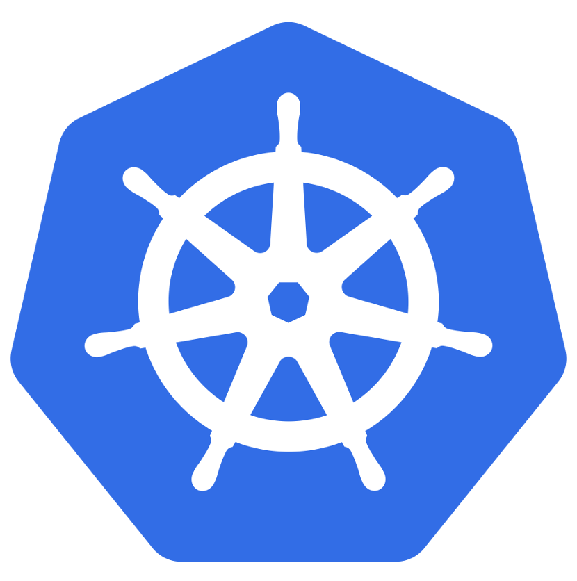

class: split-30 nopadding
background-image: url( https://cloud.githubusercontent.com/assets/4231611/15446277/524847a4-1f45-11e6-8aab-60c9899a0afa.jpg )

.column_t2.center[.vmiddle[
.fgtransparent[
.figplaint[

]
]
]]
.column_t2[.vmiddle.nopadding[
.shadelightdark[.boxtitle1[
### Orchestrating Containers
# Kubernetes Basics

### [Eueung Mulyana](https://github.com/eueung)
### http://eueung.github.io/docker-stuff/kubernetes
#### CodeLabs | [Attribution-ShareAlike CC BY-SA](https://creativecommons.org/licenses/by-sa/4.0/)
#### 
]]
]]

---
class: column_t1 middle

.fonth4[
.tab1.fullwidth[
| Outline  |
|:-------------:|
| Kubernetes - Short Introduction |
| Parts &amp; Components |
| Getting Started |
| kubectl run + kubectl expose |
]]

---
class: split-30 nopadding
background-image: url( https://cloud.githubusercontent.com/assets/4231611/15446277/524847a4-1f45-11e6-8aab-60c9899a0afa.jpg )

.column_t2.center[.vmiddle[
.fgtransparent[
.figplaint[

]
]
]]
.column_t2[.vmiddle.nopadding[
.shadelightdark[.boxtitle1[
### Kubernetes
# Short Introduction

### 
### 
#### 
#### 
]]
]]

---
class: split-50 nopadding 

.column_t1[.vmiddle.pushfront.right[
# What is Kubernetes?

The name Kubernetes originates from Greek, meaning "helmsman" or "pilot", and is the root of "governor" and "cybernetic". 

.yellow[**K8s**] is an abbreviation derived by replacing the 8 letters "ubernete" with 8.

.bluelight[With Kubernetes you can deploy a .uline[full cluster] of **multi-tiered** containers (frontend, backend, etc.) with a **single** configuration .uline[file] and a **single** .uline[command] ([Ref](http://omerio.com/2015/12/18/learn-the-kubernetes-key-concepts-in-10-minutes/)).]

]]
.column_t2[.vmiddle[
Kubernetes is an open-source platform for **automating** .uline[deployment], .uline[scaling], and .uline[operations] of **application containers** across .red[**clusters**] of hosts, providing .blue[**container-centric**] infrastructure.

With Kubernetes, you are able to quickly and efficiently respond to customer demand:
- **Deploy** your applications .uline[quickly] and .uline[predictably].
- **Scale** your applications .uline[on the fly].
- Seamlessly **roll out** new features.
- **Optimize** use of your hardware by using only the resources you need

Kubernetes is:
- **portable**: public, private, hybrid, multi-cloud
- **extensible**: modular, pluggable, hookable, composable
- **self-healing**: auto-placement, auto-restart, auto-replication, auto-scaling

Ref: [kubernetes.io](http://kubernetes.io/docs/whatisk8s/)

]]

---
class: split-50 nopadding 

.column_t1[.vmiddle.pushfront.center[

.figplaint[

]

]]
.column_t2[.vmiddle[
 # Kubernetes

- Container orchestrator
- Runs and manages containers
- Supports multiple cloud and bare-metal environments
- Inspired and informed by Google's experiences and internal systems
- 100% Open source, written in Go
- Manage applications, not machines

Ref: [Kubernetes Intro and Update @thockin](https://speakerdeck.com/thockin/kubernetes-intro-and-update)

]]

---
class: split-30 nopadding 
background-image: url(images/overview.png)

.column_bt[.vmiddle.pushfront.right[
# Architecture

A running Kubernetes cluster contains **node agents** (.yellow[**kubelet**]) and **master** components (.bluelight[**apiserver**], .bluelight[**scheduler**], etc), on top of a distributed storage solution.

]]
.column_t2[.vmiddle[

]]

---
class: split-30 nopadding 
background-image: url(images/kminion.png)

.column_bt[.vmiddle.pushfront.right[
# K8s Node
### Worker / Minion 

The Kubernetes node has the services necessary to **run** application containers and **be managed** from the master systems.

Each node runs container engine e.g. Docker. This engine takes care of the details of downloading images and running containers.

### .yellow[kubelet]

### .yellow[kube-proxy]

]]
.column_t2[.vmiddle[

]]

---
class: split-30 nopadding 
background-image: url(images/kminion1.png)

.column_bt[.vmiddle.pushfront.right[
# K8s Node

### .yellow[kubelet]

The kubelet manages **pods** and their containers, their images, their volumes, etc.

### .yellow[kube-proxy]

Each node also runs a simple network proxy and load balancer. This reflects .yellow[**services**] as defined in the Kubernetes API (apiserver) on each node and can do simple TCP and UDP stream forwarding (round robin) across a set of backends.

]]
.column_t2[.vmiddle[

]]

---
class: split-30 nopadding 
background-image: url(images/kmaster.png)

.column_bt[.vmiddle.pushfront.right[
# K8s Master
### Control Plane

The Kubernetes control plane is split into a set of components. Currently they all run on a single master node. These components work together to provide a unified view of the cluster.

### .yellow[etcd]

All persistent master state is stored in an instance of etcd. This provides a great way to store configuration data reliably. With watch support, coordinating components can be notified very quickly of changes.

]]
.column_t2[.vmiddle[

]]

---
class: split-40 nopadding 
background-image: url(images/kmaster1.png)

.column_bt[.vmiddle.pushfront.right[
# K8s Master

### .yellow[etcd]

### .yellow[API Server]

The apiserver serves up the Kubernetes API. It is intended to be a CRUD-y server, with most/all business logic implemented in separate components or in plug-ins. It mainly processes REST operations, validates them, and updates the corresponding objects in etcd (and eventually other stores).


]]
.column_t2[.vmiddle[

]]

---
class: split-40 nopadding 
background-image: url(images/kmaster2.png)

.column_bt[.vmiddle.pushfront.right[
### .yellow[Scheduler]

The scheduler binds unscheduled pods to nodes via the **/binding** API. The scheduler is pluggable, support for multiple cluster schedulers and user-provided schedulers in the plan.

### .yellow[Controller Manager]

All other cluster-level functions are currently performed by the Controller Manager. 

For instance, Endpoints objects are created and updated by the **endpoints controller**, and nodes are discovered, managed, and monitored by the **node controller**. These could eventually be split into separate components to make them independently pluggable. The **replicationcontroller** is a mechanism that is layered on top of the simple pod API. 

]]
.column_t2[.vmiddle[


]]

---
class: split-30 nopadding
background-image: url( https://cloud.githubusercontent.com/assets/4231611/15446277/524847a4-1f45-11e6-8aab-60c9899a0afa.jpg )

.column_t2.center[.vmiddle[
.fgtransparent[
.figplaint[

]
]
]]
.column_t2[.vmiddle.nopadding[
.shadelightdark[.boxtitle1[
### Kubernetes
# Parts &amp; Components

### 
### 
#### 
#### 
]]
]]

---
class: split-70 nopadding 
background-image: url(images/01.png)

.column_t2[.vmiddle[

]]
.column_bt[.vmiddle.pushfront[
.fonth5[
.yellow[**Containers**]<br/>
]
<hr/>
Base Asset

]]

---
class: split-70 nopadding 
background-image: url(images/02.png)

.column_t2[.vmiddle[

]]
.column_bt[.vmiddle.pushfront[
.fonth5[
Containers<br/>
.yellow[**Pods**]<br/>
]
<hr/>
A pod is a co-located group of containers ...

]]

---
class: split-70 nopadding 
background-image: url(images/03.png)

.column_t2[.vmiddle[

]]
.column_bt[.vmiddle.pushfront[
.fonth5[
Containers<br/>
Pods<br/>
Pods with .yellow[**Volumes**]<br/>
]
<hr/>
A pod is a co-located group of containers .uline[and volumes].

A volume is a directory, possibly with some data in it, which is accessible to a Container as part of its filesystem. 

Kubernetes volumes build upon Docker Volumes, adding provisioning of the volume directory and/or device.
]]

---
class: split-70 nopadding 
background-image: url(images/04.png)

.column_t2[.vmiddle[

]]
.column_bt[.vmiddle.pushfront[
.fonth5[
Containers<br/>
Pods<br/>
Pods with Volumes<br/>
.yellow[**Labels**]<br/>
]
<hr/>
A label is a key/value pair that is attached to a resource, such as a pod, to convey a user-defined identifying attribute. 

Labels can be used to organize and to select subsets of resources.

]]

---
class: split-70 nopadding 
background-image: url(images/05.png)

.column_t2[.vmiddle[

]]
.column_bt[.vmiddle.pushfront[
.fonth5[
Containers<br/>
Pods<br/>
Pods with Volumes<br/>
Labels<br/>
.yellow[**Replication Controllers**]<br/>
]
<hr/>
A replication controller ensures that a specified number of pod replicas are running at any one time. 

It both allows for easy scaling of replicated systems and handles re-creation of a pod when the machine it is on reboots or otherwise fails.

]]

---
class: split-70 nopadding 
background-image: url(images/06.png)

.column_t2[.vmiddle[

]]
.column_bt[.vmiddle.pushfront[
.fonth5[
Containers<br/>
Pods<br/>
Pods with Volumes<br/>
Labels<br/>
Replication Controllers<br/>
]
<hr/>
Creating labeled pods with a (labeled) RC

]]

---
class: split-70 nopadding 
background-image: url(images/07.png)

.column_t2[.vmiddle[

]]
.column_bt[.vmiddle.pushfront[
.fonth5[
Containers<br/>
Pods<br/>
Pods with Volumes<br/>
Labels<br/>
Replication Controllers<br/>
.yellow[**Services**]<br/>
]
<hr/>
Services &amp; labeled Services

A service defines a set of pods and a means by which to access them, such as single stable IP address and corresponding DNS name.
]]

---
class: split-70 nopadding 
background-image: url(images/08.png)

.column_t2[.vmiddle[

]]
.column_bt[.vmiddle.pushfront[
.fonth5.yellow[
Containers<br/>
Pods<br/>
Pods with Volumes<br/>
Labels<br/>
Replication Controllers<br/>
Services<br/>
]

]]

---
class: split-30 nopadding
background-image: url( https://cloud.githubusercontent.com/assets/4231611/15446277/524847a4-1f45-11e6-8aab-60c9899a0afa.jpg )

.column_t2.center[.vmiddle[
.fgtransparent[
.figplaint[

]
]
]]
.column_t2[.vmiddle.nopadding[
.shadelightdark[.boxtitle1[
### Kubernetes
# Getting Started

### 
### 
#### 
#### 
]]
]]

---
class: split-70 nopadding 
background-image: url(images/cluster.jpg)

.column_t2[.vmiddle.right[

]]
.column_bt[.vmiddle.pushfront[

### node1 .yellow[**RPI 3**]
192.168.1.102

### node2 .yellow[**RPI 2**]
192.168.1.101

### node3 .yellow[**RPI 2**]
192.168.1.100
]]

---
class: split-50 nopadding 
background-image: url(images/cluster.jpg)

.column_bt[.vmiddle.pushfront[

## kubernetes-on-arm v0.7.0
### by [@luxas](https://github.com/luxas/kubernetes-on-arm/releases)

```bash
*$ dpkg -i kube-systemd.deb
*$ kube-config install 
#rpi or rpi-2, hypriotos

*$ gzip -dc images.tar.gz | docker load

*$ kube-config info
Architecture: armv7l
Kernel: Linux 4.1.17
CPU: 4 cores x 1200 MHz

Used RAM Memory: 111 MiB - RAM Memory: 925 MiB

Used disk space: 2.4GB (2424044 KB)
Free disk space: 11GB (11382472 KB)

SD Card/deb package was built: 21-03-2016 21:06

kubernetes-on-arm:  Latest commit: 1d0bbe1 - Version: 0.7.0

systemd version: v215
docker version: v1.10.3
kubernetes client version: v1.2.0
```

]]
.column_t2[.vmiddle.right[

]]

---
class: split-30 nopadding 
background-image: url(images/cluster.jpg)

.column_t2[.vmiddle.right[

]]
.column_bt[.vmiddle.pushfront[


```bash
*$ docker images
REPOSITORY                     TAG                 IMAGE ID            CREATED             SIZE
kubernetesonarm/etcd           0.7.0               3550c0c4f205        8 weeks ago         30.54 MB
kubernetesonarm/etcd           latest              3550c0c4f205        8 weeks ago         30.54 MB
kubernetesonarm/grafana        0.7.0               8ea26f4ef5a3        8 weeks ago         162.4 MB
kubernetesonarm/grafana        latest              8ea26f4ef5a3        8 weeks ago         162.4 MB
kubernetesonarm/influxdb       0.7.0               447951a687c6        8 weeks ago         18.38 MB
kubernetesonarm/influxdb       latest              447951a687c6        8 weeks ago         18.38 MB
kubernetesonarm/heapster       0.7.0               1d034674fc0e        8 weeks ago         39.51 MB
kubernetesonarm/heapster       latest              1d034674fc0e        8 weeks ago         39.51 MB
kubernetesonarm/loadbalancer   0.7.0               6b262f2fd318        8 weeks ago         34.75 MB
kubernetesonarm/loadbalancer   latest              6b262f2fd318        8 weeks ago         34.75 MB
kubernetesonarm/registry       0.7.0               4c9c964f89e9        8 weeks ago         21.34 MB
kubernetesonarm/registry       latest              4c9c964f89e9        8 weeks ago         21.34 MB
kubernetesonarm/exechealthz    0.7.0               57f77542ac5c        8 weeks ago         11.96 MB
kubernetesonarm/exechealthz    latest              57f77542ac5c        8 weeks ago         11.96 MB
kubernetesonarm/kube2sky       0.7.0               770cccac4236        8 weeks ago         21.33 MB
kubernetesonarm/kube2sky       latest              770cccac4236        8 weeks ago         21.33 MB
kubernetesonarm/skydns         0.7.0               30ea4958f939        8 weeks ago         10.69 MB
kubernetesonarm/skydns         latest              30ea4958f939        8 weeks ago         10.69 MB
kubernetesonarm/pause          0.7.0               05edc969256e        8 weeks ago         247.4 kB
kubernetesonarm/pause          latest              05edc969256e        8 weeks ago         247.4 kB
kubernetesonarm/hyperkube      0.7.0               380def049467        8 weeks ago         163.2 MB
kubernetesonarm/hyperkube      latest              380def049467        8 weeks ago         163.2 MB
kubernetesonarm/flannel        0.7.0               8a35c629399f        8 weeks ago         23.55 MB
kubernetesonarm/flannel        latest              8a35c629399f        8 weeks ago         23.55 MB
hypriot/rpi-swarm              latest              c298de062190        10 weeks ago        13.27 MB
```

]]

---
class: split-30 nopadding 

.column_t1[.vmiddle.pushfront.right[
# Master
]]
.column_t2[.vmiddle[

```bash
*$ kube-config enable-master
Disabling k8s if it is running
Checks so all images are present
Transferring images to system-docker, if necessary
Copying kubernetesonarm/etcd to system-docker
...
Kubernetes master services enabled

*$ docker ps
CONTAINER ID        IMAGE                       COMMAND                  CREATED             STATUS              PORTS               NAMES
7bf736d84451        kubernetesonarm/hyperkube   "/hyperkube controlle"   2 minutes ago       Up 2 minutes                            k8s_controller-manager.42676441_k8s-master-192.168.1.102_default_80a366492c94fafeacf2fc27c3de60c5_c736dd3c
5560f06bcf47        kubernetesonarm/hyperkube   "/hyperkube proxy --m"   2 minutes ago       Up 2 minutes                            k8s_kube-proxy.59df49da_k8s-master-192.168.1.102_default_80a366492c94fafeacf2fc27c3de60c5_161c9a74
0fb169567946        kubernetesonarm/hyperkube   "/hyperkube scheduler"   2 minutes ago       Up 2 minutes                            k8s_scheduler.9849f626_k8s-master-192.168.1.102_default_80a366492c94fafeacf2fc27c3de60c5_3a278a11
11c03a40412c        kubernetesonarm/hyperkube   "/hyperkube apiserver"   2 minutes ago       Up 2 minutes                            k8s_apiserver.70815ff9_k8s-master-192.168.1.102_default_80a366492c94fafeacf2fc27c3de60c5_ab75ffd5
ede858b35dfa        kubernetesonarm/pause       "/pause"                 2 minutes ago       Up 2 minutes                            k8s_POD.b10bdbaa_k8s-master-192.168.1.102_default_80a366492c94fafeacf2fc27c3de60c5_f1184de0
5e38dac4fd19        kubernetesonarm/hyperkube   "/hyperkube kubelet -"   3 minutes ago       Up 3 minutes                            k8s-master

```

]]

---
class: split-30 nopadding 

.column_t1[.vmiddle.pushfront.right[
# Worker
]]
.column_t2[.vmiddle[

```bash
*$ kube-config enable-worker 192.168.1.102
Disabling k8s if it is running
Using master ip: 192.168.1.102
Checks so all images are present
Transferring images to system-docker, if necessary
Copying kubernetesonarm/flannel to system-docker
Created symlink from /etc/systemd/system/multi-user.target.wants/flannel.service to /usr/lib/systemd/system/flannel.service.
Starting worker components in docker containers
Created symlink from /etc/systemd/system/multi-user.target.wants/k8s-worker.service to /usr/lib/systemd/system/k8s-worker.service.
Kubernetes worker services enabled
```
]]


---
class: split-30 nopadding 

.column_t1[.vmiddle.pushfront.right[
# Check
]]
.column_t2[.vmiddle[

```bash

*$ kubectl get nodes
NAME            STATUS    AGE
192.168.1.100   Ready     26s
192.168.1.101   Ready     7m
192.168.1.102   Ready     4h

*$ kubectl cluster-info
Kubernetes master is running at http://localhost:8080

```


]]

---
class: split-30 nopadding 

.column_t1[.vmiddle.pushfront.right[
# Test .yellow[\#1] 
]]
.column_t2[.vmiddle[

```bash

*$ kubectl run my-nginx --image=luxas/nginx-test  --replicas=3 --expose --port=80
service "my-nginx" created
deployment "my-nginx" created

*$ kubectl get pods
NAME                        READY     STATUS              RESTARTS   AGE
k8s-master-192.168.1.102    4/4       Running             1          5h
my-nginx-3795026575-9w8mw   0/1       ContainerCreating   0          14s
my-nginx-3795026575-miz3d   0/1       ContainerCreating   0          14s
my-nginx-3795026575-zy2d4   0/1       ContainerCreating   0          14s

*$ kubectl get svc
NAME         CLUSTER-IP   EXTERNAL-IP   PORT(S)   AGE
kubernetes   10.0.0.1     <none>        443/TCP   5h
my-nginx     10.0.0.129   <none>        80/TCP    36s

*$ kubectl get deployments
NAME       DESIRED   CURRENT   UP-TO-DATE   AVAILABLE   AGE
my-nginx   3         3         3            1           1m

*$ curl 10.0.0.129
<p>WELCOME TO NGINX</p>

```


]]

---
class: split-30 nopadding 

.column_t1[.vmiddle.pushfront.right[
# Test .yellow[\#2]
]]
.column_t2[.vmiddle[

```bash
*$ kubectl run hello-kube --image=hypriot/rpi-nano-httpd  --port=80
deployment "hello-kube" created

*$ kubectl expose deployment hello-kube --type="LoadBalancer" --external-ip="192.168.1.102"
service "hello-kube" exposed

*$ kubectl get pods -o wide
NAME                          READY     STATUS             RESTARTS   AGE       NODE
hello-kube-1079346743-2knj3   0/1       ImagePullBackOff   0          55s       192.168.1.100
k8s-master-192.168.1.102      4/4       Running            1          8h        192.168.1.102

*$ kubectl get deployments
NAME         DESIRED   CURRENT   UP-TO-DATE   AVAILABLE   AGE
hello-kube   1         1         1            1           1m

*$ kubectl get pods -o wide
NAME                          READY     STATUS    RESTARTS   AGE       NODE
hello-kube-1079346743-2knj3   1/1       Running   0          1m        192.168.1.100
k8s-master-192.168.1.102      4/4       Running   1          8h        192.168.1.102

*$ kubectl get svc
NAME         CLUSTER-IP   EXTERNAL-IP      PORT(S)   AGE
hello-kube   10.0.0.197   ,192.168.1.102   80/TCP    44s
kubernetes   10.0.0.1     <none>           443/TCP   8h

*$ curl 10.0.0.197
<html><head><title>Pi armed with Docker by Hypriot</title>
  <body style="width: 100%; background-color: black;">
    <div id="main" style="margin: 100px auto 0 auto; width: 800px;">
      
    </div>
</body></html>
```

]]

---
class: split-30 nopadding 

.column_t1[.vmiddle.pushfront.right[
# Test .yellow[\#3]
]]
.column_t2[.vmiddle[

```bash
*$ kubectl run hello-kube --image=hypriot/rpi-nano-httpd  --replicas=2 --port=80
deployment "hello-kube" created

*$ kubectl expose deployment hello-kube --type="LoadBalancer" --external-ip="192.168.1.102"
service "hello-kube" exposed

*$ kubectl get svc
NAME         CLUSTER-IP   EXTERNAL-IP      PORT(S)   AGE
hello-kube   10.0.0.221   ,192.168.1.102   80/TCP    10s
kubernetes   10.0.0.1     <none>           443/TCP   8h

*$ kubectl get pods -o wide
NAME                          READY     STATUS    RESTARTS   AGE       NODE
hello-kube-1079346743-44yig   1/1       Running   0          1m        192.168.1.100
hello-kube-1079346743-upzxy   1/1       Running   0          1m        192.168.1.101
k8s-master-192.168.1.102      4/4       Running   1          8h        192.168.1.102

*$ curl 10.0.0.221

*$ curl 192.168.1.102
<html><head><title>Pi armed with Docker by Hypriot</title>
  <body style="width: 100%; background-color: black;">
    <div id="main" style="margin: 100px auto 0 auto; width: 800px;">
      
    </div>
</body></html> 
```


]]

---
class: split-30 nopadding 

.column_t1[.vmiddle.pushfront.right[
# Test .yellow[\#4]
]]
.column_t2[.vmiddle[

```bash
*$ kubectl run hello-kube --image=hypriot/rpi-nano-httpd  --replicas=3 --port=80
deployment "hello-kube" created

*$ kubectl expose deployment hello-kube --port=8300 --target-port=80 --type="LoadBalancer" --external-ip="192.168.1.102"
service "hello-kube" exposed

*$ kubectl get svc
NAME         CLUSTER-IP   EXTERNAL-IP      PORT(S)    AGE
hello-kube   10.0.0.124   ,192.168.1.102   8300/TCP   8s
kubernetes   10.0.0.1     <none>           443/TCP    7h

*$ kubectl delete service,deployment hello-kube 
```


]]


---
class: split-30 nopadding
background-image: url( https://cloud.githubusercontent.com/assets/4231611/15446277/524847a4-1f45-11e6-8aab-60c9899a0afa.jpg )

.column_t2.center[.vmiddle[
.fgtransparent[
.figplaint[

]
]
]]
.column_t2[.vmiddle.nopadding[
.shadelightdark[.boxtitle1[
### 
# kubectl run + kubectl expose

### 
### 
#### 
#### 
]]
]]

---
class: split-70 nopadding 
background-image: url(images/run-expose1.png)

.column_t2[.vmiddle[

]]
.column_t2[.vmiddle.pushfront.right[

]]

---
class: split-70 nopadding 
background-image: url(images/run-expose2.png)

.column_t2[.vmiddle[

]]
.column_t2[.vmiddle.pushfront.right[

]]

---
class: split-70 nopadding 
background-image: url(images/run-expose3.png)

.column_t2[.vmiddle[

]]
.column_t2[.vmiddle.pushfront.right[

]]

---
class: split-70 nopadding 
background-image: url(images/run-expose4.png)

.column_t2[.vmiddle[

]]
.column_t2[.vmiddle.pushfront.right[

]]

---
class: split-70 nopadding 
background-image: url(images/run-expose5.png)

.column_t2[.vmiddle[

]]
.column_t2[.vmiddle.pushfront.right[

]]


---
class: split-30 nopadding
background-image: url( https://cloud.githubusercontent.com/assets/4231611/15446277/524847a4-1f45-11e6-8aab-60c9899a0afa.jpg )

.column_t2.center[.vmiddle[
.fgtransparent[
.figplaint[

]
]
]]
.column_t2[.vmiddle.nopadding[
.shadelightdark[.boxtitle1[
### 
# Refs

### 
### 
#### 
#### 
]]
]]

---
# Refs
.fonth5[
1. Tim Hockin, Kubernetes: One Year Later
1. Ray Tsang @saturnism, Kubernetes with Java-based Microservices
1. Stefan Schimanski, Kubernetes Architecture &amp; Introduction
1. @luxas - [kubernetes-on-arm](https://github.com/luxas/kubernetes-on-arm)
1. Daniel Smith, What's new in Kubernetes
1. [Kubernetes - What is Kubernetes?](http://kubernetes.io/docs/whatisk8s/)
1. [Kubernetes - User Guide](http://kubernetes.io/docs/user-guide/)
1. [Learn the Kubernetes Key Concepts](http://omerio.com/2015/12/18/learn-the-kubernetes-key-concepts-in-10-minutes/)
1. [Kubernetes Intro and Update @thockin](https://speakerdeck.com/thockin/kubernetes-intro-and-update)
1. [kubernetes/architecture.md at release-1.2 - kubernetes/kubernetes](https://github.com/kubernetes/kubernetes/blob/release-1.2/docs/design/architecture.md)
1. [Kubernetes - User Guide](http://kubernetes.io/docs/user-guide/#quick-walkthrough)
1. [An Introduction to Kubernetes](http://www.slideshare.net/imesh/an-introduction-to-kubernetes)
]

---
class: split-30 nopadding
background-image: url( https://cloud.githubusercontent.com/assets/4231611/15446277/524847a4-1f45-11e6-8aab-60c9899a0afa.jpg )

.column_t2.center[.vmiddle[
.fgtransparent[
.figplaint[

]
]
]]
.column_t2[.vmiddle.nopadding[
.shadelightdark[.boxtitle1[
### 
# END

### [Eueung Mulyana](https://github.com/eueung)
### http://eueung.github.io/docker-stuff/kubernetes
#### CodeLabs | [Attribution-ShareAlike CC BY-SA](https://creativecommons.org/licenses/by-sa/4.0/)
#### 
]]
]]

