class: split-30 nopadding
background-image: url( https://cloud.githubusercontent.com/assets/4231611/15727066/89970aaa-287e-11e6-8b9e-85d190dd3b09.jpg )

.column_t2.center[.vmiddle[
.fgtransparent[
.figplaint[
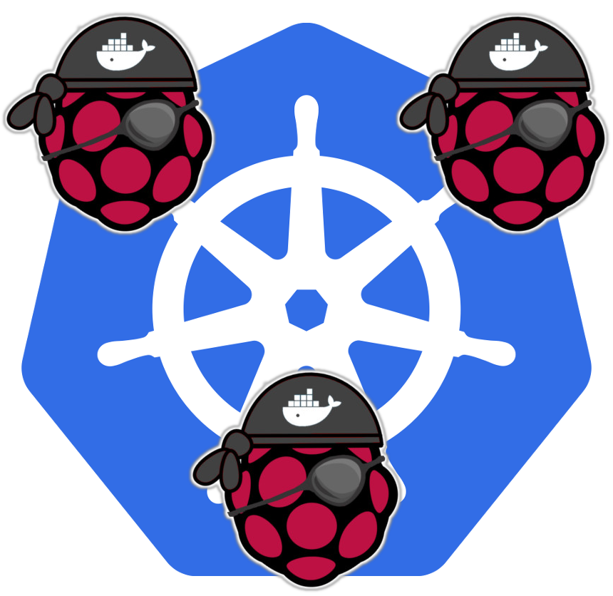
]
]
]]
.column_t2[.vmiddle.nopadding[
.shadelightdark[.boxtitle1[
### Orchestrating Containers
# Kubernetes - Learning Continues

### [Eueung Mulyana](https://github.com/eueung)
### http://eueung.github.io/docker-stuff/learning-k8s
#### CodeLabs | [Attribution-ShareAlike CC BY-SA](https://creativecommons.org/licenses/by-sa/4.0/)
#### 
]]
]]

---
class: column_t1 middle

.fonth4[
.tab1.fullwidth[
| Outline  |
|:-------------:|
| Base Setup &amp; OS Config |
| k8s Addons - DNS &amp; Dashboard |
| Remote Master &amp; k8s Visualizer |
| Test It All |
]]

---
class: split-30 nopadding
background-image: url( https://cloud.githubusercontent.com/assets/4231611/15727066/89970aaa-287e-11e6-8b9e-85d190dd3b09.jpg )

.column_t2.center[.vmiddle[
.fgtransparent[
.figplaint[

]
]
]]
.column_t2[.vmiddle.nopadding[
.shadelightdark[.boxtitle1[
### 
# Base Setup &amp; OS Config

### 
### 
#### 
#### 
]]
]]

---
class: split-70 nopadding 
background-image: url(images/cluster.jpg)

.column_t2[.vmiddle.right[

]]
.column_bt[.vmiddle.pushfront[

### node1 .yellow[**RPI 3**]
192.168.1.102

### node2 .yellow[**RPI 2**]
192.168.1.101

### node3 .yellow[**RPI 2**]
192.168.1.100
]]

---
class: split-50 nopadding 
background-image: url(images/cluster.jpg)

.column_bt[.vmiddle.pushfront.right[

#HypriotOS 
#0.8.0

]]
.column_wt[.vmiddle.pushfront[
```bash
*$ flash -d /dev/mmcblk0 hypriotos-rpi-v0.8.0.img
*$ flash -d /dev/mmcblk0 hypriotos-rpi-v0.8.0.img

*$ ssh-keygen -f "/home/em/.ssh/known_hosts" -R black-pearl.local
*$ ssh pirate@black-pearl.local
# pirate/hypriot

*$ sudo nano /etc/network/interfaces.d/eth0
*$ sudo nano /etc/hosts
*$ sudo nano /etc/hostname

# ---
*$ sudo nano /boot/device-init.yaml 

# hostname for your HypriotOS device
*hostname: node2      
docker:
  images:
    - "/var/local/rpi-consul_v0.6.4.tar.gz"
    - "/var/local/rpi-swarm_v1.2.2.tar.gz"
clusterlab:
  service:
    run_on_boot: "false"

# optional wireless network settings
wifi:
  interfaces:
#     wlan0:
*#       ssid: "MyNetwork"
*#       password: "secret_password"
```

]]

---
class: split-50 nopadding 
background-image: url(images/cluster.jpg)

.column_wt[.vmiddle.pushfront.right[

#HypriotOS 
#0.8.0

]]
.column_bt[.vmiddle.pushfront[
```bash
*$ sudo su
*$ mount -o remount,rw /sys/fs/cgroup
*$ mkdir /sys/fs/cgroup/cpuset
*$ nano /boot/cmdline.txt
# edit: cgroup_enable=cpuset 
#---
*$ nano /etc/resolv.conf
search default.svc.cluster.local svc.cluster.local cluster.local
nameserver 10.0.0.10
nameserver 192.168.1.1

#---
# optional tools
$ apt-get install dnsutils zip

$ shutdown -r now
#---

*$ ssh-keygen -R 192.168.1.101 && ssh-keygen -R node2.local
*$ ssh-copy-id -oStrictHostKeyChecking=no -oCheckHostIP=no pirate@192.168.1.101

*$ sftp pirate@node2.local
# put images...
# put kube-systemd...

```

]]

---
class: split-50 nopadding 
background-image: url(images/cluster.jpg)

.column_bt[.vmiddle.pushfront[

## kubernetes-on-arm v0.7.0

```bash
*$ dpkg -i kube-systemd.deb
*$ kube-config install 
#rpi or rpi-2, hypriotos

*$ gzip -dc images.tar.gz | docker load
*$ kube-config info

*$ kube-config enable-master
*$ kube-config enable-worker 192.168.1.102

```

]]
.column_t2[.vmiddle.right[

]]

---
class: split-30 nopadding
background-image: url( https://cloud.githubusercontent.com/assets/4231611/15727066/89970aaa-287e-11e6-8b9e-85d190dd3b09.jpg )

.column_t2.center[.vmiddle[
.fgtransparent[
.figplaint[

]
]
]]
.column_t2[.vmiddle.nopadding[
.shadelightdark[.boxtitle1[
### k8s Addons
# DNS &amp; Dashboard

### 
### 
#### 
#### 
]]
]]

---
class: split-30 nopadding 

.column_t1[.vmiddle.pushfront.right[
# Master
]]
.column_t2[.vmiddle[

```bash
*$ sudo kube-config enable-addon dashboard
*$ sudo kube-config enable-addon dns
namespace "kube-system" created
Warning: Unit file of networking.service changed on disk, 'systemctl daemon-reload' recommended.
replicationcontroller "kube-dns-v8" created
service "kube-dns" created
Started addon: dns

*$ kubectl cluster-info
Kubernetes master is running at http://localhost:8080
KubeDNS is running at http://localhost:8080/api/v1/proxy/namespaces/kube-system/services/kube-dns
Dashboard is running at http://localhost:8080/api/v1/proxy/namespaces/kube-system/services/kubernetes-dashboard

*$ kubectl --namespace=kube-system get pods,rc,svc
NAME                         READY        STATUS        RESTARTS   AGE
kube-dns-v8-uv6r5            4/4          Running       0          1h
kubernetes-dashboard-h5g84   1/1          Running       0          1h
NAME                         DESIRED      CURRENT       AGE
kube-dns-v8                  1            1             22h
kubernetes-dashboard         1            1             22h
NAME                         CLUSTER-IP   EXTERNAL-IP   PORT(S)         AGE
kube-dns                     10.0.0.10    <none>        53/UDP,53/TCP   22h
kubernetes-dashboard         10.0.0.249   <none>        80/TCP          22h
```

]]

---
class: split-30 nopadding 

.column_t1[.vmiddle.pushfront.right[
# Restart Pods
]]
.column_t2[.vmiddle[

```bash
*# ksp-restart.sh
# ---
#!/bin/bash

*kubectl delete po $(kubectl get po --namespace=kube-system | grep kube-dns | cut -d' ' -f 1) --namespace=kube-system
*kubectl delete po $(kubectl get po --namespace=kube-system | grep dashboard | cut -d' ' -f 1) --namespace=kube-system

```

]]

---
class: split-30 nopadding 

.column_t1[.vmiddle.pushfront.right[
# Check
### DNS Service
]]
.column_t2[.vmiddle[

```bash
*$ kubectl --namespace=kube-system get po
NAME                         READY     STATUS    RESTARTS   AGE
kube-dns-v8-8dk0a            4/4       Running   0          11s
kubernetes-dashboard-ew4ec   1/1       Running   0          21s

*$ kubectl logs --namespace=kube-system kube-dns-v8-8dk0a -c kube2sky
I0531 23:29:01.131613       1 kube2sky.go:462 Etcd server found: http://127.0.0.1:4001
I0531 23:29:02.225877       1 kube2sky.go:529 Using https://10.0.0.1:443 for kubernetes master
I0531 23:29:02.226027       1 kube2sky.go:530 Using kubernetes API <nil>
I0531 23:29:02.231187       1 kube2sky.go:598 Waiting for service: default/kubernetes
I0531 23:29:03.431233       1 kube2sky.go:660 Successfully added DNS record for Kubernetes service.

*$ kubectl --namespace=kube-system exec -ti kube-dns-v8-8dk0a -- nslookup kubernetes.default.svc.cluster.local localhost
...

*$ kubectl --namespace=kube-system exec -ti kube-dns-v8-8dk0a -- cat /etc/hosts
*$ kubectl --namespace=kube-system exec -ti kube-dns-v8-8dk0a -- cat /etc/resolv.conf

```

]]

---
class: split-30 nopadding 

.column_t1[.vmiddle.pushfront.right[
# Test
### DNS Service
]]
.column_t2[.vmiddle[

```bash
*# luxas/addons/sleep.yaml
apiVersion: v1
*kind: Pod
metadata:
* name: alpine-sleep
  namespace: default
spec:
  containers:
  - image: luxas/alpine
    command:
      - sleep
      - "3600"
    imagePullPolicy: IfNotPresent
    name: alpine-sleep
  restartPolicy: Always
---
apiVersion: v1
*kind: Pod
metadata:
* name: raspbian-sleep
  namespace: default
spec:
  containers:
  - image: resin/rpi-raspbian:jessie
    command:
      - sleep
      - "3600"
    imagePullPolicy: IfNotPresent
    name: raspbian-sleep
  restartPolicy: Always
```

]]

---
class: split-30 nopadding 

.column_t1[.vmiddle.pushfront.right[
# Test
### DNS Service
]]
.column_t2[.vmiddle[

```bash
*$ kubectl create -f sleep.yaml

*$ kubectl exec -it alpine-sleep -- nslookup kubernetes.default 10.0.0.10
*$ kubectl exec -it alpine-sleep -- nslookup kubernetes 10.0.0.10
*$ kubectl exec -it alpine-sleep -- nslookup kube-dns.kube-system.svc.cluster.local 10.0.0.10
*$ kubectl exec -it alpine-sleep -- nslookup kubernetes-dashboard.kube-system.svc.cluster.local 10.0.0.10
Server:    10.0.0.10
Address 1: 10.0.0.10

Name:      kubernetes-dashboard.kube-system.svc.cluster.local
Address 1: 10.0.0.249

```

]]

---
class: split-30 nopadding 

.column_t1[.vmiddle.pushfront.right[
# Test
### DNS Service
]]
.column_t2[.vmiddle[

```bash
# from Worker/Minion

pirate@node2 in ~
*$ curl -k https://kubernetes.default.svc.cluster.local
*$ curl -k https://kubernetes
{
  "paths": [
    "/api",
    "/api/v1",
    "/apis",
    "/apis/autoscaling",
    "/apis/autoscaling/v1",
    "/apis/batch",
    "/apis/batch/v1",
    "/apis/extensions",
    "/apis/extensions/v1beta1",
    "/healthz",
    "/healthz/ping",
    "/logs/",
    "/metrics",
    "/resetMetrics",
    "/swagger-ui/",
    "/swaggerapi/",
    "/ui/",
    "/version"
  ]
}
```

]]

---
class: column_t1  middle center

# Dashboard
#### &nbsp;

.figstyle1[
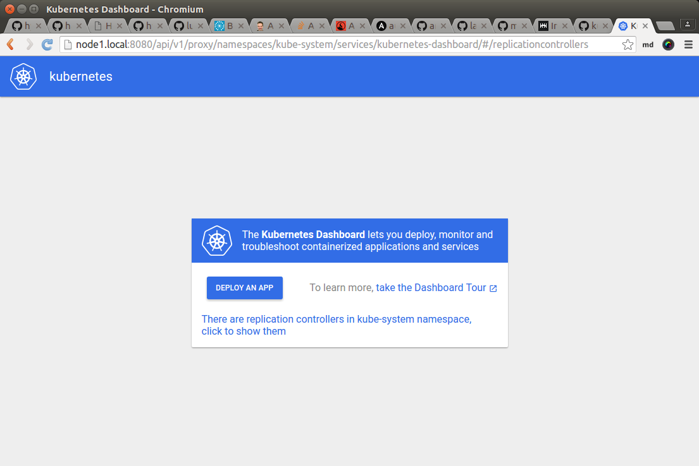
]

---
class: column_t1  middle center

# Dashboard
#### &nbsp;

.figstyle1[
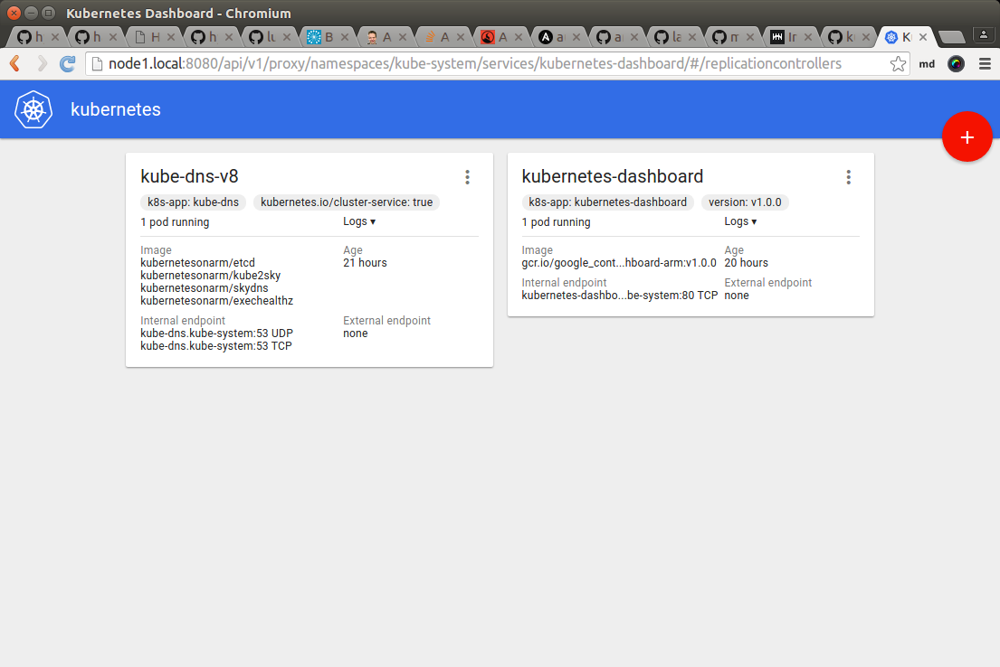
]

---
class: column_t1  middle center

# Dashboard
#### &nbsp;

.figstyle1[
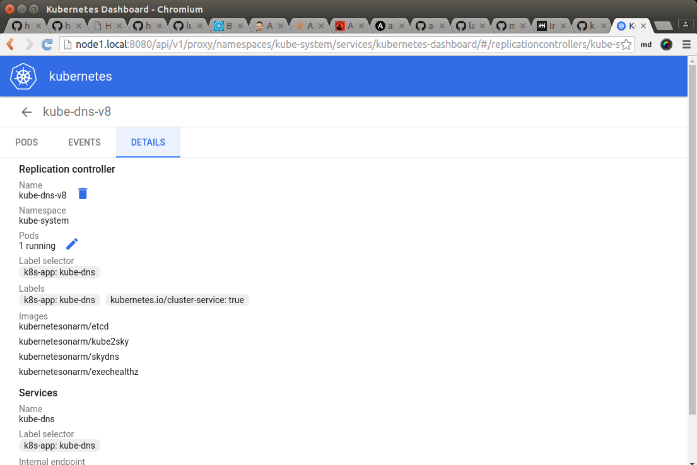
]

---
class: column_t1  middle center

# Dashboard
#### &nbsp;

.figstyle1[
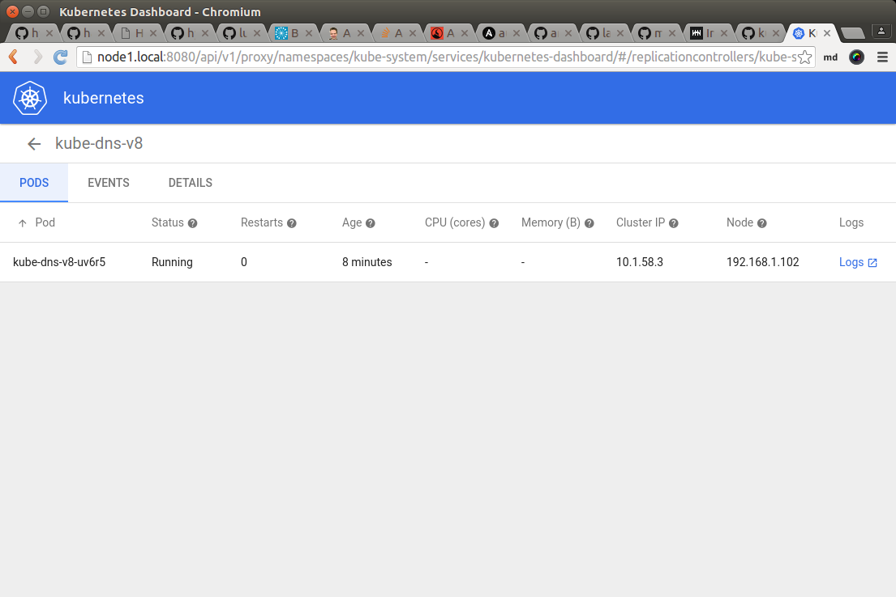
]

---
class: column_t1  middle center

# Dashboard
#### &nbsp;

.figstyle1[
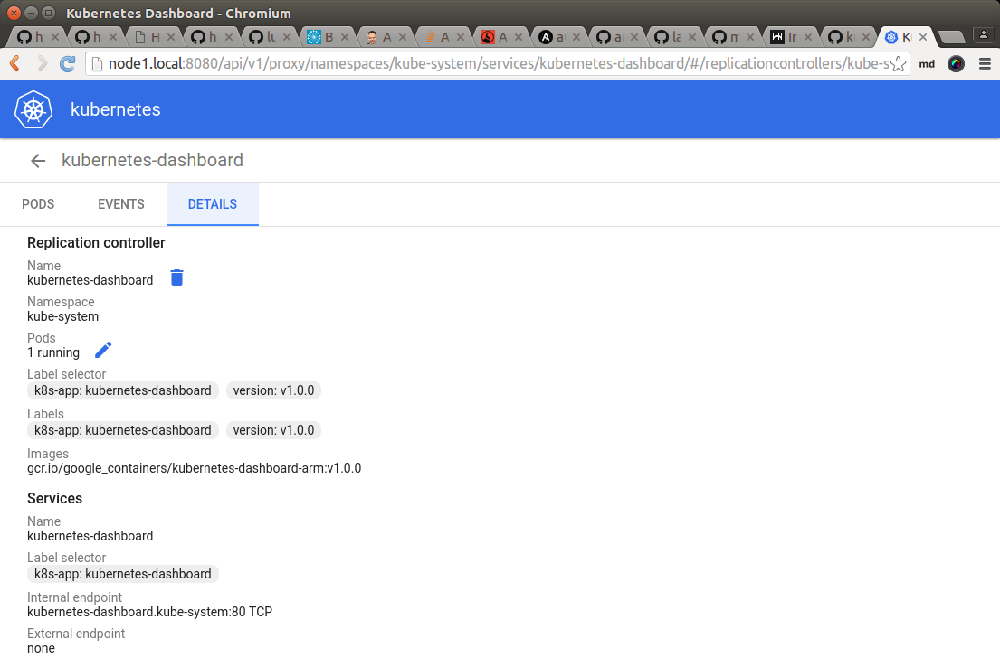
]

---
class: split-30 nopadding
background-image: url( https://cloud.githubusercontent.com/assets/4231611/15727066/89970aaa-287e-11e6-8b9e-85d190dd3b09.jpg )

.column_t2.center[.vmiddle[
.fgtransparent[
.figplaint[

]
]
]]
.column_t2[.vmiddle.nopadding[
.shadelightdark[.boxtitle1[
### 
# Remote Master &amp; k8s Visualizer

### 
### 
#### 
#### 
]]
]]

---
class: split-70 nopadding 

.column_t2[.vmiddle[

```bash
$ wget https://storage.googleapis.com/kubernetes-release/release/v1.2.0/bin/linux/amd64/kubectl 
$ chmod +x kubectl && sudo mv kubectl /usr/local/bin/  

*$ kubectl config set-cluster lk8 --server=http://192.168.1.102:8080
*$ kubectl config set-context lk8 --cluster=lk8
*$ kubectl config use-context lk8

*$ kubectl get nodes
NAME            STATUS    AGE
192.168.1.100   Ready     3d
192.168.1.101   Ready     3d
192.168.1.102   Ready     3d

```

]]
.column_t1[.vmiddle.pushfront[
# Remote Master
]]

---
class: split-70 nopadding 

.column_t2[.vmiddle[

```bash

*$ git clone https://github.com/saturnism/gcp-live-k8s-visualizer.git k8s-visualizer
$ cd k8s-visualizer
*$ kubectl proxy --www=.
Starting to serve on 127.0.0.1:8001

```

]]
.column_t1[.vmiddle.pushfront[
# k8s Visualizer
]]

---
class: column_t1  middle center

# k8s Visualizer
#### &nbsp;

.figstyle1[
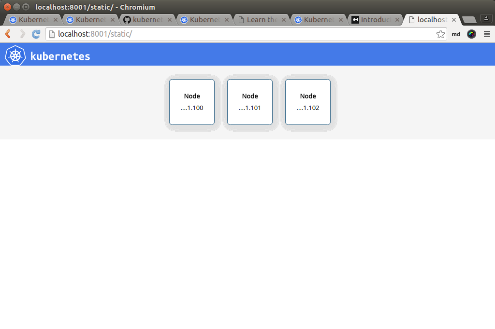
]

---
class: split-30 nopadding
background-image: url( https://cloud.githubusercontent.com/assets/4231611/15727066/89970aaa-287e-11e6-8b9e-85d190dd3b09.jpg )

.column_t2.center[.vmiddle[
.fgtransparent[
.figplaint[

]
]
]]
.column_t2[.vmiddle.nopadding[
.shadelightdark[.boxtitle1[
### 
# Test It All

### 
### 
#### 
#### 
]]
]]

---
class: split-30 nopadding 

.column_t1[.vmiddle.pushfront.right[
# Test .yellow[\#1]
]]
.column_t2[.vmiddle[

```bash

*$ kubectl run hello-kube --image=hypriot/rpi-nano-httpd  --port=80 -l visualize=true,run=hello-kube
deployment "hello-kube" created

*$ kubectl expose deployment hello-kube --type="LoadBalancer" --external-ip="192.168.1.102"
service "hello-kube" exposed
*# any node eth0 address: 102,101,100

*$ kubectl get svc
NAME         CLUSTER-IP   EXTERNAL-IP      PORT(S)   AGE
hello-kube   10.0.0.157   ,192.168.1.102   80/TCP    37s
kubernetes   10.0.0.1     <none>           443/TCP   3d

*$ kubectl get po -o wide
NAME                         READY     STATUS    RESTARTS   AGE       NODE
alpine-sleep                 1/1       Running   0          1h        192.168.1.102
hello-kube-658934829-o6ka3   1/1       Running   0          2m        192.168.1.101
k8s-master-192.168.1.102     4/4       Running   3          2h        192.168.1.102
raspbian-sleep               1/1       Running   0          1h        192.168.1.102

```

]]

---
class: split-30 nopadding 

.column_t1[.vmiddle.pushfront.right[
# Test .yellow[\#1]
### Reachability
]]
.column_t2[.vmiddle[

```bash
# from node3
*$ curl 192.168.1.102
*$ curl 10.0.0.157
*$ curl hello-kube
<html>
<head><title>Pi armed with Docker by Hypriot</title>
  <body style="width: 100%; background-color: black;">
    <div id="main" style="margin: 100px auto 0 auto; width: 800px;">
      
    </div>
  </body>
</html>

```

]]

---
class: column_t1  middle center

# .yellow[**hello-kube**] Visualized
#### &nbsp;

.figstyle1[
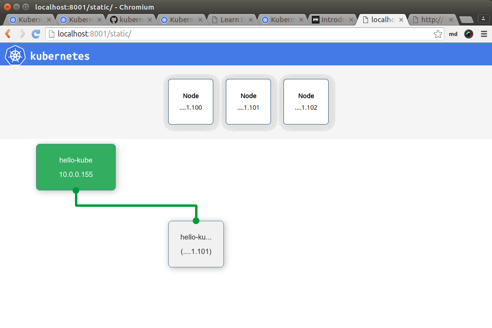
]

---
class: column_t1  middle center

# Test .yellow[\#2] via Dashboard
#### &nbsp;

.figstyle1[
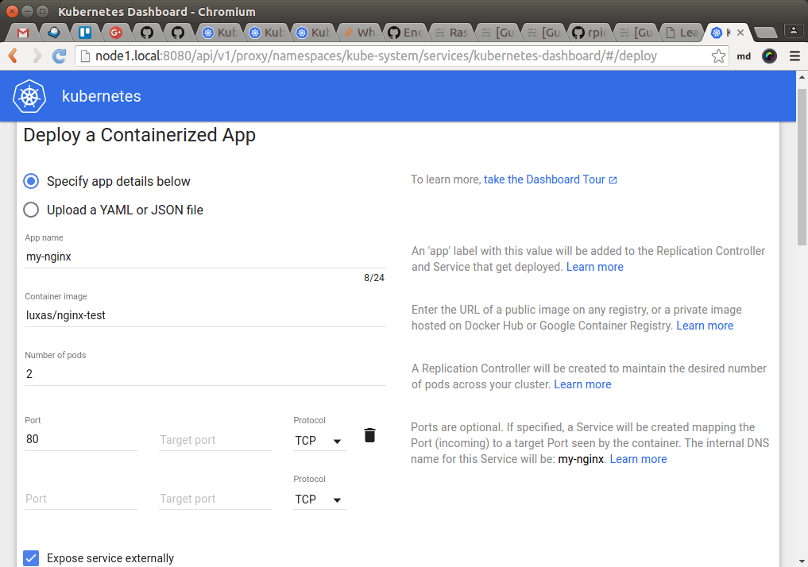
]

---
class: column_t1  middle center

# Test .yellow[\#2] via Dashboard
#### &nbsp;

.figstyle1[
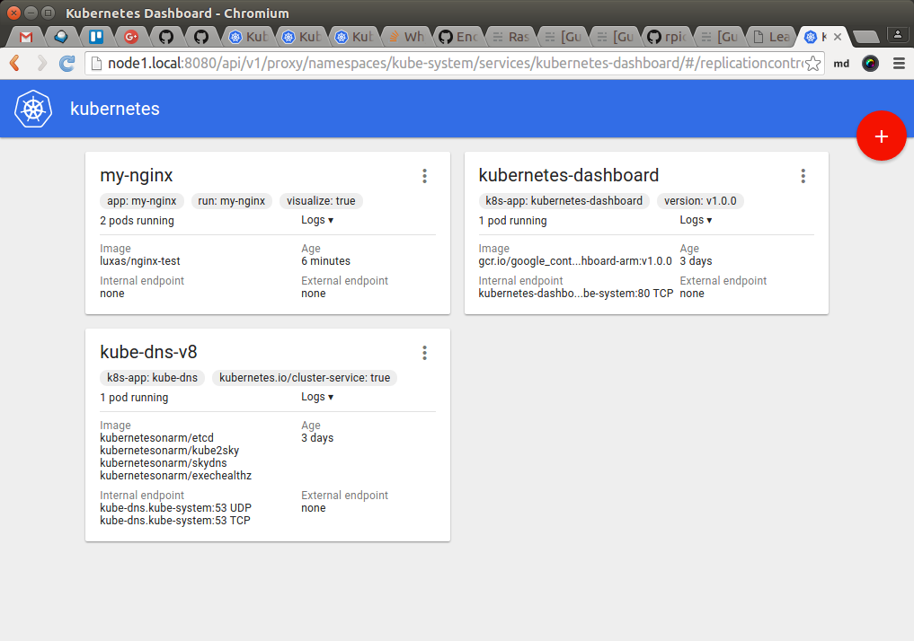
]

---
class: column_t1  middle center

# Test .yellow[\#2] - Take 2
#### &nbsp;

.figstyle1[
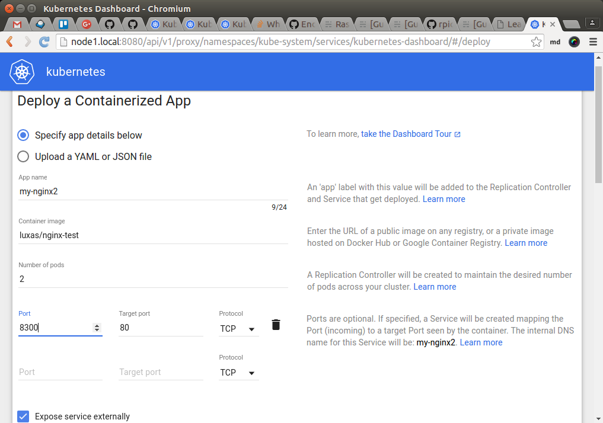
]

---
class: column_t1  middle center

# Test .yellow[\#2] - Take 2
#### &nbsp;

.figstyle1[
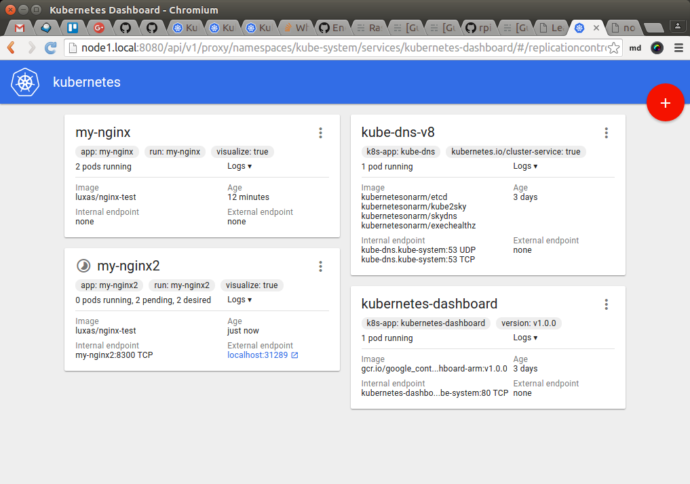
]

---
class: column_t1  middle center

# Test .yellow[\#2] - Visualizer
#### &nbsp;

.figstyle1[
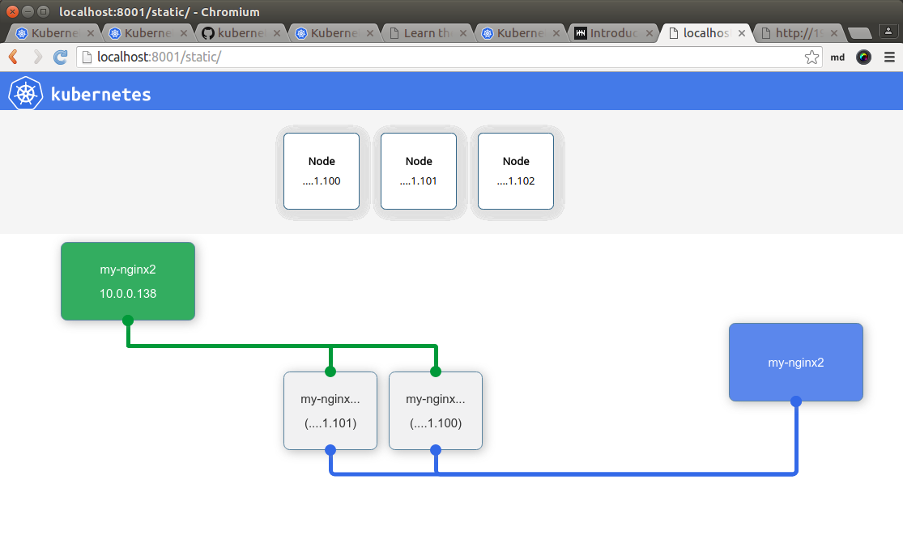
]

---
class: split-30 nopadding 

.column_t1[.vmiddle.pushfront.right[
# Test .yellow[\#2]
### Reachability
]]
.column_t2[.vmiddle[

```bash
*$ kubectl get po -o wide
NAME                       READY     STATUS    RESTARTS   AGE       NODE
alpine-sleep               1/1       Running   2          2h        192.168.1.102
k8s-master-192.168.1.102   4/4       Running   3          4h        192.168.1.102
my-nginx-afadx             1/1       Running   0          19m       192.168.1.100
my-nginx-e5coa             1/1       Running   0          19m       192.168.1.101
my-nginx2-68r7o            1/1       Running   0          6m        192.168.1.101
my-nginx2-pviak            1/1       Running   0          6m        192.168.1.100
raspbian-sleep             1/1       Running   2          2h        192.168.1.102

*$ kubectl get svc
NAME         CLUSTER-IP   EXTERNAL-IP   PORT(S)    AGE
kubernetes   10.0.0.1     <none>        443/TCP    3d
my-nginx2    10.0.0.138                 8300/TCP   6m

*$ curl my-nginx2:8300
<p>WELCOME TO NGINX</p>
HypriotOS/armv7: pirate@node1 in ~

```

]]

---
class: column_t1  middle center

.figstyle1[
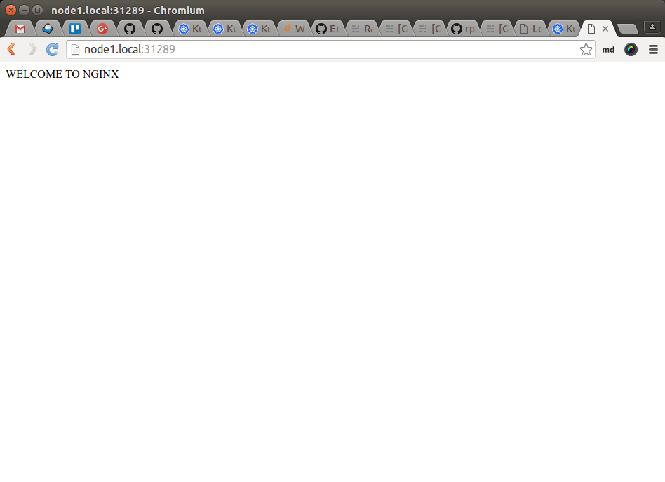
]


---
class: split-30 nopadding
background-image: url( https://cloud.githubusercontent.com/assets/4231611/15727066/89970aaa-287e-11e6-8b9e-85d190dd3b09.jpg )

.column_t2.center[.vmiddle[
.fgtransparent[
.figplaint[

]
]
]]
.column_t2[.vmiddle.nopadding[
.shadelightdark[.boxtitle1[
### 
# Refs

### 
### 
#### 
#### 
]]
]]

---
# Refs
.fonth5[
1. [Docker Pirates ARMed with explosive stuff](http://blog.hypriot.com/)
1. [kubernetes-on-arm](https://github.com/luxas/kubernetes-on-arm/releases) - by @luxas
1. k8s-visualizer [@brendandburns](https://github.com/brendandburns/gcp-live-k8s-visualizer) [@saturnism](https://github.com/saturnism/gcp-live-k8s-visualizer)
1. [Setting up Kubernetes visualization of a cluster](http://rpi-cloud.com/guide-setting-up-visualizer-for-kubernetes/) - @rpicloud

]

---
class: split-30 nopadding
background-image: url( https://cloud.githubusercontent.com/assets/4231611/15727066/89970aaa-287e-11e6-8b9e-85d190dd3b09.jpg )

.column_t2.center[.vmiddle[
.fgtransparent[
.figplaint[

]
]
]]
.column_t2[.vmiddle.nopadding[
.shadelightdark[.boxtitle1[
### 
# END

### [Eueung Mulyana](https://github.com/eueung)
### http://eueung.github.io/docker-stuff/learning-k8s
#### CodeLabs | [Attribution-ShareAlike CC BY-SA](https://creativecommons.org/licenses/by-sa/4.0/)
#### 
]]
]]
