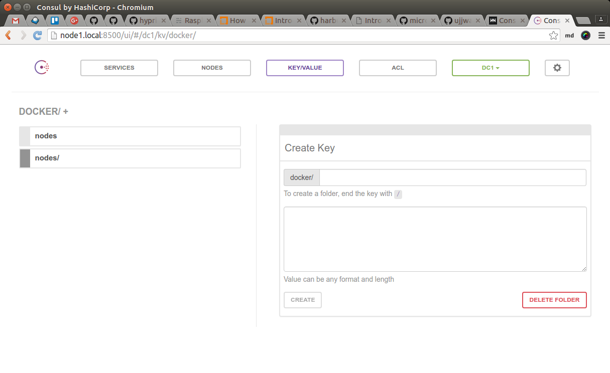
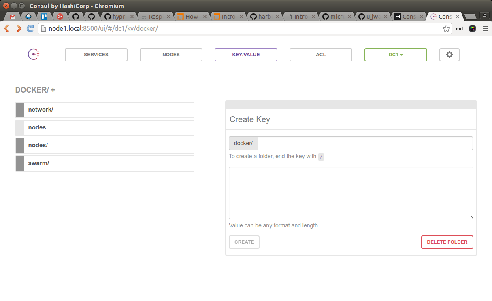
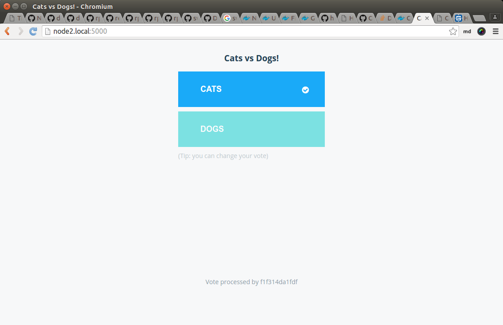
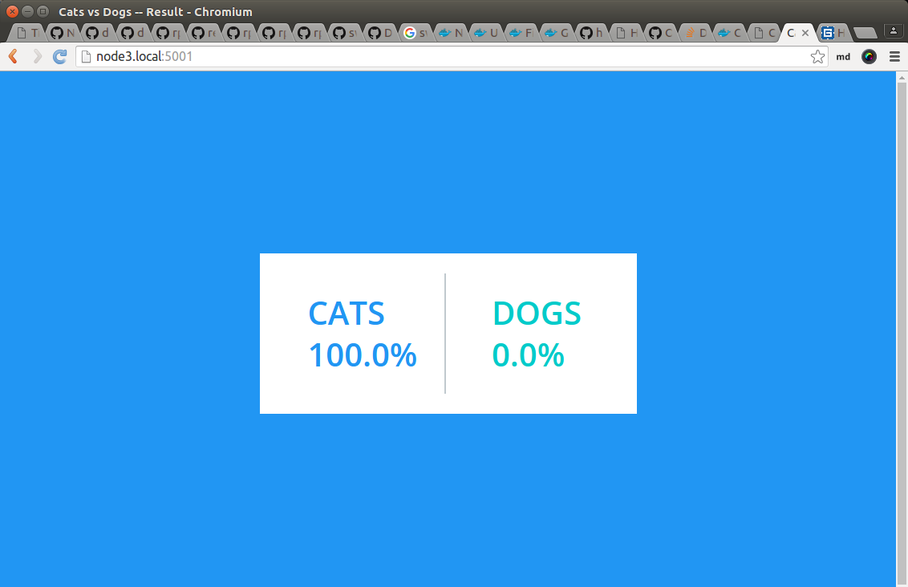
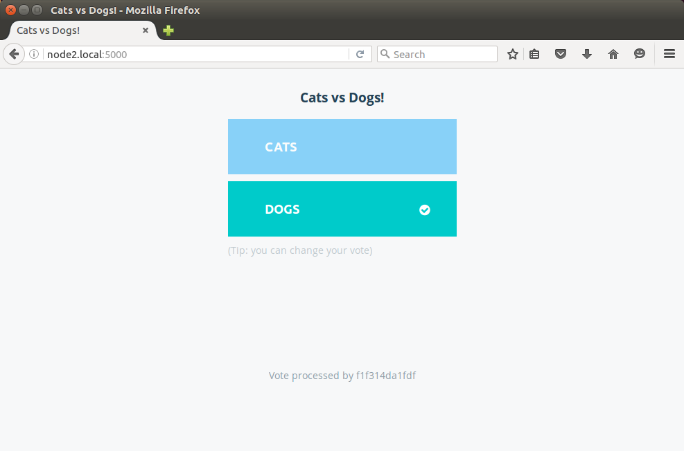
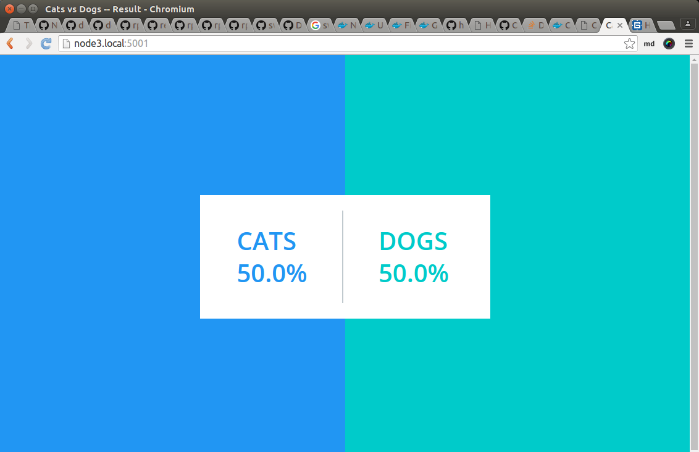

class: split-30 nopadding
background-image: url( https://cloud.githubusercontent.com/assets/4231611/11023045/87f27160-86a0-11e5-87a4-1de57dab61e5.jpg )

.column_t2.center[.vmiddle[
.fgtransparent[
.figplaint[

]
]
]]
.column_t2[.vmiddle.nopadding[
.shadelightdark[.boxtitle1[
### Swarm + Consul + Compose
# Multi-Container Apps

### [Eueung Mulyana](https://github.com/eueung)
### http://eueung.github.io/docker-stuff/multicont
#### CodeLabs | [Attribution-ShareAlike CC BY-SA](https://creativecommons.org/licenses/by-sa/4.0/)
#### 
]]
]]

---
class: column_t1 middle

.fonth4[
.tab1.fullwidth[
| Outline  |
|:-------------:|
| Infrastructure &amp; Cluster Config - Short Recap |
| Another Swarm Arch |
| RPI Voting App |
]]

---
class: split-30 nopadding
background-image: url( https://cloud.githubusercontent.com/assets/4231611/11023045/87f27160-86a0-11e5-87a4-1de57dab61e5.jpg )

.column_t2.center[.vmiddle[
.fgtransparent[
.figplaint[

]
]
]]
.column_t2[.vmiddle.nopadding[
.shadelightdark[.boxtitle1[
### Infrastructure and Cluster Config
# Short Recap

### 
### 
#### 
#### 
]]
]]


---
class: split-70 nopadding 
background-image: url(images/cluster.jpg)

.column_t2[.vmiddle.right[

]]
.column_bt[.vmiddle.pushfront[
# Physical Look
<hr>

### node1
192.168.1.102

### node2
192.168.1.101

### node3
192.168.1.100
]]

---
class: split-70 nopadding 
background-image: url(images/p01.jpg)

.column_t2[.vmiddle.right[
]]
.column_bt[.vmiddle.pushfront.right[
.fonth5[Cluster Discovery via a KV (Consul)]

]]

---
class: split-70 nopadding 
background-image: url(images/p02.jpg)

.column_t2[.vmiddle.right[
]]
.column_bt[.vmiddle.pushfront.right[
.fonth5[Swarm Manager Accesses Remote Daemons / Engines via Exposed Port]

]]
---
class: split-30 nopadding
background-image: url( https://cloud.githubusercontent.com/assets/4231611/11023045/87f27160-86a0-11e5-87a4-1de57dab61e5.jpg )

.column_t2.center[.vmiddle[
.fgtransparent[
.figplaint[

]
]
]]
.column_t2[.vmiddle.nopadding[
.shadelightdark[.boxtitle1[
### Infrastructure and Cluster Config
# Another Swarm Arch

### 
### 
#### 
#### 
]]
]]

---
class: split-70 nopadding 
background-image: url(images/p03.jpg)

.column_t2[.vmiddle.right[
]]
.column_bt[.vmiddle.pushfront.right[
.fonth5[Using Legacy (now Optional) Swarm Join ]

]]

---
class: split-70 nopadding 
background-image: url(images/p04.jpg)

.column_t2[.vmiddle.right[
]]
.column_bt[.vmiddle.pushfront.right[
.fonth5[It's now acctually like this]

]]

---
class: split-40 nopadding 

.column_t1[.vmiddle.pushfront.right[
# Start Consul
### @ node1

]]
.column_t2[.vmiddle[

```bash

*$ source ~/.dvm/dvm.sh 
*$ dvm use 1.10.2
Now using Docker 1.10.2

*$ ./start-consul.sh node1.local
192.168.1.102
8b54ab3104b18f75814e5c03f89f3778acaad263f731695163cf52c95b1a4f4f

*# ./start-consul.sh
# ---
#!/bin/bash

function getip() { (traceroute $1 2>&1 | head -n 1 | cut -d\( -f 2 | cut -d\) -f 1) }

IP_ADDRESS=$(getip $1)
echo $IP_ADDRESS

*docker -H $IP_ADDRESS:2375 run \
*  -d --net=host --name=consul \
*  -v /data -p 8500:8500 \
*  hypriot/rpi-consul:0.6.4 agent -server -data-dir /data -bootstrap-expect 1 \
*  -ui-dir=/ui \
*  -advertise=$IP_ADDRESS -bind=$IP_ADDRESS -client=$IP_ADDRESS 
```

]]

---
class: column_t1  middle center

# Consul UI
#### &nbsp;

.figstyle1[

]

---
class: split-40 nopadding 

.column_t1[.vmiddle.pushfront.right[
# Start Swarm
### agent @ all nodes
### manager @ node1

]]
.column_t2[.vmiddle[

```bash

*$ ./start-swarm.sh 
Running Swarm Agent at 192.168.1.100
b879a04323c817432e95a970bbf71a6e03fd6ae895fa643a7fe75fd12c78d06d
Running Swarm Agent at 192.168.1.101
f47f6c6b258f8f03e1ad441049e2c4320b0a138e6d8eac52bdaa5f70ca80e72d
Running Swarm Agent at 192.168.1.102
47346d30d35d8174b41995fa34efaa69cc6d2de6c2091e29750d7e264c6d4816
de5ee57f8e20ef3ef15cd68f873620319202486510e88c1d22bfdbd8e4ec935a

*# ./start-swarm.sh
# ---
#!/bin/bash

arr=("192.168.1.100" "192.168.1.101" "192.168.1.102")
IP_CONSUL="192.168.1.102"
IP_SWARMMASTER=$IP_CONSUL

for IP in "${arr[@]}"; do
  echo "Running Swarm Agent at $IP"

* docker -H $IP:2375 run \
*   -d --name=swarm-agent \
*   hypriot/rpi-swarm:1.2.1 \
*   join -advertise $IP:2375 \
*   consul://$IP_CONSUL:8500
done

*docker -H $IP_SWARMMASTER:2375 run \
* -d -p 10000:6000 --name=swarm-master \
* hypriot/rpi-swarm:1.2.1 manage -H 0.0.0.0:6000 \
* consul://$IP_CONSUL:8500

```

]]

---
class: column_t1  middle center

# Consul UI
#### &nbsp;

.figstyle1[

]

---
class: column_t1  middle center

# Consul UI
#### &nbsp;

.figstyle1[

]

---
class: split-30 nopadding 

.column_t1[.vmiddle.pushfront.right[
# Check

]]
.column_t2[.vmiddle[

```bash

*$ export DOCKER_HOST=tcp://192.168.1.102:10000
*$ docker info
...
*$ docker ps
CONTAINER ID        IMAGE                      COMMAND                  CREATED             STATUS              PORTS                                     NAMES
de5ee57f8e20        hypriot/rpi-swarm:1.2.1    "/swarm manage -H 0.0"   3 minutes ago       Up 3 minutes        2375/tcp, 192.168.1.102:10000->6000/tcp   node1/swarm-master
47346d30d35d        hypriot/rpi-swarm:1.2.1    "/swarm join -adverti"   3 minutes ago       Up 3 minutes        2375/tcp                                  node1/swarm-agent
f47f6c6b258f        hypriot/rpi-swarm:1.2.1    "/swarm join -adverti"   3 minutes ago       Up 3 minutes        2375/tcp                                  node2/swarm-agent
b879a04323c8        hypriot/rpi-swarm:1.2.1    "/swarm join -adverti"   3 minutes ago       Up 3 minutes        2375/tcp                                  node3/swarm-agent
8b54ab3104b1        hypriot/rpi-consul:0.6.4   "/consul agent -serve"   5 minutes ago       Up 5 minutes                                                  node1/consul

```

]]

---
class: split-30 nopadding
background-image: url( https://cloud.githubusercontent.com/assets/4231611/11023045/87f27160-86a0-11e5-87a4-1de57dab61e5.jpg )

.column_t2.center[.vmiddle[
.fgtransparent[
.figplaint[

]
]
]]
.column_t2[.vmiddle.nopadding[
.shadelightdark[.boxtitle1[
### 
# RPI Voting App

### 
### Credit: [@jmMeessen](https://github.com/jmMeessen/rpi-voting-app) , [@dduportal](http://dduportal.github.io/presentations/docker-meetup-brussels-20160210)
#### 
#### 
]]
]]

---
class: middle center

# 5 Containers, 2 Networks
####&nbsp;

.figplaint-75[

]

---
class: split-30 nopadding 

.column_t1[.vmiddle.pushfront.right[
# Optional Preparation
### tag, save, load

]]
.column_t2[.vmiddle[

```bash
*#./tag-images.sh
#!/bin/bash

docker tag thecaptainsshack/rpi-worker thecaptainsshack/rpi-worker:v1
docker tag thecaptainsshack/rpi-voting-app thecaptainsshack/rpi-voting-app:v1 
docker tag thecaptainsshack/rpi-result-app thecaptainsshack/rpi-result-app:v1 
docker tag thecaptainsshack/postgres-arm thecaptainsshack/postgres-arm:v1 

*./save-images.sh
#!/bin/bash

docker save -o rpi-worker.tar thecaptainsshack/rpi-worker
docker save -o rpi-voting-app.tar thecaptainsshack/rpi-voting-app
docker save -o rpi-result-app.tar thecaptainsshack/rpi-result-app
docker save -o postgres-arm.tar thecaptainsshack/postgres-arm

*# ./load-images.sh
#!/bin/bash

docker load -i rpi-worker.tar
docker load -i rpi-voting-app.tar 
docker load -i rpi-result-app.tar 
docker load -i postgres-arm.tar 

*sftp> mkdir voting
*sftp> put -r voting
*$ rm -f voting/* && rmdir voting
```
]]

---
class: split-50 nopadding 

.column_t2[.vmiddle.pushfront[
## docker-compose.yml

```bash
version: '2'

services:
* voting-app:
    image: thecaptainsshack/rpi-voting-app:v1
    ports:
      - "5000:80"
    links:
      - redis
    networks:
      - front-tier
      - back-tier

* redis:
    image: hypriot/rpi-redis:3.0.4
    expose: ["6379"]
    networks:
      - back-tier

* worker:
    image: thecaptainsshack/rpi-worker:v1
*   depends_on:
      - db
      - redis
    networks:
      - back-tier
```

]]
.column_t1[.vmiddle[

```bash
* db:
    image: thecaptainsshack/postgres-arm:v1
    volumes:
      - db-data:/var/lib/postgresql/data
    networks:
      - back-tier

* result-app:
    image: thecaptainsshack/rpi-result-app:v1
    ports:
      - "5001:80"
    links:
      - db
    networks:
      - front-tier
      - back-tier


volumes:
  db-data: {}

networks:
  front-tier:
    driver: overlay
  back-tier:
    driver: overlay
```
]]

---
class: split-30 nopadding 

.column_t1[.vmiddle.pushfront.right[
# Ready for Show

]]
.column_t2[.vmiddle[

```bash
*$ docker-compose up -d
Creating network "voteapps_front-tier" with driver "overlay"
Creating network "voteapps_back-tier" with driver "overlay"
Creating volume "voteapps_db-data" with default driver
Creating voteapps_redis_1
Creating voteapps_db_1
Creating voteapps_voting-app_1
Creating voteapps_worker_1
Creating voteapps_result-app_1

*$ docker ps
CONTAINER ID        IMAGE                                COMMAND                  CREATED             STATUS              PORTS                                     NAMES
*13390ae07634        thecaptainsshack/rpi-result-app:v1   "node server.js"         14 seconds ago      Up 7 seconds        192.168.1.100:5001->80/tcp                node3/voteapps_result-app_1
*fb7788e21dcf        thecaptainsshack/rpi-worker:v1       "java -jar /worker-ja"   14 seconds ago      Up 9 seconds                                                  node3/voteapps_worker_1
*02da4fd6d395        thecaptainsshack/postgres-arm:v1     "/docker-entrypoint.s"   19 seconds ago      Up 14 seconds       5432/tcp                                  node3/voteapps_db_1
9271161cffd0        hypriot/rpi-swarm:1.2.1              "/swarm manage -H 0.0"   2 minutes ago       Up 2 minutes        2375/tcp, 192.168.1.102:10000->6000/tcp   node1/swarm-master
5094d356a141        hypriot/rpi-swarm:1.2.1              "/swarm join -adverti"   2 minutes ago       Up 2 minutes        2375/tcp                                  node1/swarm-agent
43c6c9914167        hypriot/rpi-swarm:1.2.1              "/swarm join -adverti"   2 minutes ago       Up 2 minutes        2375/tcp                                  node3/swarm-agent
38dc46794c30        hypriot/rpi-consul:0.6.4             "/consul agent -serve"   2 minutes ago       Up 2 minutes                                                  node1/consul
*4952e24ce452        thecaptainsshack/rpi-voting-app:v1   "python app.py"          10 hours ago        Up 10 hours         192.168.1.101:5000->80/tcp                node2/voteapps_voting-app_1
*ac998b65792c        hypriot/rpi-redis:3.0.4              "/entrypoint.sh redis"   10 hours ago        Up 10 hours         6379/tcp                                  node2/voteapps_redis_1
94e83aa038b1        hypriot/rpi-swarm:1.2.1              "/swarm join -adverti"   10 hours ago        Up 10 hours         2375/tcp                                  node2/swarm-agent

# restart if necessary
*$ docker-compose stop && docker-compose rm -f
```
]]

---
class: split-30 nopadding 

.column_t1[.vmiddle.pushfront.right[
# Ready for Show

]]
.column_t2[.vmiddle[

```bash
*$ docker-compose ps
        Name                       Command               State             Ports            
-------------------------------------------------------------------------------------------
voteapps_db_1           /docker-entrypoint.sh postgres   Up      5432/tcp                   
voteapps_redis_1        /entrypoint.sh redis-server      Up      6379/tcp                   
voteapps_result-app_1   node server.js                   Up      192.168.1.100:5001->80/tcp 
voteapps_voting-app_1   python app.py                    Up      192.168.1.101:5000->80/tcp 
voteapps_worker_1       java -jar /worker-jar-with ...   Up                                 

*root@node3 in ~
*$ docker network ls
NETWORK ID          NAME                  DRIVER
*8add79af5bf7       voteapps_front-tier   overlay             
*c9c8503da2d8       voteapps_back-tier    overlay             
f0dce7240349        docker_gwbridge       bridge              
8cbe7e085fad        none                  null                
ec272b59cfd7        host                  host                
4592696ebf19        bridge                bridge           
```
]]

---
class: column_t1  middle center

# voting-app
#### &nbsp;

.figstyle1[

]


---
class: split-30 nopadding 

.column_t1[.vmiddle.pushfront.right[
# redis log

]]
.column_t2[.vmiddle[

```bash

*$ docker logs -f 2de6
Connected to redis
Watching vote queue
*Processing vote for 'a' by '84a51f315b69e04a'

```
]]

---
class: column_t2  middle center

# result-app
#### &nbsp;

.figstyle1[

]

---
class: column_t1  middle center

# voting-app
#### &nbsp;

.figstyle1[

]


---
class: split-30 nopadding 

.column_t1[.vmiddle.pushfront.right[
# redis log

]]
.column_t2[.vmiddle[

```bash

*$ docker logs -f 2de6
Connected to redis
Watching vote queue
*Processing vote for 'a' by '84a51f315b69e04a'
*Processing vote for 'a' by '84a51f315b69e04a'
Processing vote for 'b' by '8f3ee350c2aec3f5'

```
]]

---
class: column_t2  middle center

# result-app
#### &nbsp;

.figstyle1[

]


---
class: split-30 nopadding
background-image: url( https://cloud.githubusercontent.com/assets/4231611/11023045/87f27160-86a0-11e5-87a4-1de57dab61e5.jpg )

.column_t2.center[.vmiddle[
.fgtransparent[
.figplaint[

]
]
]]
.column_t2[.vmiddle.nopadding[
.shadelightdark[.boxtitle1[
### 
# Refs

### 
### 
#### 
#### 
]]
]]

---
# Refs
.fonth5[
1. [jmMeessen/rpi-voting-app: A dockerized voting application demo, adapted for Raspberry PI](https://github.com/jmMeessen/rpi-voting-app)
1. @dduportal - [Swarm on Raspberry Pis](http://dduportal.github.io/presentations/docker-meetup-brussels-20160210)
1. [docker/example-voting-app: Example Docker Compose app](https://github.com/docker/example-voting-app)

]

---
class: split-30 nopadding
background-image: url( https://cloud.githubusercontent.com/assets/4231611/11023045/87f27160-86a0-11e5-87a4-1de57dab61e5.jpg )

.column_t2.center[.vmiddle[
.fgtransparent[
.figplaint[

]
]
]]
.column_t2[.vmiddle.nopadding[
.shadelightdark[.boxtitle1[
### 
# END

### [Eueung Mulyana](https://github.com/eueung)
### http://eueung.github.io/docker-stuff/multicont
#### CodeLabs | [Attribution-ShareAlike CC BY-SA](https://creativecommons.org/licenses/by-sa/4.0/)
#### 
]]
]]


