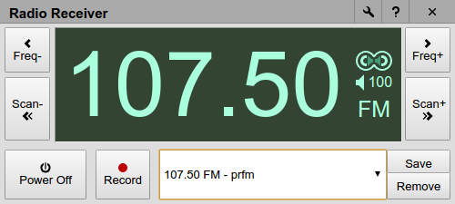
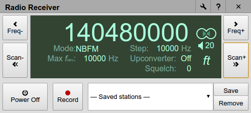
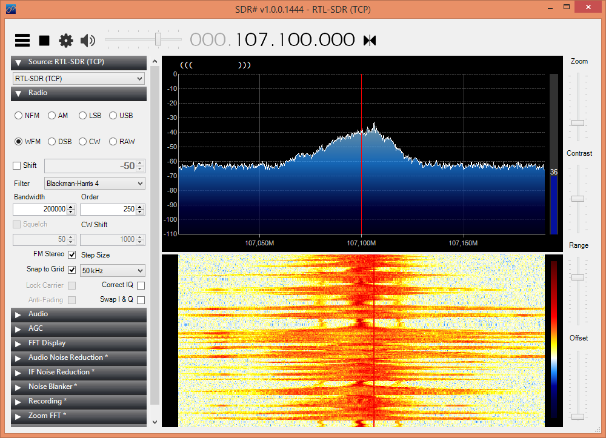
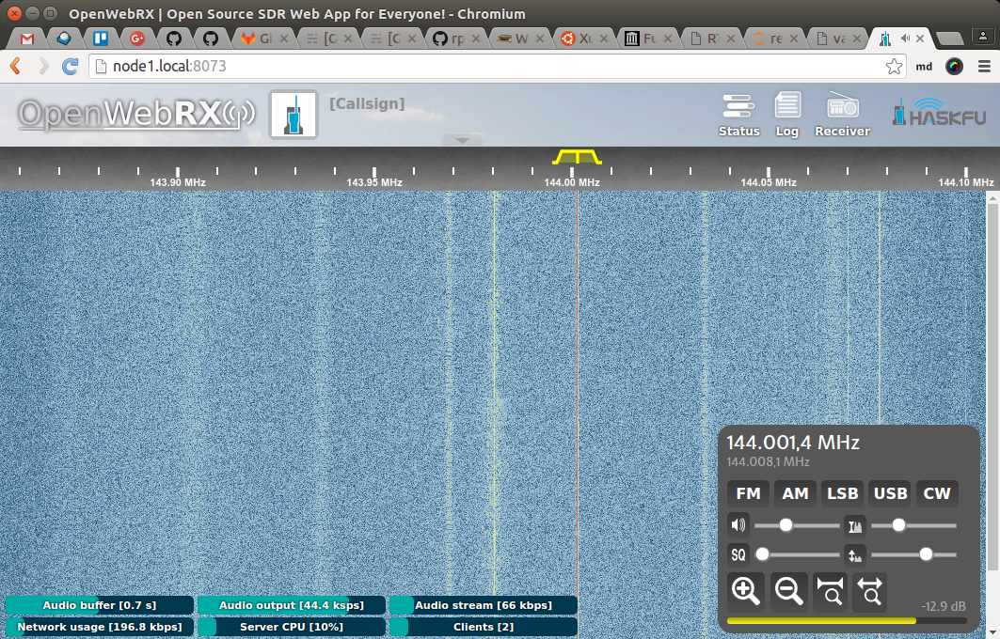
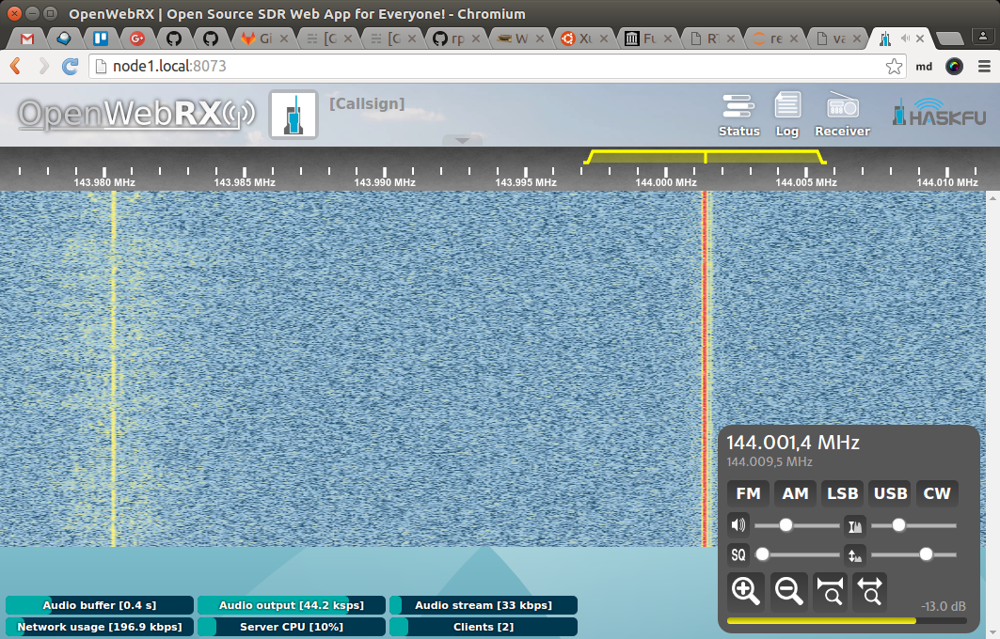
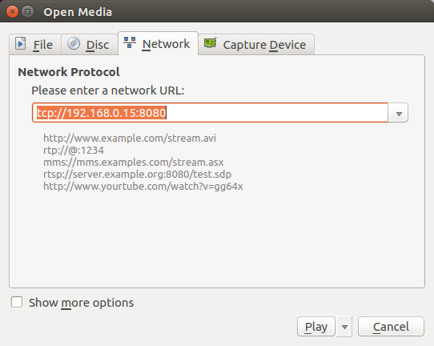
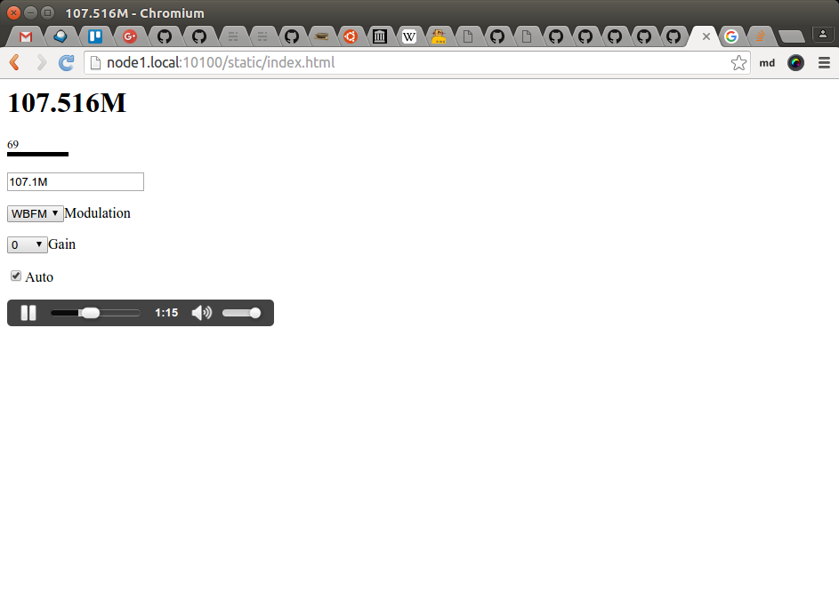
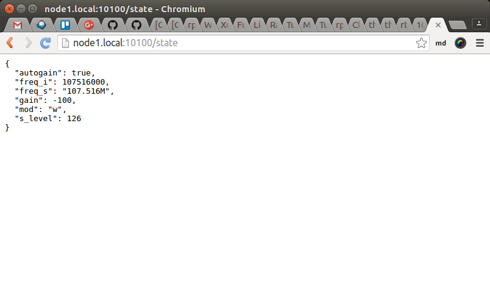
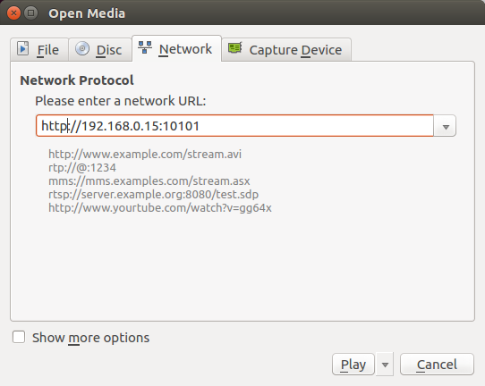

class: split-30 nopadding
background-image: url( https://cloud.githubusercontent.com/assets/4231611/11551881/2ddf3a50-99b0-11e5-93e3-ae60582e38f4.jpg )

.column_t2.center[.vmiddle[
.fgtransparent[
# .fa-2x.fa-stack[.red[<i class="fa icon-docker fa-stack-2x"></i>]<i class="fa icon-antenna fa-stack-1x"></i>]
]
]]
.column_t2[.vmiddle.nopadding[
.shadelightdark[.boxtitle1[
### SDR Sejuta Umat
# RTL-SDR (+Docker)

### [Eueung Mulyana](https://github.com/eueung)
### http://eueung.github.io/docker-stuff/rtl-sdr
#### CodeLabs | [Attribution-ShareAlike CC BY-SA](https://creativecommons.org/licenses/by-sa/4.0/)
#### 
]]
]]

---
class: column_t1 middle

.fonth4[
.tab1.fullwidth[
| Outline  |
|:-------------:|
| Preparation |
| Google Radio Receiver |
| RTL-SDR with Docker |
| OpenWebRX |
| rtl\_fm + Stream |
| rtl\_fm\_python |
]]

---
class: split-30 nopadding
background-image: url( https://cloud.githubusercontent.com/assets/4231611/11551881/2ddf3a50-99b0-11e5-93e3-ae60582e38f4.jpg )

.column_t2.center[.vmiddle[
.fgtransparent[
# .fa-2x.fa-stack[.red[<i class="fa icon-docker fa-stack-2x"></i>]<i class="fa icon-antenna fa-stack-1x"></i>]
]
]]
.column_t2[.vmiddle.nopadding[
.shadelightdark[.boxtitle1[
### 
# Preparation

### 
### 
#### 
#### 
]]
]]

---
class: split-30 nopadding 

.column_t1[.vmiddle.pushfront.right[
# RPI
]]
.column_t2[.vmiddle[

```bash
*$ flash -c config.yaml -d /dev/mmcblk0 hypriotos-rpi-v0.8.0.img

*# config.yaml
hostname: node1
wifi:
  interfaces:
    wlan0:
      ssid: "lk8fm"
      password: "1234567890"

# ---
*$ sudo ./blacklist.sh 
*$ less /etc/modprobe.d/rtlsdr-blacklist.conf 

*# blacklist.sh - manually blacklist
#!/bin/bash

sudo echo -e "blacklist rtl2832\n\
blacklist r820t\n\
blacklist rtl2830\n\
blacklist dvb_usb_rtl28xxu" > /etc/modprobe.d/rtlsdr-blacklist.conf 
```

]]

---
class: split-30 nopadding 

.column_t1[.vmiddle.pushfront.right[
# PC/Laptop
### Test - Setup
]]
.column_t2[.vmiddle[

```bash
*$ apt-cache policy rtl-sdr
rtl-sdr:
  Installed: 0.5.3-5
  Candidate: 0.5.3-5
  Version table:
 *** 0.5.3-5 500
        500 http://kambing.ui.ac.id/ubuntu xenial/universe amd64 Packages
        100 /var/lib/dpkg/status

*$ sudo apt install rtl-sdr

# package
*$ cat /etc/modprobe.d/rtl-sdr-blacklist.conf 
# This system has librtlsdr0 installed in order to
# use digital video broadcast receivers as generic
# software defined radios.
blacklist dvb_usb_rtl28xxu
*blacklist e4000
blacklist rtl2832

# manual
*$ cat /etc/modprobe.d/rtlsdr-blacklist.conf 
blacklist rtl2832
*blacklist r820t
*blacklist rtl2830
blacklist dvb_usb_rtl28xxu
```

]]

---
class: split-30 nopadding 

.column_t1[.vmiddle.pushfront.right[
# PC/Laptop
### Test
]]
.column_t2[.vmiddle[

```bash
*$ rtl_test -h
rtl_test, a benchmark tool for RTL2832 based DVB-T receivers

Usage:
  [-s samplerate (default: 2048000 Hz)]
  [-d device_index (default: 0)]
  [-t enable Elonics E4000 tuner benchmark]
  [-p[seconds] enable PPM error measurement (default: 10 seconds)]
  [-b output_block_size (default: 16 * 16384)]
  [-S force sync output (default: async)]

*$ rtl_test
Found 1 device(s):
  0:  Realtek, RTL2838UHIDIR, SN: 00000001

Using device 0: Generic RTL2832U OEM
Found Rafael Micro R820T tuner
Supported gain values (29): 0.0 0.9 1.4 2.7 3.7 7.7 8.7 12.5 14.4 15.7 16.6 19.7 20.7 22.9 25.4 28.0 29.7 32.8 33.8 36.4 37.2 38.6 40.2 42.1 43.4 43.9 44.5 48.0 49.6 
[R82XX] PLL not locked!
Sampling at 2048000 S/s.

Info: This tool will continuously read from the device, and report if
samples get lost. If you observe no further output, everything is fine.

Reading samples in async mode...

```

]]

---
class: split-30 nopadding 

.column_t1[.vmiddle.pushfront.right[
# RPI
### Test
]]
.column_t2[.vmiddle[

```bash
*$ lsusb
Bus 001 Device 003: ID 0424:ec00 Standard Microsystems Corp. SMSC9512/9514 Fast Ethernet Adapter
Bus 001 Device 002: ID 0424:9514 Standard Microsystems Corp. 
Bus 001 Device 001: ID 1d6b:0002 Linux Foundation 2.0 root hub

*$ lsusb
*Bus 001 Device 004: ID 0bda:2838 Realtek Semiconductor Corp. RTL2838 DVB-T
Bus 001 Device 003: ID 0424:ec00 Standard Microsystems Corp. SMSC9512/9514 Fast Ethernet Adapter
Bus 001 Device 002: ID 0424:9514 Standard Microsystems Corp. 
Bus 001 Device 001: ID 1d6b:0002 Linux Foundation 2.0 root hub

*$ rtl_test
...
 
```

]]


---
class: split-30 nopadding
background-image: url( https://cloud.githubusercontent.com/assets/4231611/11551881/2ddf3a50-99b0-11e5-93e3-ae60582e38f4.jpg )

.column_t2.center[.vmiddle[
.fgtransparent[
# .fa-2x.fa-stack[.red[<i class="fa icon-docker fa-stack-2x"></i>]<i class="fa icon-antenna fa-stack-1x"></i>]
]
]]
.column_t2[.vmiddle.nopadding[
.shadelightdark[.boxtitle1[
### Local Receiver
# Google Radio Receiver

### [radioreceiver](https://github.com/google/radioreceiver)@github by @jtarrio
### 
#### 
#### 
]]
]]

---
class: split-70 nopadding 
background-image: url(images/a04.jpg)

.column_t2[.vmiddle.right[

]]
.column_bt[.vmiddle.pushfront[

### RTL.yellow[**2832U**]
820T.yellow[2]

]]

---
class: column_t1  middle center

# radioreceiver
#### &nbsp;

.figstyle1[

]

---
class: column_t1  middle center

# radioreceiver
#### &nbsp;

.figstyle1[

]

---
class: column_t1  middle center

# radioreceiver
#### &nbsp;

.figstyle1[

]

---
class: split-30 nopadding
background-image: url( https://cloud.githubusercontent.com/assets/4231611/11551881/2ddf3a50-99b0-11e5-93e3-ae60582e38f4.jpg )

.column_t2.center[.vmiddle[
.fgtransparent[
# .fa-2x.fa-stack[.red[<i class="fa icon-docker fa-stack-2x"></i>]<i class="fa icon-antenna fa-stack-1x"></i>]
]
]]
.column_t2[.vmiddle.nopadding[
.shadelightdark[.boxtitle1[
### Remote Receiver
# RTL-SDR with Docker

### 
### 
#### 
#### 
]]
]]

---
class: split-30 nopadding 
background-image: url(images/a05.jpg)

.column_bt[.vmiddle.pushfront.right[

<br/><br/><br/><br/><br/><br/><br/><br/>
### RTL.yellow[**2832U**]
820T.yellow[2]

]]
.column_t2[.vmiddle.right[

]]

---
class: split-30 nopadding 

.column_t1[.vmiddle.pushfront.right[
# Image by [sysrun](http://www.sysrun.io/)
]]
.column_t2[.vmiddle[

```bash
*$ docker run --rm -it --device=/dev/bus/usb sysrun/rpi-rtl-sdr-base:0.4 /bin/sh
*# which rtl_tcp
*# which rtl_fm
*# which rtl_test
/usr/local/bin/rtl_test

*# rtl_test
Found 1 device(s):
  0:  Realtek, RTL2838UHIDIR, SN: 00000001

Using device 0: Generic RTL2832U OEM
Found Rafael Micro R820T tuner
Supported gain values (29): 0.0 0.9 1.4 2.7 3.7 7.7 8.7 12.5 14.4 15.7 16.6 19.7 20.7 22.9 25.4 28.0 29.7 32.8 33.8 36.4 37.2 38.6 40.2 42.1 43.4 43.9 44.5 48.0 49.6 
[R82XX] PLL not locked!
Sampling at 2048000 S/s.

Info: This tool will continuously read from the device, and report if
samples get lost. If you observe no further output, everything is fine.
...
```

]]

---
class: split-30 nopadding 

.column_t1[.vmiddle.pushfront.right[
# Build New Image
]]
.column_t2[.vmiddle[

```bash
*# Dockerfile-01
FROM resin/rpi-raspbian:jessie-20160601

MAINTAINER EM

RUN apt-get update && \
    apt-get install -y rtl-sdr && \
    apt-get clean && \
    rm -rf /var/lib/apt/lists/*

WORKDIR /

*$ docker build -f Dockerfile-01 --rm -t em-rtlsdr:jessie .

# Test
*$ docker run --rm -it --device=/dev/bus/usb em-rtlsdr:jessie /bin/sh

```

]]

---
class: split-30 nopadding 

.column_t1[.vmiddle.pushfront.right[
# Start Server
### rtl\_tcp
]]
.column_t2[.vmiddle[

```bash
*$ docker run --rm -it -p 5325:5325 --device=/dev/bus/usb sysrun/rpi-rtl-sdr-base:0.4 rtl_tcp -a 0.0.0.0 -p 5325 -f 107100000

#or
*$ docker run --rm -it -p 5325:5325 --device=/dev/bus/usb em-rtlsdr:jessie rtl_tcp -a 0.0.0.0 -p 5325 -f 107100000

```

]]

---
class: column_t1  middle center

#Start .yellow[**rtl\_tcp**] Client &amp; Connect ...

.fonth5[
We're using [SDR\#](http://airspy.com/)<br/>
or any other rtl\_tcp-compatible clients ...
]
---
class: column_t1  middle center

### SDR.yellow[\#]
#### &nbsp;

.figstyle1[

]

---
class: split-30 nopadding
background-image: url( https://cloud.githubusercontent.com/assets/4231611/11551881/2ddf3a50-99b0-11e5-93e3-ae60582e38f4.jpg )

.column_t2.center[.vmiddle[
.fgtransparent[
# .fa-2x.fa-stack[.red[<i class="fa icon-docker fa-stack-2x"></i>]<i class="fa icon-antenna fa-stack-1x"></i>]
]
]]
.column_t2[.vmiddle.nopadding[
.shadelightdark[.boxtitle1[
### Remote Receiver
# OpenWebRX

### 
### 
#### 
#### 
]]
]]

---
class: split-30 nopadding 

.column_t1[.vmiddle.pushfront.right[
# Dockerfile
]]
.column_t2[.vmiddle[

```bash
*#Dockerfile-02
*FROM sysrun/rpi-rtl-sdr-base:0.4

MAINTAINER EM, Frederik Granna

RUN apt-get update && \
    apt-get install -y libfftw3-dev apt-utils nmap python2.7 vim --no-install-recommends && \
    apt-get clean && \
    rm -rf /var/lib/apt/lists/*

WORKDIR /tmp

*RUN git clone https://github.com/simonyiszk/csdr.git && \
    cd csdr && \
    make && \
    make install && \
    cd / && \
    rm -rf /tmp/csdr

WORKDIR /opt

*RUN git clone https://github.com/simonyiszk/openwebrx.git

WORKDIR /opt/openwebrx

EXPOSE 8073 8888 4951

*CMD python2.7 openwebrx.py
```

]]

---
class: split-30 nopadding 

.column_t1[.vmiddle.pushfront.right[
# Build &amp; Run
]]
.column_t2[.vmiddle[

```bash
*$ docker build -f Dockerfile-02 --rm -t rpi-openwebrx:v1 .
...
$ cd ~/openwebrx && git clone https://github.com/simonyiszk/openwebrx.git
$ nano config_webrx.py
*# center_freq = 143980000
*# ppm = 9

*$ docker run --rm -it -p 8073:8073 --device=/dev/bus/usb -v ~/openwebrx/openwebrx:/opt/openwebrx rpi-openwebrx:v1
```

]]


---
class: column_t1  middle center

### OpenWebRX
#### &nbsp;

.figstyle1[

]

---
class: column_t1  middle center

### OpenWebRX
#### &nbsp;

.figstyle1[

]

---
class: split-30 nopadding
background-image: url( https://cloud.githubusercontent.com/assets/4231611/11551881/2ddf3a50-99b0-11e5-93e3-ae60582e38f4.jpg )

.column_t2.center[.vmiddle[
.fgtransparent[
# .fa-2x.fa-stack[.red[<i class="fa icon-docker fa-stack-2x"></i>]<i class="fa icon-antenna fa-stack-1x"></i>]
]
]]
.column_t2[.vmiddle.nopadding[
.shadelightdark[.boxtitle1[
### Remote Receiver
# rtl\_fm + Stream

### 
### 
#### 
#### 
]]
]]

---
class: split-30 nopadding 

.column_t1[.vmiddle.pushfront.right[
# Dockerfile &amp; Script
]]
.column_t2[.vmiddle[

```bash
*# Dockerfile-03
*FROM em-rtlsdr:jessie

MAINTAINER EM

RUN apt-get update && \
*   apt-get install -y sox socat libsox-fmt-mp3 && \
    apt-get clean && \
    rm -rf /var/lib/apt/lists/*

WORKDIR /work

# ---
*# start-03.sh
#!/bin/sh

rtl_fm -M wbfm -f $1 | sox -traw -r24k -es -b16 -c1 -V1 - -tmp3 - | socat -u - TCP-LISTEN:8080
```

]]

---
class: split-30 nopadding 

.column_t1[.vmiddle.pushfront.right[
# Build &amp; Run
]]
.column_t2[.vmiddle[

```bash
*$ docker build -f Dockerfile-03 --rm -t rpi-rtlfm:v1 .
...

*$ docker run --rm -ti -p 8080:8080 -v $(pwd):/work --device=/dev/bus/usb rpi-rtlfm:v1 /bin/sh start-03.sh 107.5M
```

]]

---
class: split-30 nopadding 

.column_t1[.vmiddle.pushfront.right[
# Client 1
### sox
]]
.column_t2[.vmiddle[

```bash

# deps
*$ sudo apt install sox libsox-fmt-mp3

# receive & play
*$ netcat node1.local 8080 | play -t mp3 -

#  
```

]]

---
class: split-30 nopadding 

.column_t1[.vmiddle.pushfront.right[
# Client 2
### vlc
]]
.column_t2[.vmiddle[

.figstyle1[

]

]]

---
class: split-30 nopadding
background-image: url( https://cloud.githubusercontent.com/assets/4231611/11551881/2ddf3a50-99b0-11e5-93e3-ae60582e38f4.jpg )

.column_t2.center[.vmiddle[
.fgtransparent[
# .fa-2x.fa-stack[.red[<i class="fa icon-docker fa-stack-2x"></i>]<i class="fa icon-antenna fa-stack-1x"></i>]
]
]]
.column_t2[.vmiddle.nopadding[
.shadelightdark[.boxtitle1[
### Remote Receiver
# rtl\_fm\_python

### 
### 
#### 
#### 
]]
]]

---
class: split-30 nopadding 

.column_t1[.vmiddle.pushfront.right[
# Dockerfile
]]
.column_t2[.vmiddle[

```bash
*# Dockerfile-04
FROM resin/rpi-raspbian:jessie-20160601

MAINTAINER EM

RUN apt-get update && apt-get install -y \
    python python-dev python-pip python-virtualenv \
    rtl-sdr && \
    build-essential git libusb-1.0-0.dev librtlsdr0 librtlsdr-dev vlc && \
    apt-get clean && \
    rm -rf /var/lib/apt/lists/*

RUN pip install flask

WORKDIR /work

RUN git clone https://github.com/eueung/rtl_fm_python.git && \
    cd rtl_fm_python && ./build.sh 

RUN chmod +x /work/rtl_fm_python/web.sh

RUN sed -i 's/geteuid/getppid/' /usr/bin/vlc

WORKDIR /work/rtl_fm_python

CMD ["/bin/sh","web.sh"]

# ---
*# web.sh
./rtl_fm_python_web.py -M wbfm -f 107.5M -p 9 - | cvlc --demux=rawaud --rawaud-channels=1 --rawaud-samplerate=32000 - --sout '#transcode{acodec=vorb,ab=32}:standard{access=http,mux=ogg,dst=0.0.0.0:10101}'

```

]]

---
class: split-30 nopadding 

.column_t1[.vmiddle.pushfront.right[
# Build &amp; Run
]]
.column_t2[.vmiddle[

```bash
*$ docker build -f Dockerfile-04 --rm -t em-rtlfmpy:v1 .

*$ docker run --rm -ti -p 10100:10100 -p 10101:10101 --device=/dev/bus/usb em-rtlfmpy:v1
*$ docker run --rm -ti -p 10100:10100 -p 10101:10101 --device=/dev/bus/usb em-rtlfmpy:v1 /bin/sh web.sh
```

]]

---
class: column_t1  middle center

.figstyle1[

]

---
class: column_t1  middle center

.figstyle1[

]
---
class: split-30 nopadding 

.column_t1[.vmiddle.pushfront.right[
# VLC Client

]]
.column_t2[.vmiddle[

.figstyle1[

]

]]

---
class: split-30 nopadding
background-image: url( https://cloud.githubusercontent.com/assets/4231611/11551881/2ddf3a50-99b0-11e5-93e3-ae60582e38f4.jpg )

.column_t2.center[.vmiddle[
.fgtransparent[
# .fa-2x.fa-stack[.red[<i class="fa icon-docker fa-stack-2x"></i>]<i class="fa icon-antenna fa-stack-1x"></i>]
]
]]
.column_t2[.vmiddle.nopadding[
.shadelightdark[.boxtitle1[
### 
# Refs

### 
### 
#### 
#### 
]]
]]

---
# Refs
.fonth5[
1. [Rtl_fm Guide: Updates for rtl_fm overhaul](http://kmkeen.com/rtl-demod-guide/)
1. [th0ma5w/rtl_fm_python: An API and web application to interact with a running instance of RTL_FM](https://github.com/th0ma5w/rtl_fm_python)
1. [google/radioreceiver: An application to listen to broadcast stereo FM and AM radio from your Chrome browser or your ChromeBook computer using a $15 USB digital TV tuner.](https://github.com/google/radioreceiver)
1. [sdr.hu/openwebrx](http://sdr.hu/openwebrx)
1. [SDR\#](http://airspy.com/)
1. [Sysrun.io | Magic Smoke And Software](http://www.sysrun.io/)
]

---
class: split-30 nopadding
background-image: url( https://cloud.githubusercontent.com/assets/4231611/11551881/2ddf3a50-99b0-11e5-93e3-ae60582e38f4.jpg )

.column_t2.center[.vmiddle[
.fgtransparent[
# .fa-2x.fa-stack[.red[<i class="fa icon-docker fa-stack-2x"></i>]<i class="fa icon-antenna fa-stack-1x"></i>]
]
]]
.column_t2[.vmiddle.nopadding[
.shadelightdark[.boxtitle1[
### 
# END

### [Eueung Mulyana](https://github.com/eueung)
### http://eueung.github.io/docker-stuff/rtl-sdr
#### CodeLabs | [Attribution-ShareAlike CC BY-SA](https://creativecommons.org/licenses/by-sa/4.0/)
#### 
]]
]]
