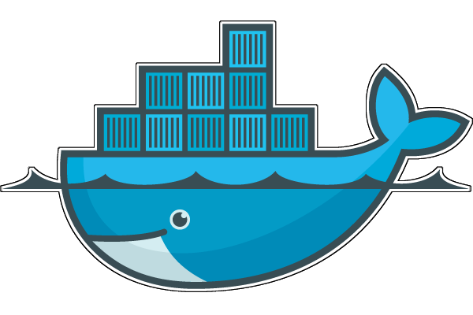
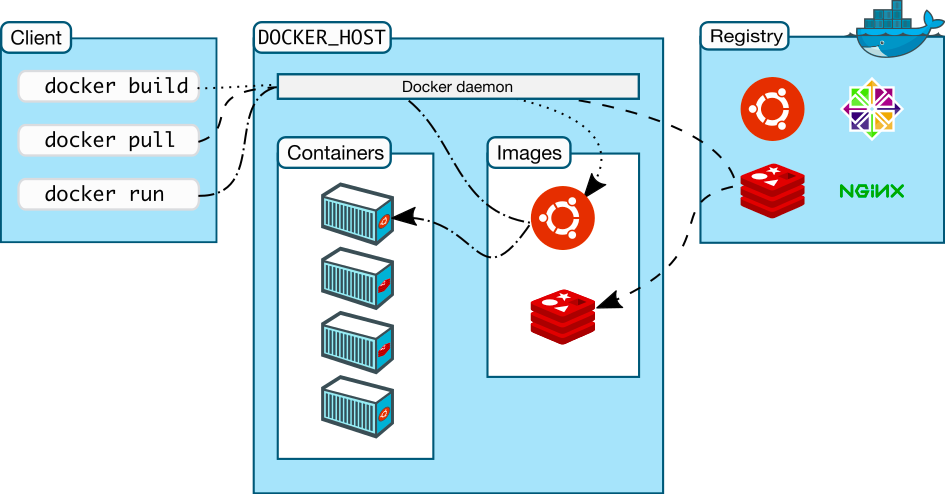
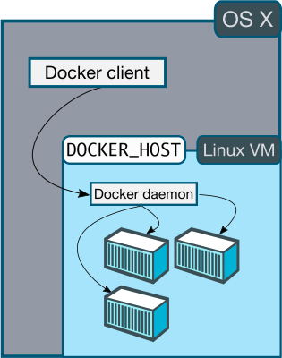
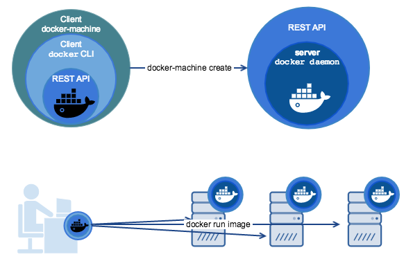
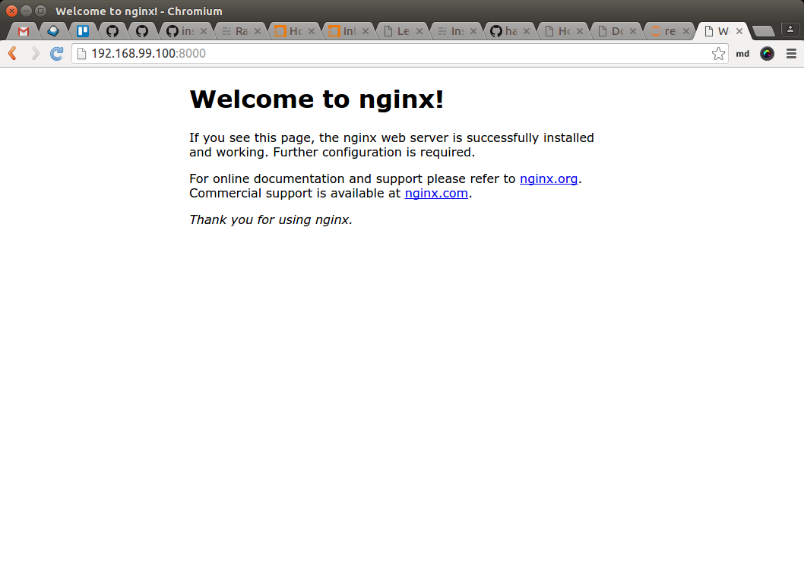

class: split-30 nopadding
background-image: url( https://cloud.githubusercontent.com/assets/4231611/15064418/3a582178-137e-11e6-9cc2-7040ad771c03.jpg )

.column_t2.center[.vmiddle[
.fgtransparent[
.figplaint[

]
]
]]
.column_t2[.vmiddle.nopadding[
.shadelightdark[.boxtitle1[
### Docker Swarm + Machine
# Docker - Container Clustering

### [Eueung Mulyana](https://github.com/eueung)
### http://eueung.github.io/docker-stuff/swarm
#### CodeLabs | [Attribution-ShareAlike CC BY-SA](https://creativecommons.org/licenses/by-sa/4.0/)
#### 
]]
]]


---
class: column_t1 middle

.fonth4[
.tab1.fullwidth[
| Outline  |
|:-------------:|
| Docker Engine - Revisited|
| Docker Machine|
| Docker Swarm |
]]

---
class: split-30 nopadding
background-image: url( https://cloud.githubusercontent.com/assets/4231611/15064418/3a582178-137e-11e6-9cc2-7040ad771c03.jpg )

.column_t2.center[.vmiddle[
.fgtransparent[
.figplaint[

]
]
]]
.column_t2[.vmiddle.nopadding[
.shadelightdark[.boxtitle1[
### Previously Addressed
# Docker Engine

### 
### 
#### 
#### 
]]
]]

---

class: split-50 nopadding 

.column_t2[.vmiddle.pushfront[

.figplaint[

]

]]
.column_t1[.vmiddle[
# Docker Engine
When people say "Docker" they typically mean .yellow[**Docker Engine**], the client-server application made up of the Docker .yellow[**daemon**], a .yellow[**REST API**] that specifies interfaces for interacting with the daemon, and a command line interface (.yellow[**CLI**]) client that talks to the daemon (through the REST API wrapper). 

Docker Engine accepts docker commands from the CLI, such as `docker run <image>`, `docker ps` to list running containers, `docker images` to list images, and so on.

Engine is the core of Docker and nothing else will run without it. 

Ref: [docker.com](https://docs.docker.com/machine/overview/)

]]

---
class: column_t1 center middle 

#Docker Architecture
.figplaint[

]

---
class: split-50 nopadding 

.column_t1[.vmiddle.pushfront[
# Docker Architecture

Docker uses a client-server architecture. The Docker .yellow[**client**] talks to the Docker .yellow[**daemon**], which does the heavy lifting of building, running, and distributing your Docker containers. 

Both the Docker client and the daemon can run on the .uline[same] system, or you can connect a Docker client to a .uline[remote] Docker daemon. 

The Docker client and daemon communicate via sockets or through a RESTful API.

]]
.column_t2[.vmiddle[

###Docker daemon
The Docker daemon runs on a host machine. The user does not directly interact with the daemon, but instead through the Docker client.

###Docker client
The Docker client, in the form of the docker binary, is the primary user interface to Docker.

It accepts commands from the user and communicates back and forth with a Docker daemon.

Ref: [docker.com](https://docs.docker.com/engine/understanding-docker/)

]]

---

class: split-50 nopadding 

.column_t2[.vmiddle.pushfront[

.figplaint[

]

]]
.column_t1[.vmiddle[

.figplaint[

]

]]


---
class: split-30 nopadding
background-image: url( https://cloud.githubusercontent.com/assets/4231611/15064418/3a582178-137e-11e6-9cc2-7040ad771c03.jpg )

.column_t2.center[.vmiddle[
.fgtransparent[
.figplaint[

]
]
]]
.column_t2[.vmiddle.nopadding[
.shadelightdark[.boxtitle1[
### 
# Docker Machine

### 
### 
#### 
#### 
]]
]]

---
class: split-30 nopadding 

.column_t1[.vmiddle.pushfront.right[
###Docker Machine vs. Docker Engine

.figplaint[

]

Ref: [Machine Overview](https://docs.docker.com/machine/overview/)

]]
.column_t2[.vmiddle[

**Docker Machine** is a tool for .red[provisioning] and .red[managing] your .uline[Dockerized hosts] (hosts with Docker Engine on them). Typically, you install Docker Machine on your .uline[local] system. Docker Machine has its own command line client `docker-machine` and the Docker Engine client, `docker`. 

You can use Machine to install Docker Engine on one or more .uline[virtual] systems. These virtual systems can be local (as when you use Machine to install and run Docker Engine in VirtualBox on Mac or Windows) or remote (as when you use Machine to provision Dockerized hosts on .uline[cloud] providers). 

The **Dockerized hosts** themselves can be thought of, and are sometimes referred to as, managed "**machines**".

Using `docker-machine` commands, you can start, inspect, stop, and restart a managed host, upgrade the Docker client and daemon, and configure a Docker client to talk to your host.

Point the Machine CLI at a running, managed host, and you .uline[can run] docker commands .uline[directly] on that host. For example, run `docker-machine env default` to point to a host called `default`, follow on-screen instructions to complete env setup, and run `docker ps`, `docker run hello-world`, and so forth.
]]

---
class: split-30 nopadding 

.column_bt[.vmiddle.pushfront.right[

.fonth5[
Install and run Docker on Mac or Windows

.bluelight[Provision and manage multiple remote Docker hosts]

Provision **Swarm** clusters
]

]]
.column_t2[.vmiddle.center[
#Docker Machine 

.figplaint[

]

]]

---
class: column_t1 center middle

# Let's Try It ...

---
class: split-70 nopadding 

.column_t2[.vmiddle[


```bash
*$ curl -L https://github.com/docker/machine/releases/download/v0.6.0/docker-machine-`uname -s`-`uname -m` > /usr/local/bin/docker-machine 
*$ chmod +x /usr/local/bin/docker-machine

*$ docker-machine version
docker-machine version 0.7.0, build a650a40

*$ docker-machine ls
NAME   ACTIVE   DRIVER   STATE   URL   SWARM   DOCKER   ERRORS

```

]]
.column_t1[.vmiddle[
# Install

]]

---
class: split-30 nopadding 

.column_t1[.vmiddle.right[
# Create a Machine

]]
.column_t2[.vmiddle[

```bash
*$ docker-machine create --driver virtualbox default
Creating CA: /home/em/.docker/machine/certs/ca.pem
Creating client certificate: /home/em/.docker/machine/certs/cert.pem
Running pre-create checks...
(default) Image cache directory does not exist, creating it at /home/em/.docker/machine/cache...
(default) No default Boot2Docker ISO found locally, downloading the latest release...
(default) Latest release for github.com/boot2docker/boot2docker is v1.11.1
(default) Downloading /home/em/.docker/machine/cache/boot2docker.iso from https://github.com/boot2docker/boot2docker/releases/download/v1.11.1/boot2docker.iso...
(default) 0%....10%....20%....30%....40%....50%....60%....70%....80%....90%....100%
Creating machine...
(default) Copying /home/em/.docker/machine/cache/boot2docker.iso to /home/em/.docker/machine/machines/default/boot2docker.iso...
(default) Creating VirtualBox VM... (default) Creating SSH key... (default) Starting the VM...
(default) Check network to re-create if needed...
(default) Found a new host-only adapter: "vboxnet1"
(default) Waiting for an IP...
Waiting for machine to be running, this may take a few minutes...
Detecting operating system of created instance...
Waiting for SSH to be available...
Detecting the provisioner...
Provisioning with boot2docker...
Copying certs to the local machine directory...
Copying certs to the remote machine...
Setting Docker configuration on the remote daemon...
Checking connection to Docker...
Docker is up and running!
To see how to connect your Docker Client to the Docker Engine running on this virtual machine, run: docker-machine env default

*$ docker-machine ls
NAME      ACTIVE   DRIVER       STATE     URL                         SWARM   DOCKER    ERRORS
default   -        virtualbox   Running   tcp://192.168.99.100:2376           v1.11.1   

```

]]

---
class: split-30 nopadding 

.column_t1[.vmiddle.right[
# Connect

]]
.column_t2[.vmiddle[

```bash
*$ docker-machine env default
export DOCKER_TLS_VERIFY="1"
export DOCKER_HOST="tcp://192.168.99.100:2376"
export DOCKER_CERT_PATH="/home/em/.docker/machine/machines/default"
export DOCKER_MACHINE_NAME="default"
# Run this command to configure your shell: 
# eval $(docker-machine env default)

*$ eval $(docker-machine env default)
*$ docker images
REPOSITORY          TAG                 IMAGE ID            CREATED             SIZE

*$ env|grep DOCKER
DOCKER_HOST=tcp://192.168.99.100:2376
DOCKER_MACHINE_NAME=default
DOCKER_TLS_VERIFY=1
DOCKER_CERT_PATH=/home/em/.docker/machine/machines/default

*$ docker-machine ls
NAME      ACTIVE   DRIVER       STATE     URL                         SWARM   DOCKER    ERRORS
default   *        virtualbox   Running   tcp://192.168.99.100:2376           v1.11.1   

```

]]

---
class: split-30 nopadding 

.column_t1[.vmiddle.right[
# Work

]]
.column_t2[.vmiddle[

```bash
*$ docker run busybox echo hello world
Unable to find image 'busybox:latest' locally
latest: Pulling from library/busybox ... 385e281300cc: Pull complete ... a3ed95caeb02: Pull complete 
Digest: sha256:4a887a2326ec9e0fa90cce7b4764b0e627b5d6afcb81a3f73c85dc29cea00048
Status: Downloaded newer image for busybox:latest
hello world

*$ docker images
REPOSITORY          TAG                 IMAGE ID            CREATED             SIZE
busybox             latest              47bcc53f74dc        6 weeks ago         1.113 MB

*$ docker-machine ip default
192.168.99.100

*$ docker ps -a
CONTAINER ID        IMAGE               COMMAND              CREATED             STATUS                     PORTS               NAMES
0fb8afca05ea        busybox             "echo hello world"   2 minutes ago       Exited (0) 2 minutes ago                       jovial_goodall

*$ docker run -d -p 8000:80 nginx
Unable to find image 'nginx:latest' locally
latest: Pulling from library/nginx
efd26ecc9548: Pull complete ... 8ddc2d7beb91: Pull complete 
Digest: sha256:2ca2638e55319b7bc0c7d028209ea69b1368e95b01383e66dfe7e4f43780926d
Status: Downloaded newer image for nginx:latest
a8eb8f257cc1a747ff5bd30c056fcf5fe173de8fb0781265eed595ab7cd69b40

*$ docker ps
CONTAINER ID        IMAGE               COMMAND                  CREATED             STATUS              PORTS                           NAMES
a8eb8f257cc1        nginx               "nginx -g 'daemon off"   10 seconds ago      Up 10 seconds       443/tcp, 0.0.0.0:8000->80/tcp   pedantic_mirzakhani

```

]]

---
class: column_t1 center middle

.figplaint[

]

---
class: split-30 nopadding 

.column_t1[.vmiddle.right[
# Work

]]
.column_t2[.vmiddle[

```bash
# or
*$ curl $(docker-machine ip default):8000

*$ docker-machine stop
Stopping "default"...
Machine "default" was stopped.
# without explicit name -> default

*$ env | grep DOCKER
DOCKER_HOST=tcp://192.168.99.100:2376
DOCKER_MACHINE_NAME=default
DOCKER_TLS_VERIFY=1
DOCKER_CERT_PATH=/home/em/.docker/machine/machines/default

*$ docker images
An error occurred trying to connect: Get https://192.168.99.100:2376/v1.23/images/json: dial tcp 192.168.99.100:2376: getsockopt: no route to host

*$ eval $(docker-machine env -u)
*$ env | grep DOCKER
*$ docker images
REPOSITORY                  TAG                 IMAGE ID            CREATED             SIZE
composetest_web             latest              e7d62ba30c20        4 days ago          667.7 MB
web                         latest              d6f25a9bf632        4 days ago          667.7 MB
redis                       latest              9a450ae418d8        4 days ago          408.6 MB

```

]]

---
class: split-30 nopadding
background-image: url( https://cloud.githubusercontent.com/assets/4231611/15064418/3a582178-137e-11e6-9cc2-7040ad771c03.jpg )

.column_t2.center[.vmiddle[
.fgtransparent[
.figplaint[

]
]
]]
.column_t2[.vmiddle.nopadding[
.shadelightdark[.boxtitle1[
### 
# Docker Swarm

### 
### 
#### 
#### 
]]
]]

---
class: split-50 nopadding 

.column_t1[.vmiddle.pushfront.right[
# Docker Swarm

Ref: Mike  Goelzer, [Swarm: Docker  Native  Clustering](), [Swarm Overview](https://docs.docker.com/swarm/overview/)

]]
.column_t2[.vmiddle[

.fonth5[
Docker Swarm is .red[**native**] clustering for Docker. 

It turns .uline[a pool of Docker hosts] into a .blue[**single**], virtual Docker host. 

Because Docker Swarm serves the standard Docker API, .uline[any] tool that already communicates with a Docker daemon .uline[can use] Swarm to **transparently** scale to multiple hosts.
]

]]

---
background-image: url(images/swarm1.jpg)

---
background-image: url(images/swarm2.jpg)

---
class: column_t1 center middle

# Back to Console ...

---
class: split-30 nopadding 

.column_t1[.vmiddle.pushfront.right[
## Create Nodes

]]
.column_t2[.vmiddle[

```bash
*$ docker-machine create -d virtualbox manager
*$ docker-machine create -d virtualbox agent1
*$ docker-machine create -d virtualbox agent2

*$ docker-machine ls
NAME      ACTIVE   DRIVER       STATE     URL                         SWARM   DOCKER    ERRORS
agent1    -        virtualbox   Running   tcp://192.168.99.101:2376           v1.11.1   
agent2    -        virtualbox   Running   tcp://192.168.99.102:2376           v1.11.1   
default   -        virtualbox   Stopped                                       Unknown   
manager   -        virtualbox   Running   tcp://192.168.99.100:2376           v1.11.1   

```

]]

---
class: split-30 nopadding 

.column_t1[.vmiddle.pushfront.right[
## Run Swarm Manager

]]
.column_t2[.vmiddle[

```bash
*$ eval $(docker-machine env manager)

*$ docker run --rm swarm create
Unable to find image 'swarm:latest' locally
latest: Pulling from library/swarm
dd2ca02feeef: Pull complete ... a3ed95caeb02: Pull complete 
Digest: sha256:69363272443f4080e0623e78ced41bf38273535ee7f422b26bbc555db2b5d4a4
Status: Downloaded newer image for swarm:latest
*323517cd62f3b9697152e09bdcfe8714

*$ docker ps
CONTAINER ID        IMAGE               COMMAND             CREATED             STATUS              PORTS               NAMES

*$ docker images
REPOSITORY          TAG                 IMAGE ID            CREATED             SIZE
swarm               latest              47dc182ea74b        32 hours ago        19.32 MB

*$ docker run -d -p 3376:3376 -t -v /var/lib/boot2docker:/certs:ro swarm manage -H 0.0.0.0:3376 --tlsverify --tlscacert=/certs/ca.pem --tlscert=/certs/server.pem --tlskey=/certs/server-key.pem token://323517cd62f3b9697152e09bdcfe8714
20824649fd03351da2f8b77270332c2d94983664a7a2733a776d48b64b409655

```

]]

---
class: split-50 nopadding 

.column_t1[.vmiddle.pushfront.right[

# Swarm Discovery Token

]]
.column_t2[.vmiddle[
.fonth5[
In this case, we are using the discovery backend .uline[hosted on Docker Hub] to create a .red[**unique**] discovery token for the cluster. This discovery backend is only for low-volume development and testing purposes.

The discovery backend .uline[maintains] an **up-to-date list** of cluster members and .uline[shares] that list with the Swarm manager. The Swarm manager uses this list to assign tasks to the nodes.
]
]]


---
class: split-30 nopadding 

.column_t1[.vmiddle.pushfront.right[
## Run Swarm Agents

]]
.column_t2[.vmiddle[

```bash
*$ eval $(docker-machine env agent1)
*$ docker run -d swarm join --addr=$(docker-machine ip agent1):2376 token://323517cd62f3b9697152e09bdcfe8714
Unable to find image 'swarm:latest' locally
latest: Pulling from library/swarm
dd2ca02feeef: Pull complete ... a3ed95caeb02: Pull complete 
Digest: sha256:69363272443f4080e0623e78ced41bf38273535ee7f422b26bbc555db2b5d4a4
Status: Downloaded newer image for swarm:latest
2f929cdff3e9ae6de47b0367140bdc3e0f2d23d8ef809d4bb5f8900ffba82e63

*$ eval $(docker-machine env agent2)
*$ docker run -d swarm join --addr=$(docker-machine ip agent2):2376 token://323517cd62f3b9697152e09bdcfe8714
...

*$ eval $(docker-machine env -u)
```

]]

---
class: split-30 nopadding 

.column_t1[.vmiddle.pushfront.right[
## Connect to Swarm
]]
.column_t2[.vmiddle[

```bash
*$ eval $(docker-machine env manager)
*$ export DOCKER_HOST=$(docker-machine ip manager):3376
*$ docker info
Containers: 2
 Running: 2
 Paused: 0
 Stopped: 0
Images: 2
*Server Version: swarm/1.2.1
Role: primary
Strategy: spread
Filters: health, port, containerslots, dependency, affinity, constraint
Nodes: 2
 agent1: 192.168.99.101:2376
  - Containers: 1
  - Reserved CPUs: 0 / 1
  - Reserved Memory: 0 B / 1.021 GiB
 agent2: 192.168.99.102:2376
  - Containers: 1
  - Reserved CPUs: 0 / 1
  - Reserved Memory: 0 B / 1.021 GiB
...
Kernel Version: 4.4.8-boot2docker
Operating System: linux
Architecture: amd64
CPUs: 2
Total Memory: 2.042 GiB
...
WARNING: No kernel memory limit support

```

]]

---
class: split-30 nopadding 

.column_t1[.vmiddle.pushfront.right[
## Use Swarm
]]
.column_t2[.vmiddle[

```bash
*$ docker run hello-world
Hello from Docker.
...

*$ docker ps -a
CONTAINER ID        IMAGE               COMMAND                  CREATED             STATUS                      PORTS               NAMES
81ea366b46e5        hello-world         "/hello"                 18 seconds ago      Exited (0) 17 seconds ago                       agent1/kickass_wescoff
abbfbcc8de62        swarm               "/swarm join --addr=1"   20 minutes ago      Up 20 minutes               2375/tcp            agent2/mad_shirley
2f929cdff3e9        swarm               "/swarm join --addr=1"   22 minutes ago      Up 22 minutes               2375/tcp            agent1/insane_hodgkin

```

]]

---
class: split-30 nopadding
background-image: url( https://cloud.githubusercontent.com/assets/4231611/15064418/3a582178-137e-11e6-9cc2-7040ad771c03.jpg )

.column_t2.center[.vmiddle[
.fgtransparent[
.figplaint[

]
]
]]
.column_t2[.vmiddle.nopadding[
.shadelightdark[.boxtitle1[
### 
# Refs

### 
### 
#### 
#### 
]]
]]

---
# Refs
.fonth5[
1. [Machine Overview](https://docs.docker.com/machine/overview/)
1. [Get started with a local VM](https://docs.docker.com/machine/get-started/)
1. [Swarm Overview](https://docs.docker.com/swarm/overview/)
1. [Evaluate Swarm in a sandbox](https://docs.docker.com/swarm/install-w-machine/)
1. Mike  Goelzer, [Swarm: Docker  Native  Clustering]()
1. Docker Machine - Reference [env](https://docs.docker.com/machine/reference/env/)
]

---
class: split-30 nopadding
background-image: url( https://cloud.githubusercontent.com/assets/4231611/15031428/adad3994-1282-11e6-9138-fca4c5b148f2.jpg )

.column_t2.center[.vmiddle[
.fgtransparent[
.figplaint[

]
]
]]
.column_t2[.vmiddle.nopadding[
.shadelightdark[.boxtitle1[
### 
# END

### [Eueung Mulyana](https://github.com/eueung)
### http://eueung.github.io/docker-stuff/swarm
#### CodeLabs | [Attribution-ShareAlike CC BY-SA](https://creativecommons.org/licenses/by-sa/4.0/)
#### 
]]
]]

